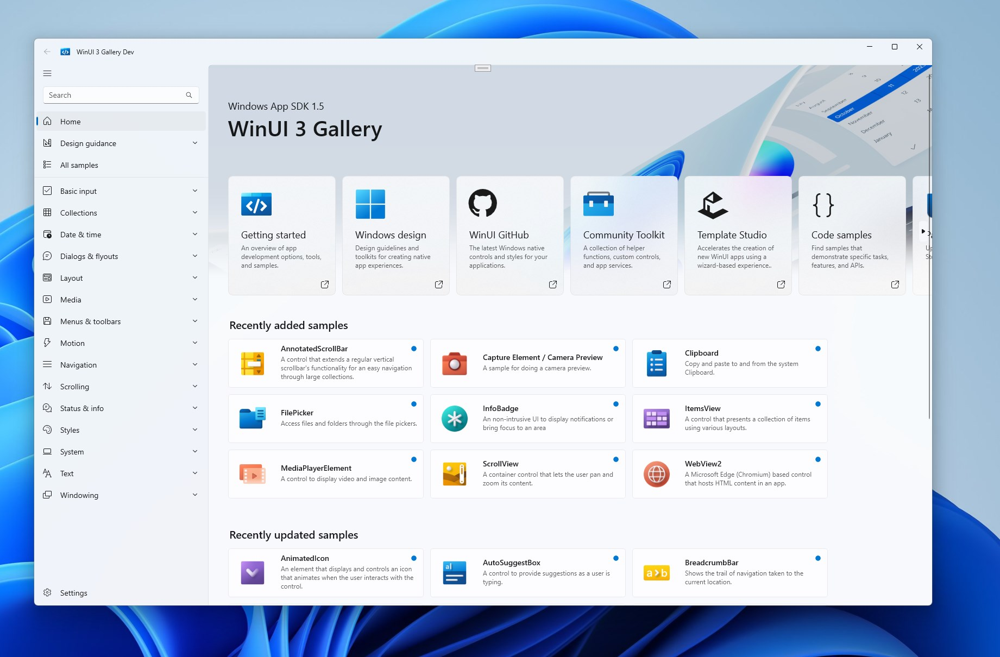

  

<h1 align="center">Windows App SDK</h1>

<h3 align="center">
  <a href="https://learn.microsoft.com/windows/apps/windows-app-sdk">About</a>
   · 
  <a href="https://learn.microsoft.com/windows/apps/desktop">Documentation</a>
   · 
  <a href="https://learn.microsoft.com/windows/apps/windows-app-sdk/release-channels">Release notes</a>
   · 
  <a href="https://github.com/microsoft/WindowsAppSDK-Samples">Samples</a>
</h3>

  

[Windows App SDK](https://aka.ms/winappsdk) (formerly Project Reunion) is a set of libraries, frameworks, components, and tools that you can use in your apps to access powerful Windows platform functionality from all kinds of apps on many versions of Windows. The Windows App SDK combines the powers of Win32 native applications alongside modern API usage techniques, so your apps light up everywhere your users are.

- **WinUI 3 support:** [WinUI](https://aka.ms/winui) embodies Fluent Design to enable intuitive, accessible, and powerful experiences and the latest user interface patterns.
- **Access modern features:** [Modern resource tooling](https://github.com/microsoft/WindowsAppSDK/issues/11), [modern lifecycle helpers](https://github.com/microsoft/WindowsAppSDK/issues/9), [startup tasks](https://github.com/microsoft/WindowsAppSDK/issues/10), and more without having to rewrite your app.
- **Backwards compatibility:** Down to Windows 10 1809 (build 17763). There may be some API that are dependent on new OS features
(like new Action Center functionality), however we will do our best to ensure this is the exception and not the norm, and provide reasonable fallbacks when possible.
- **Wide platform support:** Win32, WPF, WinForms, and more.
- **Use your current installer:** no requirement to use MSIX, but there are [reliability/security benefits to using MSIX](https://docs.microsoft.com/windows/msix/overview#key-features).

## 📋 Getting started with Windows App SDK

* [Build your first app with Windows App SDK](https://learn.microsoft.com/windows/apps/winui/winui3/create-your-first-winui3-app)
* [Developer documentation](https://aka.ms/windowsappsdkdocs)
* [Samples & resources](https://learn.microsoft.com/windows/apps/get-started/samples)
  * [Windows App SDK samples](https://github.com/microsoft/WindowsAppSDK-Samples)
  * [WinUI 3 Gallery](https://github.com/microsoft/WinUI-Gallery)
  * [AI Dev Gallery (Preview)](https://github.com/microsoft/ai-dev-gallery)
  * [Windows Community Toolkit](https://github.com/CommunityToolkit/Windows)
  * [Template Studio](https://github.com/microsoft/TemplateStudio)
* [FAQ](docs/faq.md)
* [Contribution guide](docs/contributor-guide.md)
* [Roadmap](./docs/roadmap.md)
* Windows App SDK family repositories
  * [WinUI](https://github.com/microsoft/microsoft-ui-xaml)
  * [C++/WinRT](https://github.com/microsoft/CppWinRT) and [C#/WinRT](https://github.com/microsoft/CsWinRT)
  * [MSIX packaging](https://github.com/microsoft/msix-packaging)

## 👨‍💻 Join in and stay connected

Interested in WinUI and Windows App SDK? Come join us on the quarterly [WinUI Community Calls](https://www.youtube.com/playlist?list=PLI_J2v67C23ZqsolUDaHoFkF1GKvGrttB).
You can find and tag us on X using [#WindowsAppSDK](https://twitter.com/search?q=%23WindowsAppSDK).

## 🖼️ WinUI 3 Gallery

Make sure to also check out the [WinUI 3 Gallery](https://aka.ms/winui-gallery), our interactive sample experience showing everything you can do with WinUI and Windows App SDK.

  <a style="text-decoration:none" href="https://apps.microsoft.com/detail/9NGHP3DX8HDX?launch=true&mode=full">
    <picture>
      <source media="(prefers-color-scheme: light)" srcset="https://get.microsoft.com/images/en-us%20dark.svg" width="200" />
      
  </picture></a>

## 📢 Contributing

- **[File a new issue](https://github.com/microsoft/WindowsAppSDK/issues/new/choose):** Tell us what problem you're trying to solve, how you've tried to solve it so far, and what would be the ideal solution for your app. Bonus points if there's a gist or existing repo we can look at with you.
- **[Ask a question](https://github.com/microsoft/WindowsAppSDK/discussions/categories/q-a):** Also, have a look at our [FAQ on WinAppSDK](docs/faq.md) page, which we will update periodically.
- **[Start a discussion](https://github.com/microsoft/WindowsAppSDK/discussions):** Let's start a Discussion issue to see if others are interested in a cool new idea you've been thinking about that isn't quite ready to be filed as a more formal Feature Proposal.
- **[Code contributions](docs/contributor-guide.md):** See our [contributing guidelines](docs/contributor-guide.md).

## Data collection

This project collects usage data and sends it to Microsoft to help improve our products and services. Note, however, that no data collection is performed when using your private builds.

Privacy information can be found at https://privacy.microsoft.com

## Code of Conduct

This project has adopted the [Microsoft Open Source Code of Conduct](https://opensource.microsoft.com/codeofconduct).

For more information see the [Code of Conduct FAQ](https://opensource.microsoft.com/codeofconduct/faq) or
contact [opencode@microsoft.com](mailto:opencode@microsoft.com) with any additional questions or comments.
