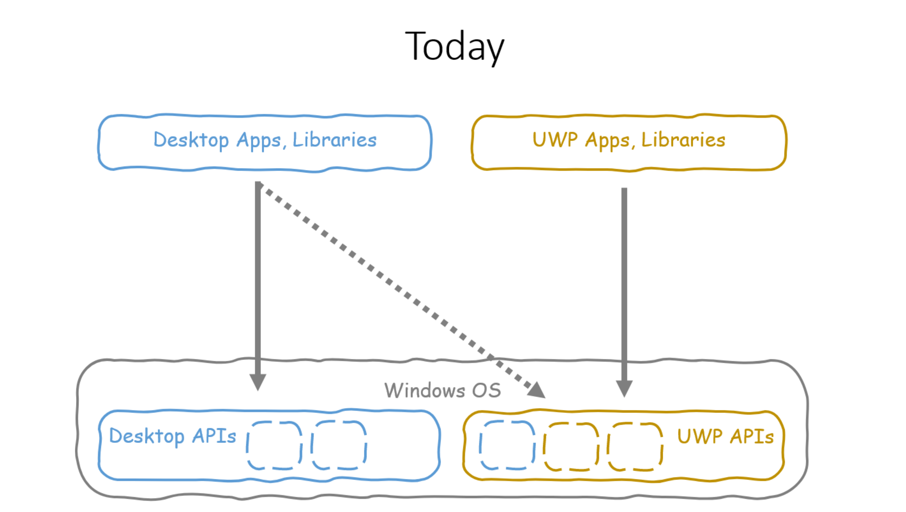
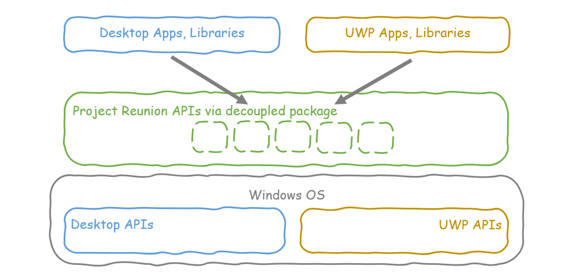
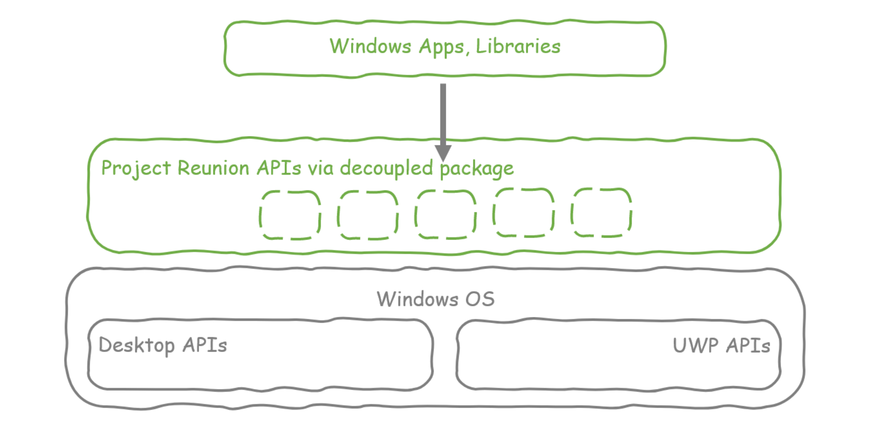

# Project Reunion

Over the past couple of years, we have been breaking down the barriers between Desktop Win32 and 
Universal Windows Platform (UWP) APIs. Project Reunion is an expansion of that effort to truly make 
it easier to build a great Windows app. It will unify access to existing desktop and UWP APIs and 
make them available decoupled from the OS via tools like NuGet. This will provide a common platform
 for new apps, as well as enable you to incrementally update and modernize your existing apps with the 
latest functionality, whether they're C++, .NET – including WinForms, WPF, and UWP – or React Native. 
We'll also continue to expand and evolve the platform with new capabilities. As we decouple the 
platform, we are also doing the work to polyfill as needed so that APIs work downlevel across 
supported versions of Windows. 

Project Reunion:

- **Is the next evolution of the journey we started with UWP**. It embraces all the goodness and 
investments our community has made in UWP and Win32, and builds a path forward for both.

- **It clears up the confusion around the Windows platform**, and acknowledges that supporting
 all Windows versions (over 1 billion endpoints) not just the latest version, provides a meaningful
 total adressable market(TAM) and lowers cost for our developer base i.e. build once run everywhere.

- **This evolution will converge our divergent paths of the past and brings our developer base forward**. 
It unblocks future scenarios and jumpstarts the revolution of Windows apps (e.g. Cloud streamed, 
Cloud-hybrid, Cloud/Edge Apps)

We invite you to come learn more and engage with us at this early stage right here. [Ask questions,
start discussions and make feature proposals](https://github.com/microsoft/ProjectReunion/issues/new/choose). We'll be sharing our progress and listening to your feedback as we implement 
this vision. 

### Current App Model

When you write Windows apps or libraries today, they call directly into Desktop Win32 APIs or UWP APIs that are 
part of the OS. Over time we have brought more Desktop Win32 APIs into UWP e.g. the File System API and 
enabled Desktop apps to call WinRT UWP APIs.

### Unified App Model(Project Reunion)
With Project reunion, we are iteratively taking the same APIs you use today across UWP and Desktop apps (like 
WinForms, WPF, C++) and decoupling them from the OS by making them available via package managers like Nuget.
This allows you to mix and match APIs that work best for your app and adopt new capabilities on demand. 

Over time, we will blur that distinction between Desktop Win32 apps and UWP apps such that you are building a 
Windows app or library.

**We have already started with APIs like [WinUI 3](https://github.com/microsoft/microsoft-ui-xaml),
 [WebView2](https://docs.microsoft.com/en-us/microsoft-edge/hosting/webview2/gettingstarted)
 and [MSIX](https://docs.microsoft.com/en-us/windows/msix/overview) which you can start using today!** 

WinUI 3 Preview 1 is one of the first components in the Project Reunion journey: it’s the modern native 
UI framework for Windows, now available to all Windows app developers across both UWP and Desktop apps.
Using WinUI you will be able to create new apps with modern UI that adapts and scales across devices, 
or incrementally modernize the UI of existing desktop apps including C++, WPF and WinForms. 

###  Benefits of Project Reunion

 _Windows and Project Reunion loves all your apps_

- Your **existing UWP and Win32 apps continue to work** on supported versions of Windows with **no changes**.
- If you build fully against Project Reunion, **we will do the work** to make your app always work across all of Windows. Project Reunion APIs are backwards-compatible across a range of Windows versions and provide a clear
message to you that an API might not be supported.
- You can **incrementally adopt** Project Reunion components for your existing apps and middleware libraries. Project Reunion helps you incrementally adopt powerful Windows features like AppContainer, Desktop
Bridge, Identity, and more.
- Project Reunion will **update independent of Windows releases**, and will always have the latest and greatest support for new hardware. Project Reunion stays up to date automatically as new versions are available without recompilation or
updates to your app.
- Project Reunion is an inclusive set of technologies allowing developers **a broad range of choice**.  We will recommend technologies 
that deliver the best experience on the broad set of hardware we support, have great fundamentals, and are optimized for the cloud.
- Project Reunion works for packaged, unpackaged, UWP, Desktop Bridge, and bring-your-own identity apps.
Write your app or framework **code once and use it everywhere**.

### Project Reunion Principles
Here are four principles directing our strategy. We are building a platform that is: 

1. **Compatible** 
	It unifies Win32 and UWP. You won't have to pick between UWP or Win32 app models and it 
    works on all supported Windows versions. 

2. **Modern** 
	It supports the latest libraries(e.g. UI, AI, ML) , modern languages( e.g. industry standard C++) and API runtimes, 
	Project Reunion will also help you get ready for cloud integration, app streaming, edge compute, etc 

3. **Agile** 
	Project Reunion ships out of band with OS releases, with regular previews. You get to incrementally
    adopt Project Reunion components for your existing apps and middleware libraries. 

4. **Open** 
	We're committing to engineering Project Reunion in the open on GitHub so you have a more direct say in how the platform evolves and even help out. 

## Version Support

At this time, Project Reunion supports Windows `TargetPlatformVersion` >= 10.0.18362 (Windows 10 1809) or
greater. 

Your app's users can be on any of the following supported Windows 10 versions:

* Windows Insider Previews
* May 2019 Update (18362 aka "19H1")
* October 2018 Update (17763 aka "Redstone 5")
* April 2018 Update (17134 aka "Redstone 4")
* Fall Creators Update (16299 aka "Redstone 3")

When features have partial implementations on older versions of Windows they will have an
`IsSupported` method indicating what level of support is present.

## Documentation

* [High level overview](README.md) - Why we're doing this? How does it benefit you?
* [Roadmap](docs/roadmap.md) - Where we're going. We're following a [roadmap](docs/roadmap.md) that 
gets us to building a v1.0 of Project Reunion exploring some basic common features.
  [You can help by filing issues for features you'd like to see](https://github.com/microsoft/ProjectReunion/issues/new/choose)!
* [Contributor guide](docs/contributor-guide.md) - How to contribute to Project Reunion.
* [FAQ](docs/faq.md) - frequently asked questions about Project Reunion.

## Links

* [Build 2020 Kevin Gallo keynote speech introducing Project Reunion]()
* [Build 2020 Project Reunion Session with Jesse Bishop & Paul Gusmorino]()
* [Project Reunion announcement blog post]()
  

## Contributing

_We want to hear from you!_

File a [new issue!](https://github.com/microsoft/ProjectReunion/issues/new/choose) Tell us what problem you're
trying to solve, how you've tried to solve it so far, and what would be the ideal solution for your app.  Bonus
points if there's a gist or existing repo we can look at with you.

This project welcomes contributions and suggestions.  Most contributions require you to agree to a
Contributor License Agreement (CLA) declaring that you have the right to, and actually do, grant us
the rights to use your contribution. For details, visit https://cla.opensource.microsoft.com.

When you submit a pull request, a CLA bot will automatically determine whether you need to provide
a CLA and decorate the PR appropriately (e.g., status check, comment). Simply follow the instructions
provided by the bot. You will only need to do this once across all repos using our CLA.

This project has adopted the [Microsoft Open Source Code of Conduct](https://opensource.microsoft.com/codeofconduct/).
For more information see the [Code of Conduct FAQ](https://opensource.microsoft.com/codeofconduct/faq/) or
contact [opencode@microsoft.com](mailto:opencode@microsoft.com) with any additional questions or comments.

## Legal Notices

Microsoft and any contributors grant you a license to the Microsoft documentation and other content
in this repository under the [Creative Commons Attribution 4.0 International Public License](https://creativecommons.org/licenses/by/4.0/legalcode),
see the [LICENSE](LICENSE) file, and grant you a license to any code in the repository under the [MIT License](https://opensource.org/licenses/MIT), see the
[LICENSE-CODE](LICENSE-CODE) file.

Microsoft, Windows, Microsoft Azure and/or other Microsoft products and services referenced in the documentation
may be either trademarks or registered trademarks of Microsoft in the United States and/or other countries.
The licenses for this project do not grant you rights to use any Microsoft names, logos, or trademarks.
Microsoft's general trademark guidelines can be found at http://go.microsoft.com/fwlink/?LinkID=254653.

Privacy information can be found at https://privacy.microsoft.com/en-us/

Microsoft and any contributors reserve all other rights, whether under their respective copyrights, patents,
or trademarks, whether by implication, estoppel or otherwise.
