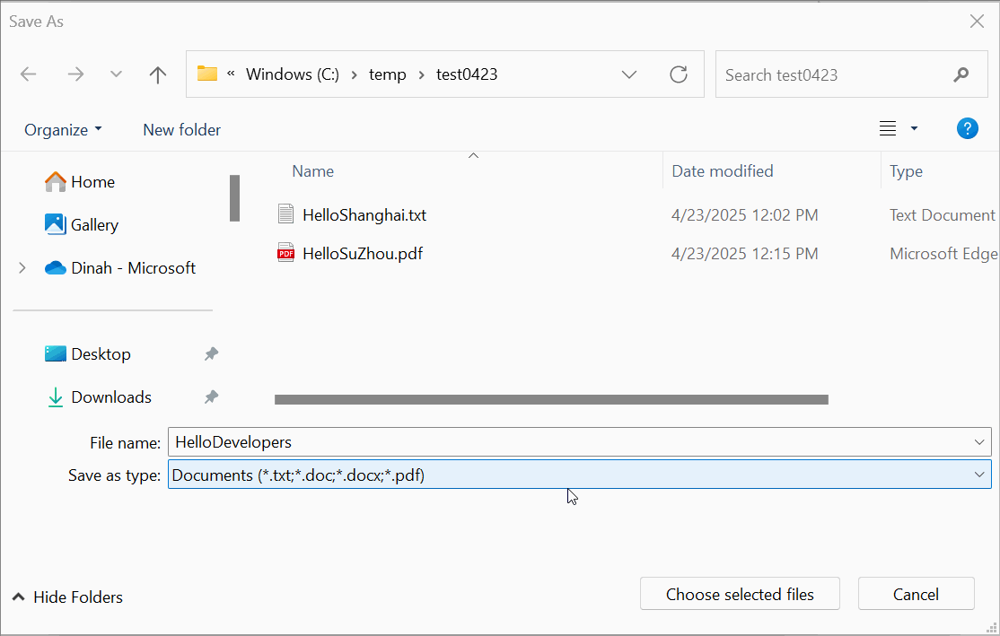

Microsoft.Windows.Storage.Pickers Manual Test Cases
===

Our existing test framework cannot capture the status after the File Dialog pops up, which makes it 
challenging to write test automations in time.

Therefore, we are recording the helpful manual test cases for the Storage Pickers in this file,
as a reference for us to investigate to add unit test automations afterward.

## Manual Tests
Below tests aiming at the functionalities fixed in [#5358](https://github.com/microsoft/WindowsAppSDK/pull/5358) for `FileOpenPicker.FileTypeFilter` and 
`FileSavePicker.FilterTypeChoices`:

### FileOpenPicker.FileTypeFilter
Test code (C++):
```C++
winrt::Microsoft::Windows::Storage::Pickers::FileOpenPicker picker{ AppWindow().Id() };
picker.FileTypeFilter().Append(L".jpg");
picker.FileTypeFilter().Append(L".png");
auto file = co_await picker.PickSingleFileAsync();
```
1. When `FileTypeFilters` are defined, append a file type filter that includes all the already 
   defined file types.
2. On launching the Open Dialog, auto select the unioned "All Files" category.

    **Expected behavior - with the fix:**
    

    **Example of unexpected behavior - without the fix:**
    

    
### FileSavePicker.FilterTypeChoices
Test code (C++):
```C++
winrt::Microsoft::Windows::Storage::Pickers::FileSavePicker picker{ AppWindow().Id() };
picker.FileTypeChoices().Insert(L"Documents", single_threaded_vector<hstring>({ L".txt", L".doc", L".docx", L".pdf"}));
picker.FileTypeChoices().Insert(L"Pictures", single_threaded_vector<hstring>({ L".jpg", L"jpeg", L".png", L".bmp"}));
auto file = co_await picker.PickSaveFileAsync();
```

1. When `FileTypeChoices` are defined and a file is saved with an extension not listed in the chosen 
   file type filters, automatically append the first extension from the choices (utilizing the 
   built-in option of the COM file dialog - [FOS_STRICTFILETYPES](https://learn.microsoft.com/en-us/previous-versions/bb775856(v=vs.85))), 
   **unless the file already exists**, in which why the FileSavePicker will allow saving a file with 
   extension not listed in the chosen file type filters.
    **Expected behavior - with the fix:**
    
    **Example of unexpected behavior - without the fix:**
    

2. When multiple categories are defined in `FileTypeChoices`, the suggested file extension should 
   change according to the selected category.
    **Expected behavior - with the fix:**
    
    **Example of unexpected behavior - without the fix:**
    

### FolderPicker.PickMultipleFoldersAsync
Test code (C++):
```C++
winrt::Microsoft::Windows::Storage::Pickers::FolderPicker picker{ AppWindow().Id() };
auto results{ co_await picker.PickMultipleFoldersAsync() };

// Manually select some folders.

if (results.Size() == 0)
{
    std::wcout << L"no folders picked" << std::endl;
}
else
{
    for (auto const& result : results)
    {
        std::wcout << result.Path().c_str() << std::endl;
    }
}
```
Expect to print out all selected folders.
