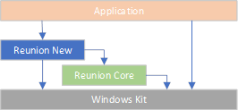
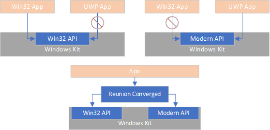
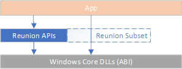

# What is Project Reunion?

Project Reunion is **a set of libraries, frameworks, components, and tools that you can 
use in your apps to access powerful Windows platform functionality from all kinds of 
apps on many versions of Windows**. Project Reunion combines the powers of Win32 native 
applications alongside modern API usage techniques, so your apps light up everywhere 
your users are.

Your app can use the parts of Project Reunion that are most interesting to you without
 having to rewrite it into a new app model or deployment system.  Project Reunion 
provides a single consistent API surface for both new and existing functionality that 
automatically adapts to your preferred app model and deployment mechanism. Project 
Reunion helps you move towards a modern API and app style without requiring you to make
 a hard choice to rewrite it or re-implement it across versions of Windows.

This repo contains the Project Reunion components that are common for all applications. 
Look for the **"Project Reunion Family"** badge in other repos showing that their code is 
using Project Reunion techniques and tooling.  Your own components can be part of the 
"Project Reunion Family" by following the same principles and practices as Project 
Reunion itself - support all forms of apps with a single API surface and meet 
developers where they are with the tools they need to build great apps on Windows.

Using Project Reunion will be as simple as adding a reference to our NuGet packages in 
your build.

# What Project Reunion Brings

Project Reunion functionality comes in three main categories - new APIs, converged APIs, 
and API subsets.  Your apps can pick up each different level of functionality **at your 
own pace**.

## New APIs
Whenever possible, new Windows functionality will be delivered as part of the Project 
Reunion Family.  APIs and functionality delivered as "New" are identity-, packaging-, 
and isolation- transparent to your application.  New functionality will share a common 
interface for you to use whether your app is MSIX, MSI, setup.exe, Desktop Bridge, or 
AppContainer.

Some of the APIs and functionality listed will come over time; they are listed as 
examples of the category rather than fully supported on day 1.

These APIs are self-consistent and solve specific application problems or help you build 
additional functionality into your application.  Potential categories of APIs here might 
be:

* Application data storage and management to keep your data in one place and the user's
system tidy
* Cloud app support for identity and connectivity management to use the power of Azure
* Packaging and system integration so Windows understands what your app is doing
* App-to-app inter-process communication helpers so your apps can work with other app easily
* Privacy-aware resource access APIs for camera, microphone, location, and more

You'll start using these APIs by adding a reference to the Project Reunion NuGet package 
and then adding uses of the APIs in your app code.  Use as much or as little of Project 
Reunion as helps your application.  New Project Reunion APIs will be available on all 
supported versions of Windows and for all apps. Where certain APIs behave differently 
(such as due to identity, isolation, or lifecycle differences) your app can detect it 
with clear "TheType.IsSupported" checks.

## Converged APIs
Project Reunion provides API surfaces that bridge the gap between Win32 and UWP/AppContainer 
functionality already within the platform.  Authors of shared code (like frameworks) can 
use a single method and avoid their own "if (AppContainer) { x } else { y }" checks.  
Project Reunion APIs provide "polyfill" implementations of APIs when necessary so your 
app can run on more versions of Windows without additional "is this Windows 10 Creator's 
Release?" checks. 

Converged API documentation also includes ways to find uses of the "un converged" code 
in your project, along with guidance on how to move from common code patterns to the 
new Project Reunion converged APIs.  Examples of converged APIs include:

* Window Content Frame abstraction over Win32 and UWP windowing
* Application lifecycle behaviors like start, logoff, restart manager integration, 
restart-for-update
* Startup and Background Task support to reduce your app's power and performance footprint
* Application resource management for strings, images, display resolutions, and locales
* Advanced clipboard access

Once your app adds a reference to the Project Reunion codebase your app can start migrating 
blocks of functionality to using these fully-supported converged APIs.  You can move as 
much of your application to Project Reunion functionality as necessary, keeping your 
existing application style and behaviors.  Whenever possible these APIs will be similar 
to their existing Windows SDK namespaced APIs, easing the transition to Project Reunion 
for your existing code.  For existing "flat C" Win32 APIs, an equivalent converged API 
will be added and then projected to your language and runtime. If you prefer a "flat C" 
style - or the APIs you want already have a "flat C" expression - we're working on 
building out a projection of those APIs for you.

As your app migrates to Project Reunion functionality it'll be easier to move between 
deployment and isolation technologies. Project Reunion handles the brokering of resource 
access from a low integrity-level (low-IL) or AppContainer process so your app can 
reference user resources while respecting user choice & privacy controls.

## Subset API Family
Project Reunion helps you stay within the set of APIs that Windows supports on all 
editions and all endpoints.  Like the Windows Kit API partitions, Project Reunion 
defines a subset of supported Windows Platform APIs that work across all versions of 
Windows.  If your code targets this subset - and uses Project Reunion New + Project 
Reunion Converged functionality whenever possible - it'll work everywhere Windows works, 
without needing additional support work.

Project Reunion Subset APIs for your apps also let you start using Project Reunion's 
functionality with minimal changes to your existing code by using an updated and 
streamlined set of headers and implementations.  Feature areas supported by the Project 
Reunion Subset include subsets of:

* Windowing, Input, Messaging, GDI, and GUI subsystem functionality 
* Filesystem and storage access
* Networking
* Printing
* Process, threading, memory management, basic application services
* DirectX, D3D, DirectML

Migrate your app to the Project Reunion Subset API set by first removing all references 
to Windows Kit headers (windows.h, kernel32.lib, user32.lib, winsock.h, etc) and then 
adding references to the core Project Reunion Subset header and import libraries.  
While many existing Windows Kit APIs are part of the Project Reunion Subset, you may 
have some minimal changes to make to your application's code or behavior.  Recompile 
& relink your application then ship it with our support packages.

Is this "subset" model interesting for you and your apps? This feature of Project 
Reunion is still in planning for a future release. Let us know by 
[filing an issue](https://github.com/microsoft/ProjectReunion/issues/new/choose) 
with the "**subset**" tag on it and list the APIs and functionality you'd like to see. 
 

# Project Reunion Family Components

## Available Now
These components are available for you to use now and adhere to the "Project Reunion 
Family Promise" that they have a single API for use in all kinds of applications.

* **[WinUI](https://github.com/microsoft/microsoft-ui-xaml)** 
is the native UI layer for Windows that embodies Fluent Design and delivers 
modern, performant, and polished user experiences to both Win32 and UWP apps. 
This component is part of the Project Reunion Family of functionality, building 
on the identity + packaging + deployment transparent ideas that Project Reunion 
supports for your app as well.

* **[C++/WinRT](https://github.com/microsoft/cppwinrt)**, 
**[Rust/WinRT](https://github.com/microsoft/winrt-rs)**, 
and **[C#/WinRT](https://github.com/microsoft/cswinrt)** 
provide language-native projections of Windows, 
Project Reunion, and your own custom types defined in metadata. Consume APIs from 
the Windows Kit, produce them for use by other supported projections, and create your 
own new language projections. 

* **[MSIX-Core](https://github.com/microsoft/msix-packaging)** 
lets you package your application for distribution to Windows Desktop machines 
via the store or your own delivery pipeline.  MSIX-Core lets you use the reuse parts 
of the MSIX packaging story on older versions of Windows.

## Coming Soon
While we think these are interesting for applications, you tell us! Part of working in 
the open is that we learn together about the needs of application developers.  Below are 
a set of functionality that seems interesting to make available through a Converged or 
New model, but you tell us! Some are linked to an issue thread proposing the functionality. 
+1 the ones you like, comment on the detailed design & direction, and help us shape where 
we're going.

* **Edge/Chromium backed WebView2** brings the ease of authoring your app in HTML+JS once 
and reusing it on all platforms.  WebView2's use of Project Reunion technologies like 
WinUI3 as a hosting frame lets you run modern web-based UX on all editions of Windows.

* **[Modern Lifecycle helpers](https://github.com/microsoft/ProjectReunion/issues/9)** 
help your app be power-sensitive and reactive to changes in 
the runtime system's power management and user state.  They also help your app restart 
after the user reboots, register your app so it can be restarted, and reduce update-related 
reboots.

* **[Startup Tasks](https://github.com/microsoft/ProjectReunion/issues/10)** 
make your app come alive as the user logs in to reconnect, start working 
while not over-using resources, or be ready for fast use.  User choice and power management 
features let you reduce your impact on the critical logon path.

* **Update Scan Integration** help keep your app up to date automatically while running at 
the same time as other system maintenance tasks are happening.

* **Access to user resources** even from AppContainer and isolated applications.  Your 
AppContainer apps can access powerful Win32 technologies like the clipboard, inter-process 
communication, and the Windows Shell Namespace with user consent through brokering.

* **[Modern Resource Tooling](https://github.com/microsoft/ProjectReunion/issues/11)** 
so you can use the power of ResX/ResW in your Win32 applications 
instead of MUI.
# Future direction
We aim to grow Project Reunion to provide a modern, simple, and accessible version of much 
of the power of the Windows Application Platform.  Working in the open with our development 
community ensures we're doing the right things first to solve problems your apps are facing 
on current and future versions of Windows.

Some functionality will be delivered first as Project Reunion components. As we think about 
evolving the platform it's important to make sure new functionality & features are available 
to our developer community just as soon as they're ready to go.  Where there's newer 
in-platform functionality to use Project Reunion will help you adopt that as soon as it's 
widely available, without you having to retarget or rewrite - the same Project Reunion API 
surface will continue to work.

As your app uses more Project Reunion functionality it'll be ready for additional targets 
such as packaging, identity, AppContainer, and other future Windows Editions. Depending on 
Project Reunion APIs means we take on the work to keep these APIs working as Windows evolves 
forward. Staying within the Project Reunion API surface ensures your app can address the 
widest range of Windows editions and releases while using up-to-date functionality.

# How we are doing this

## Working in the open
Project Reunion relies on the power of open-source and the features of GitHub to deliver 
code to you as fast as we can dream it up.  You should feel free to fork, create pull 
requests, open issues, and propose resolutions to issues.  You can see and influence all 
our features via the issue tracker. You should expect that we listen and provide constructive 
feedback.

## Build & Artifacts
Code within the Project Reunion GitHub repo builds on a CI/CD loop and produces freshly 
built DLLs and metadata on each pull request.  The output includes a NuGet package containing 
metadata for Project Reunion and a ready-to-deliver MSIX for inclusion in your application as 
a redistributable or as a package reference. Add a reference to the Project Reunion package 
and start building.  To help deploy your apps we'll include both a Framework Package MSIX 
as well as instructions on how to deploy that MSIX from your existing installer.

## Versioning
Project Reunion will use strongly-typed metadata-based API definitions on which your apps 
can take a long-term dependency following our published support lifecycle. We'll use SemVer 2 
to clearly identify breaking API shape levels that let those APIs evolve forward towards 
new functionality while not compromising existing apps. Project Reunion helps keep apps up 
to date through Framework Packages that are updated with non-breaking changes as appropriate.

## Extending APIs
Some of what Project Reunion provides is access to functionality that is inside Windows, 
but for which there is no public API.  We're working on the details, but our plan is to 
deliver a secondary package of code that provides a public API over those previously unexposed 
components.  While those components will be implemented as closed-source they'll come with 
a metadata-based publicly callable & supported API surface and be included in the Project 
Reunion framework packages for use by apps.

## Brokering
UWPs (AppContainer, Low-IL) processes are meant to protect both the user and the application 
itself from other applications.  Access to user & system resources is limited to the supported 
set of brokers for those resources.  Project Reunion also includes a main package that runs 
at the user's integrity level (medium-IL, sometimes called "full trust") and can provide 
user-approved access to resources previously unavailable to AppContainer and low-IL processes.  
This pattern is available to AppContainer apps today as a "full trust component" - 
Project Reunion aims to provide a common pattern & platform for these custom components.

# What Project Reunion isn't
Project Reunion **isn't a new application model** or platform from Windows. There won't be a 
"new Project Reunion App" template for Visual Studio, VSCode, or other development environments.  
You'll still have full access to the Windows SDK and associated kits.  Over time the features 
that Project Reunion provides will grow beyond just merging the existing Win32 and UWP models 
and provide additional functionality for all apps to use.

Project Reunion **isn't a new packaging or isolation model** for applications.  There won't 
be required changes to your application in order to access Project Reunion functionality other 
than using the new functionality itself. If the APIs you use need identity or packaging these 
requirements will be indicated.

Project Reunion **isn't a new security or privacy model** for applications.  Your app's 
existing security, privacy, reliability, and identity stories continue to work with Project 
Reunion.  There may be places that Project Reunion helps your app be more aware of customer 
security or privacy concerns.  Project Reunion helps you use modern security & privacy 
functionality that evolves alongside your application's needs.

Project Reunion **isn't a way to run your app in the cloud**.  Using Project Reunion technology 
will help get your app on modern API families that are cloud ready. Key components like modern 
lifecycle and state isolation help get your app ready to run wherever your customers are. 

# More documentation

* [High level overview](https://github.com/microsoft/ProjectReunion/blob/master/README.md) - Why we're doing this.
* [Roadmap](roadmap.md) - Where we're going. We're following a roadmap that 
gets us to building a first version of Project Reunion exploring some basic common features.
  [You can help by filing issues for features you'd like to see](https://github.com/microsoft/ProjectReunion/issues/new/choose)!
* [Contributor guide](contributor-guide.md) - How to contribute to Project Reunion.
* [FAQ](faq.md) - frequently asked questions about Project Reunion.
