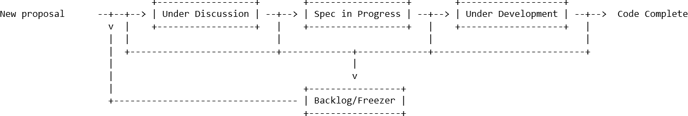

# Issue/Pull Request Management

## Overview
The Windows App SDK team manages issues and PRs in the repo using a process we call
"triage". It helps us keep issues organized and focuses the attention of the different
groups that work in our project.

Our objective is to make sure all issues have one or more owners, an issue type label,
and one or more area labels. New issues are automatically labeled needs-triage by the msftbot,
so the triage team only needs to review any issues that have been labeled as `needs-triage`.

## Issue Types
Each issue should only have one type.
* bug
* feature proposal
* question
* documentation
* announcement

## Triage Labels
1.	New and re-opened issues are marked with needs-triage.
2.	Issues with needs-assignee-attention should be investigated by the assignee as 
top priority.
3.	Issues with needs-author-feedback are waiting for the author to reply.

Because many groups are involved in the Windows App SDK, we have area-... labels to help
filter issues further for triage.

## Area Labels
Area labels are the labels (create new ones as needed); there can be multiple area labels.
 
* area-AppContainer
* area-Developer tools
* area-Input injection
* area-Media
* area-Packaging
* area-Projections
* area-UWP
* area-Win32
* area-etc.

## Triage Process

For each issue with `needs-triage`:
* Feature proposals:
  - Triage makes first pass to ask clarifying questions. If it's ok then:
     - Spec owner gets assigned
     - Adds area tag(s)
     - Gets added to `Under Discussion` in feature tracking board
     - Assigned owner is responsible for following the proposal process
     
* Everything else:
  - If author needs to provide more info, ask in comments and add `needs-author-feedback`
  - Add area tag(s)
  - Add tags for type of issue (`bug`, `feature proposal`, `discussion`, `documentation`)
  - Change labels to `question` or `discussion` if appropriate
  - Add `nice to have` for low priority issues

The temporary `needs-assignee-attention` label is intended for issues which need additional
investigation, like debugging or another teams input, to determine how to route them. 

## Proposal Review Process
The Proposal Tracking board has four columns to track the progress we are making on a
proposal.
* **Under Discussion**: Issue is actively being reviewed and discussed internally and with the community to figure out what that means for our developers
and the platform 
* **Spec in Progress**:  Work is underway to get a spec ready for publishing or has already been 
published and is currently being shaped by the community.
* **Under Development**: The spec is signed off and development can start or has started.
* **Backlog/Freezer**: Place where we put proposals that are not high priority at this time or that
can be reviewed at a later date. The backlog will be reviewed at least once monthly by the triage team.

## Bot Rules
We've setup a bot to label issues, close issues that meet a criteria and flags issues
that need attention
1.	New and re-opened issues get `needs-triage` label added
2.	If feature proposal is added or removed it gets added/removed from the feature 
tracking project board accordingly.
3.	Remove `needs-triage` label when an issue is closed.
4.	Remove `needs-triage` when a closed issue has a reply by someone with write access 
to the repo.
5.	Replace `needs-author-feedback` label with `needs-assignee-attention` 
(if assigned) or `needs-triage` (if unassigned).
6. Adds `status-no-recent-activity` for issues that have the `needs-author-feedback` label 
after 10 days of no activity and closes them after another 10 days without activity

