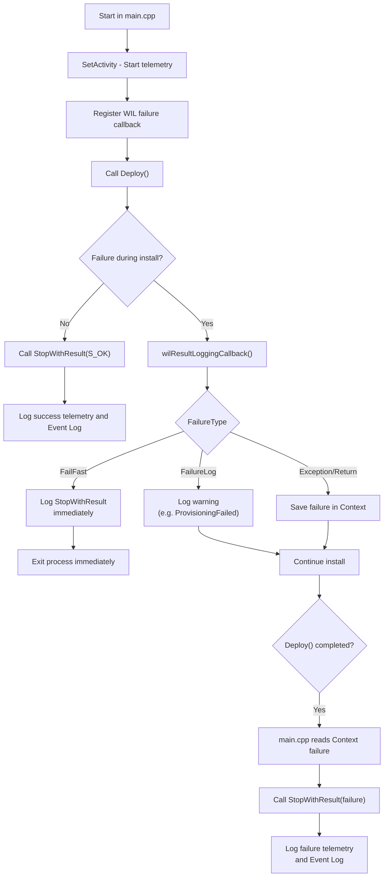

# Installer Telemetry Flow

This document illustrates how telemetry flows through the Windows App SDK installer — from initialization to structured logging of success, warnings, and failures. It highlights where and how `StopWithResult()` is called, what triggers the WIL failure callback, and how different failure types are handled.

---

## Summary: How Telemetry Works

### Setup

- `main.cpp` initializes telemetry by:
  - Setting a global WIL failure logging callback with `wil::SetResultLoggingCallback()`.
  - Instantiating the process-wide `InstallActivity::Context`, which tracks current install stage, error metadata, resource ID, and logging state.

### Installer Logic Runs

- The installer calls `Deploy()` → which calls `InstallLicenses()` and `DeployPackages()`.
- Each of these stages updates the shared `Context` with its current install stage (e.g. `AddPackage`, `ProvisionPackage`, etc.).
- Errors are reported using WIL macros like `THROW_IF_FAILED`, `LOG_IF_FAILED`, or `RETURN_IF_FAILED`.

### Telemetry on Failure

- WIL errors (e.g. HRESULT failures, file/line context) trigger the global `wilResultLoggingCallback()`.
- The callback logs telemetry via TraceLogging and sometimes logs to Windows Event Log using `ReportEventW()`.
- There are different branches depending on severity:
  - Non-blocking errors (e.g. provisioning or push notification restarts) are logged but don’t halt the install.
  - Fail-fast or final install errors result in a call to `StopWithResult()` to emit the full telemetry payload.

---

## Telemetry Flow Overview
This diagram shows when telemetry is logged based on install success or failure and how different failure types are handled.


## `InstallActivity::Context` Overview

The `InstallActivity::Context` is a shared object used across the installer to track telemetry state. It holds info such as the current install stage, package/resource ID, error HRESULTs, and TraceLogging activity ID.

This diagram shows how it's accessed, updated, and ultimately used to log structured telemetry:

```mermaid
flowchart TD

    %% Startup Phase
    subgraph "Startup (main.cpp)"
        A["main.cpp starts installer"]
        B["Context::Get() → singleton Context instance"]
        C["Context::SetActivity()"]
        D["Call Deploy(options)"]
        A --> B --> C --> D
    end

    %% Install Phase
    subgraph "Install logic"
        D --> E["InstallLicenses()"]
        D --> F["DeployPackages()"]
        F --> G["DeployPackageFromResource()"]
        G --> H1["Context::SetInstallStage()"]
        G --> H2["Context::SetCurrentResourceId()"]
        G --> H3["THROW_IF_FAILED(), LOG_IF_FAILED()"]
    end

    %% WIL Failure Callback
    subgraph "Failure handling (WIL callback)"
        H3 --> I["wilResultLoggingCallback()"]
        I --> J1["Context::SetLastFailure()"]
        I --> J2["Context::SetDeploymentErrorInfo()"]
    end

    %% Final Outcome
    D --> K{"Install succeeded?"}
    K -- Yes --> L1["Context::GetActivity().StopWithResult(S_OK)"]
    K -- No --> L2["Context::Get() for error info"]
    L2 --> L3["Context::GetLastFailure(), GetInstallStage(), etc."]
    L3 --> L4["Context::GetActivity().StopWithResult(failure)"]

    %% Logging Phase
    subgraph "Telemetry output"
        L1 --> M1["StopWithResult() logs final telemetry"]
        L4 --> M1
        M1 --> M2["Also logs to Windows Event Log"]
    end

