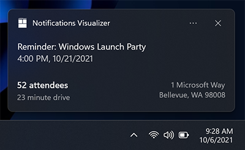

App Notification Groups and Subgroups
===

# Background

[App notifications](https://learn.microsoft.com/en-us/windows/apps/windows-app-sdk/notifications/app-notifications/app-notifications-quickstart?tabs=cs)
in the Windows App SDK are messages that your app can construct and deliver to
your user while they are not currently inside your app, for example:


App notifications are defined in XML, and the
[AppNotificationBuilder](https://docs.microsoft.com/windows/windows-app-sdk/api/winrt/Microsoft.Windows.AppNotifications.Builder.AppNotificationBuilder)
API provides a programattic way to build that XML.

The `AppNotificationBuilder` though does not support the 
[`Groups and Subgroups`](https://learn.microsoft.com/en-us/windows/apps/design/shell/tiles-and-notifications/toast-schema#adaptivegroup)
feature of the XML.

Groups and Subgroups gives developers extra control on how text and images can be organized in an AppNotifications as shown in this example:



In the above example, the bottom part of the AppNotification, the text is split into two columns, one of which is right aligned with some of the text bolded.

The above notification is defined by:

```xml
<toast>
    <visual>
        <binding template='ToastGeneric'>
            <text>Reminder: Windows Launch Party</text>
            <text>4:00 PM, 10/21/2021</text>
            <group>
                <subgroup>
                    <text hint-style='base'>52 attendees</text>
                    <text hint-style='captionSubtle'>23 minute drive</text>
                </subgroup>
                <subgroup>
                    <text hint-style='captionSubtle' hint-align='right'>1 Microsoft Way</text>
                    <text hint-style='captionSubtle' hint-align='right'>Bellevue, WA 98008</text>
                </subgroup>
            </group>
        </binding>
    </visual>
</toast>
```

The new API in this spec provides a way to build this with the `AppNotificationBuilder`.

# API Pages

## AppNotificationGroup class

Groups semantically identify that the content in the group must either be displayed as a whole, or not displayed if it cannot fit. Groups also allow creating multiple columns.

## AppNotificationExtendedTextProperties class

Specifies display, localization and style properties for text displayed as part of a Subgroup on an app notification.

## AppNotificationExtendedImageProperties class

Specifies display and alignment properties for images displayed as part of a Subgroup on an app notification.

## AppNotificationSubgroup class

Subgroups are vertical columns that can contain text and images.

## AppNotificationImageProperties class

Specifies display and alignment properties for images displayed as part of a Subgroup on an app notification.


In the following example, `AppNotificationBuilder` sets a group with two subgroups onto an [AppNotification](https://docs.microsoft.com/windows/windows-app-sdk/api/winrt/Microsoft.Windows.AppNotifications.AppNotification).

```c++
auto builder{ winrt::AppNotificationBuilder()
    .AddText(L"Reminder: Windows Launch Party")
    .AddText(L"4:00 PM, 10/21/2021")
    .AddGroup(winrt::AppNotificationGroup()
        .AddSubgroup(winrt::AppNotificationSubgroup()
            .AddText(L"52 attendees", winrt::AppNotificationTextProperties()
                .SetStyle(winrt::AppNotificationTextStyle::Base))
            .AddText(L"23 minute drive", winrt::AppNotificationTextProperties()
                .SetStyle(winrt::AppNotificationTextStyle::CaptionSubtle)))
        .AddSubgroup(winrt::AppNotificationSubgroup()
            .AddText(L"1 Microsoft Way", winrt::AppNotificationTextProperties()
                .SetStyle(winrt::AppNotificationTextStyle::CaptionSubtle)
                .SetAlign(winrt::AppNotificationTextAlign::Right))
            .AddText(L"Bellevue, WA 98008", winrt::AppNotificationTextProperties()
                .SetStyle(winrt::AppNotificationTextStyle::CaptionSubtle)
                .SetAlign(winrt::AppNotificationTextAlign::Right))))
};
```

The above usage produces the results bellow.


# API Details

```idl
[contract(AppNotificationBuilderContract, 2)]
enum AppNotificationTextStyle
{
    Default, 	      // Default value. Style is determined by the renderer.
    Caption,          // Smaller than paragraph font size.
    CaptionSubtle,    // Same as Caption but with subtle opacity.
    Body,             // Paragraph font size.
    BodySubtle,       // Same as Body but with subtle opacity.
    Base,             // Paragraph font size, bold weight. Essentially the bold version of Body.
    BaseSubtle,       // Same as Base but with subtle opacity.
    Subtitle,         // H4 font size.
    SubtitleSubtle,   // Same as Subtitle but with subtle opacity.
    Title,            // H3 font size.
    TitleSubtle,      // Same as Title but with subtle opacity.
    TitleNumeral,     // Same as Title but with top/bottom padding removed.
    Subheader,        // H2 font size.
    SubheaderSubtle,  // Same as Subheader but with subtle opacity.
    SubheaderNumeral, // Same as Subheader but with top/bottom padding removed.
    Header,           // H1 font size.
    HeaderSubtle,     // Same as Header but with subtle opacity.
    HeaderNumeral,    // Same as Header but with top/bottom padding removed.
};

[contract(AppNotificationBuilderContract, 2)]
enum AppNotificationTextAlign
{
    Default, // Default value. Alignment is automatically determined by the renderer.
    Auto,    // Alignment determined by the current language and culture.
    Left,    // Horizontally align the text to the left.
    Center,  // Horizontally align the text in the center.
    Right,   // Horizontally align the text to the right.
};

[contract(AppNotificationBuilderContract, 2)]
runtimeclass AppNotificationExtendedTextProperties
{
    // Contains the set of extended <text> attributes
    AppNotificationExtendedTextProperties();

    // AppNotificationExtendedTextProperties
    AppNotificationTextStyle Style;
    Int32 MinLines;
    AppNotificationTextAlign Align;

    // AppNotificationTextProperties
    String Language;
    Boolean IncomingCallAlignment;
    Int32 MaxLines;

    // AppNotificationExtendedTextProperties
    AppNotificationExtendedTextProperties SetStyle(AppNotificationTextStyle Style);
    AppNotificationExtendedTextProperties SetMinLines(Int32 value);
    AppNotificationExtendedTextProperties SetAlign(AppNotificationTextAlign Align);

    // AppNotificationTextProperties
    AppNotificationExtendedTextProperties SetLanguage(String value);
    AppNotificationExtendedTextProperties SetIncomingCallAlignment();
    AppNotificationExtendedTextProperties SetMaxLines(Int32 value);
};

[contract(AppNotificationBuilderContract, 2)]
enum AppNotificationTextStacking
{
    Default,
    Top,
    Center,
    Bottom,
};

[contract(AppNotificationBuilderContract, 2)]
enum AppNotificationImageAlign
{
    Default, // Default value. Alignment behavior determined by renderer. 
    Stretch, // Image stretches to fill available width (and potentially available height too, depending on where the image is placed).
    Left,    // Align the image to the left, displaying the image at its native resolution.
    Center,  // Align the image in the center horizontally, displayign the image at its native resolution.
    Right,   // Align the image to the right, displaying the image at its native resolution.
};

[contract(AppNotificationBuilderContract, 2)]
runtimeclass AppNotificationExtendedImageProperties
{
    // Contains the set of extended <image> attributes
    AppNotificationExtendedImageProperties();

    // AppNotificationExtendedImageProperties
    AppNotificationImageAlign Align;
    Boolean RemoveMargin;

    // AppNotificationImageProperties
    Boolean ImageQuery;
    String AlternateText;
    AppNotificationImageCrop Crop;

    // AppNotificationExtendedImageProperties
    AppNotificationExtendedImageProperties SetAlign(AppNotificationImageAlign align);
    AppNotificationExtendedImageProperties SetRemoveMargin();

    // AppNotificationImageProperties
    AppNotificationExtendedImageProperties SetImageQuery();
    AppNotificationExtendedImageProperties SetAlternateText(String alternateText);
    AppNotificationExtendedImageProperties SetCrop(AppNotificationImageCrop crop);
};

[contract(AppNotificationBuilderContract, 2)]
enum AppNotificationTextStacking
{
    Default, // Default value. Renderer automatically selects the default vertical alignment. 
    Top,     // Vertical align to the top.
    Center,  // Vertical align to the center.
    Bottom,  // Vertical align to the bottom.
};

[contract(AppNotificationBuilderContract, 2)]
runtimeclass AppNotificationSubgroup
{
    AppNotificationSubgroup();

    Boolean TextStacking;
    Int32 Weight;

    AppNotificationSubgroup SetTextStacking();
    AppNotificationSubgroup SetWeight(Int32 weight);

    // Adds text to the AppNotificationSubgroup.
    AppNotificationSubgroup AddText(String text);
    AppNotificationSubgroup AddText(String text, AppNotificationExtendedTextProperties properties);

    // Sets the image for the AppNotificationSubgroup.
    AppNotificationSubgroup SetImage(Windows.Foundation.Uri imageUri);
    AppNotificationSubgroup SetImage(Windows.Foundation.Uri imageUri, AppNotificationExtendedImageProperties properties);
};

[contract(AppNotificationBuilderContract, 2)]
runtimeclass AppNotificationGroup
{
    AppNotificationGroup();

    Windows.Foundation.Collections.IVector<AppNotificationSubgroup> Subgroups;

    AppNotificationGroup AddSubgroup(AppNotificationSubgroup subgroup);
};

[contract(AppNotificationBuilderContract, 2)]
runtimeclass AppNotificationImageProperties
{
    AppNotificationImageProperties();

    Boolean ImageQuery;
    String AlternateText;
    AppNotificationImageCrop Crop;

    AppNotificationImageProperties SetImageQuery();
    AppNotificationImageProperties SetAlternateText(String alternateText);
    AppNotificationImageProperties SetCrop(AppNotificationImageCrop crop);
};

[contract(AppNotificationBuilderContract, 1)]
runtimeclass AppNotificationBuilder
{
    ...

    // Sets the full-width inline-image that appears when you expand the AppNotification
    AppNotificationBuilder SetInlineImage(Windows.Foundation.Uri imageUri);
    [contract(AppNotificationBuilderContract, 2)]
    AppNotificationBuilder SetInlineImage(Windows.Foundation.Uri imageUri, AppNotificationImageProperties properties);
    [deprecated("Use the AppNotificationImageProperties version of this function instead of this one. For more info, see MSDN.", deprecate, AppNotificationBuilderContract, 2)]
    AppNotificationBuilder SetInlineImage(Windows.Foundation.Uri imageUri, AppNotificationImageCrop imageCrop);
    [deprecated("Use the AppNotificationImageProperties version of this function instead of this one. For more info, see MSDN.", deprecate, AppNotificationBuilderContract, 2)]
    AppNotificationBuilder SetInlineImage(Windows.Foundation.Uri imageUri, AppNotificationImageCrop imagecrop, String alternateText);

    // Sets the image that replaces the app logo
    AppNotificationBuilder SetAppLogoOverride(Windows.Foundation.Uri imageUri);
    [contract(AppNotificationBuilderContract, 2)]
    AppNotificationBuilder SetAppLogoOverride(Windows.Foundation.Uri imageUri, AppNotificationImageProperties properties);
    [deprecated("Use the AppNotificationImageProperties version of this function instead of this one. For more info, see MSDN.", deprecate, AppNotificationBuilderContract, 2)]
    AppNotificationBuilder SetAppLogoOverride(Windows.Foundation.Uri imageUri, AppNotificationImageCrop imageCrop);
    [deprecated("Use the AppNotificationImageProperties version of this function instead of this one. For more info, see MSDN.", deprecate, AppNotificationBuilderContract, 2)]
    AppNotificationBuilder SetAppLogoOverride(Windows.Foundation.Uri imageUri, AppNotificationImageCrop imageCrop, String alternateText);

    // Sets the image that displays within the banner of the AppNotification.
    AppNotificationBuilder SetHeroImage(Windows.Foundation.Uri imageUri);
    AppNotificationBuilder SetHeroImage(Windows.Foundation.Uri imageUri, String alternateText);

    ...

    [contract(AppNotificationBuilderContract, 2)]
    AppNotificationBuilder AddGroup(AppNotificationGroup value);

    ...
};
```

# Appendix

* The new AddGroup method is very similar in name to the SetGroup method that already exists in the AppNotificationBuilder runtimeclass. It's unfortunate as this may be a source of confusion for developers.

* Contrary to most other runtime classes part of the Builder API, the Subgroup runtime class doesn't expose its properties. This is in-line with the AppNotificationBuilder class which also does not expose properties and in part because there currently isn't a way to expose the Text strings along with their TextProperties that would make sense. If we created a struct to hold the text and their properties, we could easily expose them in the Subgroup class as well as in the AppNotificationBuilder class.

* The Groups and Subgroups feature in AppNotifications offers users a wider range of text formatting options than those available in the main body of a notification. To enable support for these extended formatting options, we are proposing adding a new runtime class called AppNotificationExtendedTextProperties along eith one named AppNotificationExtendedImageProperties.

  * We took care to give the new AppNotificationExtendedImageProperties a=nd AppNotificationExtendedTextProperties runtime classes names that is not specific to the Groups and Subgroups feature, ensuring that they can be easily adapted and re-used in the future as needed.

  * While we initially considered having the new AppNotificationExtendedTextProperties class derive from the existing AppNotificationTextProperties class, doing so requires unsealing the later, which would break the contract. Also, there is a bug in the MIDL compiler that prevented us from proceeding with this approach. Nonetheless, where appropriate, the two classes will share code internally to ensure consistent behavior.

  * Although we also considered adding the new text formatting options directly to the existing AppNotificationTextProperties API, we ultimately decided that doing so could potentially create confusion, as some of the formatting options may not be applicable in all scenarios. As a result, we determined that the creation of a new runtime class specifically designed to handle the extended formatting options was the most efficient and effective solution.

* Since we have to modify the contract on the AppNotificationBuilder, we are proposing to use this opportunity to better align the way text and image properties work. Currently, text properties are spercified in a runtime class while image properties are simply set when the image is added to the AppNotification. We are effectively proposing to deprecate the many variations of the image setting APIs on the AppNotificationBUilder and replacing them with a single call that takes an AppNotificationImageProperties object. This means that both: text and images work in the same way and ensure better future proofing.

* The AppNotificationBuilder runtime classes typically offer both properties and fluent setters, although there may be some exceptions. This is an established pattern since the first iteration of the builder was released (in version 1.2), and the APIs in this spec adhere to it.

* The fluent setters work in any languages and let developers specify complex AppNotification using the dot notation. The property accessors are useful in langugages that support object initialization syntax (C# does but C++ does not, for example) and offer an alternate syntax to the dot notation afforded by the fluent setter by letting developers configure objects at construction time.
