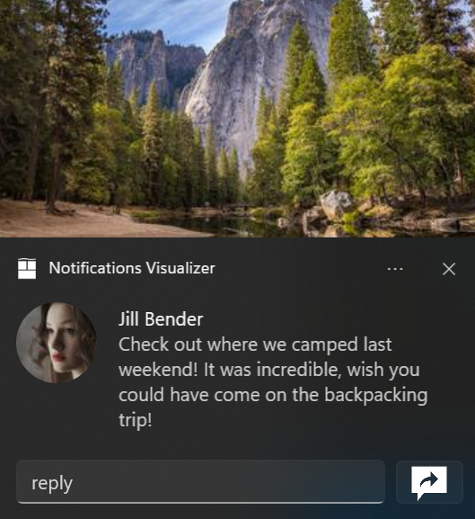
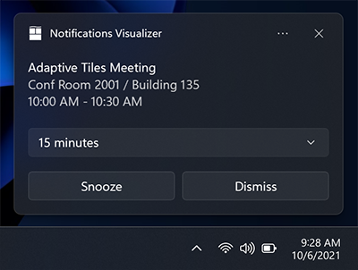

App Notification Snooze and Dismiss Buttons
===

# Background

[App notifications](https://learn.microsoft.com/en-us/windows/apps/windows-app-sdk/notifications/app-notifications/app-notifications-quickstart?tabs=cs)
in the Windows App SDK are messages that your app can construct and deliver to
your user while they are not currently inside your app, for example:



App notifications are defined in XML, and the
[AppNotificationBuilder](https://docs.microsoft.com/windows/windows-app-sdk/api/winrt/Microsoft.Windows.AppNotifications.Builder.AppNotificationBuilder)
API provides a programattic way to build that XML.

Although, the `AppNotificationBuilder` does support buttons, it does not support the creation of 
Snooze and Dismiss buttons linked to system action as described in the 
[`Button`](https://learn.microsoft.com/en-us/windows/apps/design/shell/tiles-and-notifications/adaptive-interactive-toasts?tabs=toolkit#buttons)
feature of the XML.

Snooze and Dismiss let developers post notifications that use the system snooze and dismiss actions as shown in this example:


With the current implementation developers must use xml as the AppNotificationBuilder doesn't support snooze and dismiss button. 

The above notification is defined by:

```xml
<toast scenario="reminder">
  <visual>
    <binding template="ToastGeneric">
      <text hint-maxLines="1">Adaptive Tiles Meeting</text>
      <text>Conf Room 2001 / Building 135</text>
      <text>10:00 AM - 10:30 AM</text>
    </binding>
  </visual>
  <actions>
    <input id="snoozeTime" type="selection" defaultInput="15">
      <selection id="1" content="1 minute"/>
      <selection id="15" content="15 minutes"/>
      <selection id="60" content="1 hour"/>
      <selection id="240" content="4 hours"/>
      <selection id="1440" content="1 day"/>
    </input>
    <action activationType="system" arguments="snooze" hint-inputId="snoozeTime" content="" />
    <action activationType="system" arguments="dismiss" content=""/>
  </actions>
</toast>
```

The new API in this spec provides a way to build this with the `AppNotificationBuilder`.

# API Pages

## AppNotificationButton class

Represents a button that is displayed on an app notification.

In the following example, `AppNotificationBuilder` uses the MakeSnoozeButton and MakeDismissButton 
factory functions to create a Snooze and Dismiss notification [AppNotification]
(https://docs.microsoft.com/windows/windows-app-sdk/api/winrt/Microsoft.Windows.AppNotifications.AppNotification).

```c++
auto builder{ winrt::AppNotificationBuilder()
    .SetScenario(winrt::AppNotificationScenario::Reminder)
    .AddText(L"Adaptive Tiles Meeting", winrt::AppNotificationTextProperties()
        .SetMaxLines(1))
    .AddText(L"Conf Room 2001 / Building 135")
    .AddText(L"10:00 AM - 10:30 AM")
    .AddComboBox(winrt::AppNotificationComboBox(L"snoozeTime")
        .AddItem(L"1", L"1 minute")
        .AddItem(L"15", L"15 minutes")
        .AddItem(L"60", L"1 hour")
        .AddItem(L"240", L"4 hours")
        .AddItem(L"1440", L"1 day")
        .SetSelectedItem(L"15"))
    .AddButton(winrt::AppNotificationButton::MakeSnoozeButton(L"snoozeTime"))
    .AddButton(winrt::AppNotificationButton::MakeDismissButton())
};
```

The above usage produces the results bellow.



# API Details

```idl
[contract(AppNotificationBuilderContract, 2)]
enum AppNotificationButtonType
{
    Custom,
    Snooze,
    Dismiss,
};

runtimeclass AppNotificationButton
{
    AppNotificationButton();
    AppNotificationButton(String content);

    [contract(AppNotificationBuilderContract, 2)]
    static AppNotificationButton MakeSnoozeButton(String inputId);
    [contract(AppNotificationBuilderContract, 2)]
    static AppNotificationButton MakeDismissButton();

    String Content;
    [contract(AppNotificationBuilderContract, 2)]
    AppNotificationButtonType ButtonType;
    Windows.Foundation.Collections.IMap<String, String> Arguments;
  
    ...
};
```

# Appendix

* The snooze and dismiss buttons are simple variations on the standard buttons and can be contructed without 
using the new factory methods but be it would require many steps and could be somewhat error prone.

* We have considered adding the new MakeSoozeButton and MakeDismissButton factory methods directly to the 
AppNotificationBuilder runtime class but found that it is too limiting as it prevents any form of 
customization of the button on the part of the developer.

* The two additional factory methods make constructing the new buttons easy and, since they return an 
AppNotificationButton, developers can use the fluent API to further configure the buttons, just like 
for a standard button.

* Most developers will never have to explicitely set the AppNotificationButtonType as it is 
implicitely set at the time a button is created. It is provided for advanced situations where 
a greater level of customization is required.

* The AppNotificationBuilder runtime classes typically offer both properties and fluent setters, 
although there may be some exceptions. This is an established pattern since the first iteration of 
the builder was released (in version 1.2), and the APIs in this spec adhere to it.

* The fluent setters work in any languages and let developers specify complex AppNotification 
using the dot notation. The property accessors are useful in langugages that support object 
initialization syntax (C# does but C++ does not, for example) and offer an alternate syntax 
to the dot notation afforded by the fluent setter by letting developers configure objects at 
construction time.