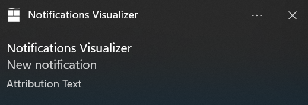
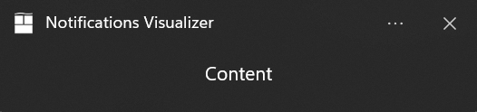
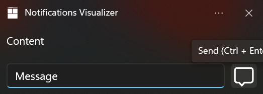
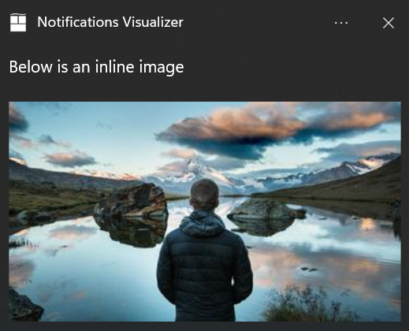
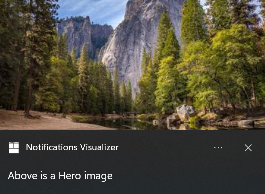
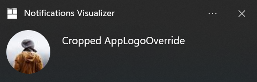
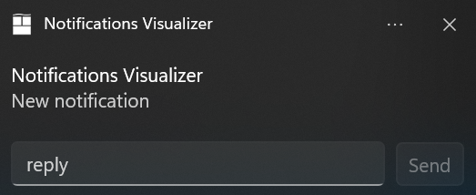
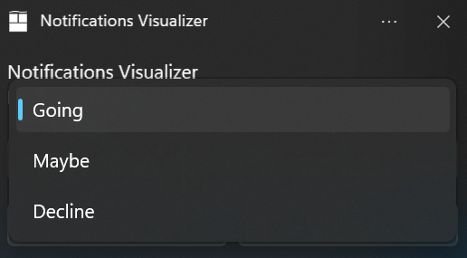
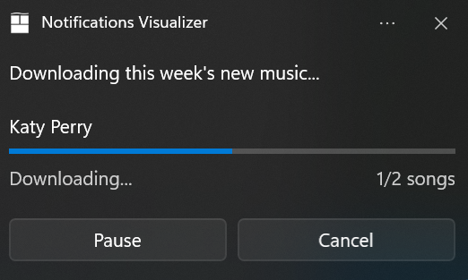

# App Notification Content Builder

# Background

App Notifications are UI popups that contain rich text, controls and images to display a message to
the user. With the Windows App SDK, developers can define an XML payload and display an
AppNotification using the AppNotificationManager::Show API, but defining these XML payloads can be
tedious when written by hand.

To generate an AppNotification like this one:


Developers have to write something like this:

```c++
int sequenceId {1234};
std::wstring pathToImage {LR"(ms-appx://images/appLogo.png)"};

winrt::hstring xmlPayload{
    fmt::format(LR"(<toast launch = "action=AppNotificationClick;sequence={}">
        <visual>
            <binding template="ToastGeneric">
                <image placement="appLogoOverride" hint-crop="circle" src="{}"/>
                <text>App Notification with Avatar Image</text>
                <text>This is an example message using XML</text>
            </binding>
        </visual>
        <actions>
            <action
                content="Open App"
                arguments="action=OpenApp&amp;sequence={}">
        </actions>
    </toast>)" ,
    sequenceId, pathToImage, sequenceId)};
auto appNotification{ winrt::AppNotification(xmlPayload) };
winrt::AppNotificationManager::Default().Show(appNotification);
```

# Description

To improve the AppNotification construction experience, the Windows App SDK is introducing
AppNotificationBuilder, a builder that constructs simple or rich App Notifications for the
developer.

```c++
AppNotificationBuilder()
    .AddArgument(L"AppNotificationClick")
    .AddArgument(L"sequence", winrt::to_hstring(sequenceId))
    .SetAppLogoOverride(winrt::Windows::Foundation::Uri(pathToImage), AppNotificationImageCrop::Circle)
    .AddText(L"App Notification with Avatar Image")
    .AddText(L"This is an example message")
    .AddButton(AppNotificationButton(L"Open App")
        .AddArgument(L"action", L"OpenAppButton")
        .AddArgument(L"sequence", winrt::to_hstring(sequenceId)));
```

# API Components

# AppNotificationBuilder

The AppNotificationBuilder component sets up the xml for a `<toast>`. This is the wrapper content
that will include any component adding to the AppNotification UI.

### WinAppSDK 1.2 `<toast>` Schema

```xml
<toast
    launch? = string
    duration? = "long" | "short"
    displayTimeStamp? = string
    scenario? = "reminder" | "alarm" | "incomingCall" | "urgent"
    useButtonStyle? = boolean>
      <!-- Child elements -->
    visual, audio?, actions?
</toast>
```

These attributes are abstracted away by the following AppNotificationBuilder component APIs
available in the Windows App SDK:

-   AppNotificationBuilder();
-   AddArgument(String key, String value)
-   SetTimeStamp(Windows.Foundation.DateTime dateTime)
-   SetScenario(AppNotificationScenario Scenario)
    -   AppNotificationScenario.Reminder
    -   AppNotificationScenario.Alarm
    -   AppNotificationScenario.IncomingCall
    -   AppNotificationScenario.Urgent

useButtonStyle will only be set if AppNotificationButton::SetButtonStyle is used.

You can append UI components through the AppNotificationBuilder component APIs:

-   AddText
-   AddButton
-   SetInlineImage
-   SetAppLogoOverrideImage
-   SetHeroImage
-   SetAudioUri
-   SetAudioEvent
-   AddTextBox
-   AddComboBox

The main advantage as an API is to provide validation, type safety, and foremost intellisense.

Below is an example usage:


AppNotificationBuilder code:

```cpp
AppNotificationBuilder()
    .AddArgument(L"action", L"openThread")
    .AddArgument(L"threadId", L"92187")
    .SetTimeStamp(DateTime.now())
    .AddText(L"Jill Bender", AppNotificationTextProperties().SetMaxLines(1))
    .AddText(L"Checkout where we camped last weekend")
    .SetAppLogoOverride(winrt::Windows::Foundation::Uri(LR"(ms-appx://images/appLogo.png)"), AppNotificationImageCrop::Circle)
    .SetHeroImage(winrt::Windows::Foundation::Uri(LR"(ms-appx://images/heroImage.png)"))
    .AddTextBox(L"textBox", L"reply")
    .AddButton(AppNotificationButton()
        .AddArgument(L"action", L"reply")
        .AddArgument(L"threadId", L"92187")
        .SetIcon(winrt::Windows::Foundation::Uri(LR"(ms-appx://images/Icon.png)"))
        .SetInputId(L"textBox"))
    .BuildNotification();
```

XML payload:

```xml
<toast launch="action=openThread&amp;threadId=92187" displayTimestamp="2022-06-19T08:30:00Z">
    <visual>
        <binding template="ToastGeneric">
            <text hint-maxLines="1">Jill Bender</text>
            <text>Check out where we camped last weekend! It was incredible, wish you could have come on the backpacking trip!</text>
            <image placement="appLogoOverride" hint-crop="circle" src="ms-appx://images/appLogo.png"/>
            <image placement="hero" src="ms-appx://images/heroImage.png"/>
        </binding>
    </visual>
    <actions>
        <input id="textBox" type="text" placeHolderContent="reply"/>
        <action
          content="Send"
          imageUri="ms-appx://images/Icon.png"
          hint-inputId="textBox"
          arguments="action=reply&amp;threadId=92187"/>
    </actions>
</toast>
```

## Limitations

-   AppNotificationScenario.Urgent is only supported for to builds 19041 (20H1) and above. Using
    this attribute on lower builds will not prevent the AppNotification from being constructed, but
    developers can use AppNotificationBuilder.IsUrgentScenarioSupported to check if the feature is
    available at runtime.

# Text

The Text component sets up the xml for a `<text>` element. Developers can define the content,
language, and placement of the text on the AppNotification.

**WinAppSDK 1.2 \<text\> Schema**:

```xml
<text lang? = string
      placement? = "attribution"
      hint-callScenarioCenterAlign? =
      hint-maxLines? = integer />
```

These attributes are abstracted with the following AppNotificationTextProperties component APIs
available in the Windows App SDK:

-   SetLanguage(String language)
-   SetHintMaxLines(Int32)
-   SetIncomingCallAlignment()

Below are some example usages:



AppNotificationBuilder Code:

```cpp
AppNotificationBuilder()
    .AddText(L"Content")
    .SetAttributionText(L"Attribution Text")
    .BuildNotification();
```

XML payload:

```xml
<toast>
  <visual>
    <binding template="ToastGeneric">
      <text>Content</text>
      <text placement="attribution">Attribution Text</text>
    </binding>
  </visual>
</toast>
```

Developers can use SetIncomingCallAlignment() to center the text like an incoming call. This feature
will be ignored unless the AppNotification scenario is set to IncomingCall using
AppNotificationBuilder::SetScenario(enum AppNotificationScenario).


AppNotificationBuilder code:

```cpp
AppNotificationBuilder()
    .SetScenario(AppNotificationScenario::IncomingCall)
    .AddText(L"Incoming Call", AppNotificationTextProperties()
        .SetIncomingCallAlignment())
    .AddText(L"Andrew Barnes", AppNotificationTextProperties()
        .SetIncomingCallAlignment())
    .SetInlineImage(winrt::Windows::Foundation::Uri(LR"(ms-appx://images/inlineImage.png)"), AppNotificationImageCrop::Circle)
    .AddButton(AppNotificationButton()
        .SetIcon(winrt::Windows::Foundation::Uri(LR"(ms-appx://images/icon.png)"))
        .SetButtonStyle(AppNotificationButtonStyle::Success)
        .SetToolTip(L"Answer video call"))
    .BuildNotification();
```

XML payload:

```xml
<toast scenario="incomingCall" useButtonStyle="true">
    <visual>
        <binding template="ToastGeneric">
            <text hint-callScenarioCenterAlign = "true">Incoming Call</text>
            <text hint-callScenarioCenterAlign = "true">Andrew Barnes</text>
            <image hint-crop="circle"  src="ms-appx://images/inlineImage.png"/>
        </binding>
    </visual>

    <actions>
        <action
              arguments="videoCallId"
              content=""
              imageUri="ms-appx://images/icon.png"
              hint-buttonStyle = "Success"
              hint-toolTip = "Answer video call"/>
</toast>
```

Notice that the text is inserted into the xml the order that it was provided in the builder.

# AppNotificationButton

The AppNotificationButton component API sets up the xml for the `<action>` element.
AppNotificationButtons are user-clickable components meant to start an action from the app.

**WinAppSDK 1.2 \<action\> Schema**:

```xml
<action content = string
        arguments = string
        placement? = "contextMenu"
        imageUri? = string
        hint-inputid? = string
        hint-buttonStyle? = "success" | "critical"
        hint-toolTip? = string />
```

These attributes are abstracted with the following AppNotificationButton component APIs available in
the Windows App SDK:

-   AppNotificationButton()
-   AppNotificationButton(String content)
-   SetIcon(Windows.Foundation.Uri iconUri)
-   SetToolTip(String toolTip)
-   SetContextMenuPlacement()
-   SetInputId(String inputId)

Below are some example usages:


AppNotificationBuilder code:

```cpp
AppNotificationBuilder()
    .AddText(L"Content")
    .AddTextBox(L"textBox", L"Reply")
    .AddButton(AppNotificationButton(L"Send")
        .AddArgument(L"action", L"textReply")
        .SetIcon(winrt::Windows::Foundation::Uri(LR"(ms-appx://images/icon.png)"))
        .SetInputId(L"textBox"))
    .BuildNotification();
```

XML payload:

```xml
<toast>
  <visual>
    <binding template="ToastGeneric">
      <text>Content</text>
    </binding>
  </visual>

    <actions>
        <input id="textBox" type="text" placeHolderContent="Reply"/>
        <action
          content="Send"
          imageUri="ms-appx://images/icon.png"
          hint-inputId="textBox"
          arguments="action=textReply"/>
    </actions>
</toast>
```

Developers can change the button style of the button using
SetButtonStyle(AppNotificationButtonStyle). The two button styles are
AppNotificationButtonStyle.Success and AppNotificationButtonStyle.Critical.



AppNotificationBuilder code:

```cpp
AppNotificationBuilder()
    .SetScenario(AppNotificationScenario::IncomingCall)
    .AddText(L"Incoming Call", AppNotificationTextProperties()
        .SetIncomingCallAlignment())
    .AddText(L"Andrew Barnes", AppNotificationTextProperties()
        .SetIncomingCallAlignment())
    .SetInlineImage(winrt::Windows::Foundation::Uri(LR"(ms-appx://images/inlineImage.png)"), AppNotificationImageCrop::Circle)
    .AddButton(AppNotificationButton()
        .AddArgument(L"videoCall", L"938465")
        .SetIcon(winrt::Windows::Foundation::Uri(LR"(ms-appx://images/videoCall.png)"))
        .SetButtonStyle(AppNotificationButtonStyle::Success)
        .SetToolTip(L"Answer video call"))
    .AddButton(AppNotificationButton()
        .AddArgument(L"voiceCall", L"938465")
        .SetIcon(winrt::Windows::Foundation::Uri(LR"(ms-appx://images/voiceCall.png)"))
        .SetButtonStyle(AppNotificationButtonStyle::Success)
        .SetToolTip(L"Answer voice call"))
    .AddButton(AppNotificationButton()
        .AddArgument(L"declineCall", L"938465")
        .SetIcon(winrt::Windows::Foundation::Uri(LR"(ms-appx://images/declineCall.png)"))
        .SetButtonStyle(AppNotificationButtonStyle::Critical)
        .SetToolTip(L"Decline all"))
    .BuildNotification();
```

XML payload:

```xml
<toast scenario="incomingCall" useButtonStyle="true">
    <visual>
        <binding template="ToastGeneric">
            <text hint-callScenarioCenterAlign = "true">Incoming Call</text>
            <text hint-callScenarioCenterAlign = "true">Andrew Barnes</text>
            <image hint-crop="circle"  src="ms-appx://images/inlineImage.png"/>
        </binding>
    </visual>

    <actions>
        <action
              arguments="videoCall=938465;action=accept"
              content=""
              imageUri="ms-appx://images/videoCall.png"
              hint-buttonStyle = "Success"
              hint-toolTip = "Answer video call"/>
        <action
              arguments="voiceCall=938465"
              content=""
              imageUri="ms-appx://images/voiceCall.png"
              hint-buttonStyle = "Success"
              hint-toolTip = "Answer voice call"/>
        <action
              arguments="declineCall=938465"
              content=""
              imageUri="ms-appx://images/declineCall.png"
              hint-buttonStyle = "Critical"
              hint-toolTip = "Decline all"/>
      </actions>
</toast>
```

Notice that the AppNotificationButtons are inserted into the xml the order that it was provided in
the builder.

The ToolTip is useful for buttons with icons and no content. Users can hover over the button with
the cursor and a text will display describing what the button does.



AppNotificationBuilder code:

```cpp
AppNotificationBuilder()
    .AddText(L"Content")
    .AddTextBox(L"textBox", L"Reply")
    .AddButton(AppNotificationButton()
        .AddArgument(L"action", L"textReply")
        .SetInputId(L"textBox")
        .SetToolTip(L"Send")
        .SetIcon(winrt::Windows::Foundation::Uri(LR"(ms-appx://images/icon.png)")))
    .BuildNotification();
```

XML payload:

```xml
<toast>
  <visual>
    <binding template="ToastGeneric">
      <text>Content</text>
    </binding>
  </visual>

    <actions>
            <input id="textBox" type="text" placeHolderContent="Reply"/>
            <action
            content=""
            imageUri="ms-appx://images/icon.png"
            hint-inputId="textBox"
            hint-toolTip="Send"
            arguments="action=textReply"/>
    </actions>
</toast>
```

The context menu is a popup UI that appears when the user right clicks on the AppNotification. The
default options are to turn off receiving notifications for the application and to launch the
notification settings page. Using SetContextMenuPlacement() will add an option to the context menu.
The behavior is the same as other buttons and when activated returns the arguments to the app.


AppNotificationBuilder code:

```cpp
AppNotificationBuilder()
    .AddText(L"Content")
    .AddTextBox(L"textBox", L"Reply")
    .AddButton(AppNotificationButton(L"Modify app settings")
        .AddArgument(L"action", L"textReply")
        .SetContextMenuPlacement())
    .BuildNotification();
```

XML payload:

```xml
<toast>
  <visual>
    <binding template="ToastGeneric">
      <text>Content</text>
    </binding>
  </visual>

    <actions>
            <input id="textBox" type="text" placeHolderContent="Reply"/>
            <action
            placement="contextMenu"
            content="Modify app settings"
            arguments="action=textReply"/>
    </actions>
</toast>
```

## Limitations

-   hint-toolTip and hint-buttonStyle are only supported for builds 19041 (20H1) and above. Using
    these attributes on lower builds will not prevent the AppNotification from being constructed,
    but developers can use AppNotificationButton.IsButtonStyleSupported and
    AppNotificationButton.IsToolTipSupported to check if the feature is available at runtime.

# Image

The Image component API sets up the xml for the `<image>` element. Images are visual elements that
are used to enhance an AppNotification.

The image source can be specified using one of these protocol handlers:

-   http:// or https:// (A web-based image) (unavailable for unpackaged application on build 22000)
-   ms-appx:/// (An image included in the app package) (only for packaged applications)
-   ms-appdata:///local/ (An image saved to local storage) (only for packaged applications)
-   file:/// (A local image) (only for unpackaged)

**WinAppSDK 1.2 \<image\> Schema**:

```xml
<image src = string
       alt? = string
       placement? = "appLogoOverride" | "hero"
       hint-crop? = "circle" />
```

Images can be displayed in three different ways:

## Inline

A full-width inline-image that appears when you expand the AppNotification.



AppNotificationBuilder code:

```cpp
AppNotificationBuilder()
    .AddText(L"Below is an inline image")
    .SetInlineImage(winrt::Windows::Foundation::Uri(LR"(ms-appx://images/inlineImage.png)"))
    .BuildNotification();
```

XML payload:

```xml
<toast>
  <visual>
    <binding template="ToastGeneric">
      <text>Below is an inline image</text>
      <image src="ms-appx://images/inlineImage.png">
    </binding>
  </visual>
</toast>
```

## AppLogoOverride

The image replaces your app's logo in the AppNotification.


AppNotificationBuilder code:

```cpp
AppNotificationBuilder()
    .AddText(L"To the left is an AppLogoOverride")
    .SetAppLogoOverride(winrt::Windows::Foundation::Uri(LR"(ms-appx://images/appLogo.png)"))
    .BuildNotification();
```

XML payload:

```xml
<toast>
  <visual>
    <binding template="ToastGeneric">
      <text>To the left is an AppLogoOverride</text>
      <image src="ms-appx://images/appLogo.png"
                placement="appLogoOverride" />
    </binding>
  </visual>
</toast>
```

## Hero

Prominently displays image within the AppNotification banner and while inside Notification Center.



AppNotificationBuilder code:

```cpp
AppNotificationBuilder()
    .AddText(L"Above is a Hero image")
    .SetHeroImage(winrt::Windows::Foundation::Uri(LR"(ms-appx://images/heroImage.png)"))
    .BuildNotification();
```

XML payload:

```xml
<toast>
  <visual>
    <binding template="ToastGeneric">
      <text>Above is a Hero image</text>
      <image src="ms-appx://images/heroImage.png"
                placement="hero" />
    </binding>
  </visual>
</toast>
```

## Cropped AppLogoOverride

For both Inline and AppLogoOverride, developers can set how the image will be cropped.



AppNotificationBuilder code:

```cpp
AppNotificationBuilder()
    .AddText(L"To the left is a cropped AppLogoOverride")
    .SetAppLogoOverride(winrt::Windows::Foundation::Uri(LR"(ms-appx://images/appLogo.png)"), AppNotificationImageCrop::Circle);
```

XML payload:

```xml
<toast>
  <visual>
    <binding template="ToastGeneric">
      <text>To the left is a cropped AppLogoOverride</text>
      <image src="ms-appx://images/appLogo.png"
                hint-crop="circle"
                placement="appLogoOverride" />
    </binding>
  </visual>
</toast>
```

Supported image file types include:

-   .png
-   .jpg
-   .svg

# Audio

The Audio component allows the developer to define a custom audio to play when an AppNotification is
displayed. The audio file can be defined by string value pointing to an app asset or one of the
[ms-winsoundevents](https://docs.microsoft.com/uwp/schemas/tiles/toastschema/element-audio).

**WinAppSDK 1.2 `<audio>` Schema**:

```xml
<audio src? = string
       loop? = boolean
       silent? = boolean />
```

These attributes are abstracted with the following Audio component APIs available in the Windows App
SDK:

-   SetAudioUri(Windows.Foundation.Uri)
-   SetAudioUri(Windows.Foundation.Uri, AppNotificationAudioLooping)
-   SetAudioEvent(AppNotificationSoundEvent)
-   SetAudioEvent(AppNotificationSoundEvent, AppNotificationAudioLooping)
-   MuteAudio()

Supported audio file types include:

-   .aac
-   .flac
-   .m4a
-   .mp3
-   .wav
-   .wma

Supported audio file sources:

-   ms-appx:///
-   ms-resource

Not supported audio file sources:

-   ms-appdata
-   http://, https://
-   C:/, F:/, etc.

More information on custom audio can be found
[here](https://docs.microsoft.com/en-us/windows/apps/design/shell/tiles-and-notifications/custom-audio-on-toasts).

Below are some example usages:

```cpp
AppNotificationBuilder()
    .SetAudioEvent(AppNotificationSoundEvent::Reminder)
    .BuildNotification();
```

XML payload:

```xml
<toast>
  <visual>
    <binding template="ToastGeneric">
    </binding>
  </visual>
  <audio src="ms-winsoundevent:Notification.Reminder" />
</toast>
```

Developers can define if the audio should be looped using SetAudioUri(Uri,
AppNotificationAudioLooping), which can be default or long.

```cpp
AppNotificationBuilder()
    .AddText(L"Content")
    .SetAudioEvent(AppNotificationSoundEvent::Alarm, AppNotificationAudioLooping::Loop)
    .BuildNotification();
```

XML payload:

```xml
<toast duration="long">
  <visual>
    <binding template="ToastGeneric">
        <text>Above is a Hero image</text>
    </binding>
  </visual>
  <audio src="ms-winsoundevent:Notification.Looping.Alarm" loop="true" />
</toast>
```

An AppNotification that does not want to play any audio can use MuteAudio to mute the audio.

```cpp
AppNotificationBuilder()
    .AddText(L"Content")
    .MuteAudio()
    .BuildNotification();
```

XML payload:

```xml
<toast duration="long">
  <visual>
    <binding template="ToastGeneric">
        <text>Content</text>
    </binding>
  </visual>
  <audio silent="true" />
</toast>
```

# TextBox

TextBox is an `<input>` component that allows users to type custom responses on an AppNotification.

**WinAppSDK 1.2 TextBox Schema**:

```xml
<input id = string
        type="text"
        placeHolderContent? = string>
</input>
```

These attributes are abstracted with the following TextBox component APIs available in the Windows
App SDK:

-   TextBox(String id)
-   TextBox(String id, String placeHolderContent)

Below is an example use:



AppNotificationBuilder code:

```cpp
AppNotificationBuilder()
    .AddTextBox(L"textBox", L"reply")
    .AddButton(AppNotificationButton(L"Send")
        .AddArguments(L"action", L"Send")
        .SetInputId(L"textBox"))
    .BuildNotification();
```

XML payload:

```xml
<toast>
  <visual>
    <binding template="ToastGeneric">
    </binding>
  </visual>

  <actions>
    <input id="textBox" type="text" />
    <action
      arguments="action=Send"
      content="Send"
      hint-inputId="textBox" />
  </actions>
</toast>
```

You can have up to 5 input components (TextBox/AppNotificationComboBox) total in the builder. The
order in the result xml will be the order it was added to the builder.

# AppNotificationComboBox

AppNotificationComboBox is an `<input>` component that allows users to pick from a dropdown menu of
values on an AppNotification.

**WinAppSDK 1.2 AppNotificationComboBox Schema**:

```xml
<input id = string
        type="selection"
        defaultInput? = string>
    <!-- Child elements -->
    selection{0,5}
</input>
```

These attributes are abstracted with the following AppNotificationComboBox component APIs available
in the Windows App SDK:

-   AppNotificationComboBox(String id)
-   SetDefaultSelection(String id)
-   AddSelection(String id, String content)

Below is an example use:



```cpp
AppNotificationBuilder()
    .AddComboBox(AppNotificationComboBox(L"ComboBox")
        .SetDefaultSelection(L"yes")
        .AddSelection(L"yes", L"Going")
        .AddSelection(L"maybe", L"Maybe")
        .AddSelection(L"no", L"Decline"))
    .AddButton(AppNotificationButton(L"Send")
        .AddArgument(L"action", L"Send"))
        .SetInputId(L"ComboBox")
    .BuildNotification();
```

XML payload:

```xml
<toast>
  <visual>
    <binding template="ToastGeneric">
    </binding>
  </visual>

  <actions>
    <input id="ComboBox" type="selection" defaultInput="yes">
      <selection id="yes" content="Going" />
      <selection id="maybe" content="Maybe" />
      <selection id="no" content="Decline" />
    </input>
    <action
      arguments="action=Send"
      hint-inputId="ComboBox"
      content="Send"/>

  </actions>
</toast>
```

# AppNotificationProgressBar

AppNotificationProgressBar is a component that builds the `<progress>` xml.
AppNotificationProgressBar is used to update an AppNotification that is currently displayed. This
allows developers to inform users about the status of certain operations such as download or
install.

**WinAppSDK 1.2 `<progress>` Schema**:

```xml
<progress title? = string
    status = string
    value = string
    valueStringOverride? = string
/>
```

AppNotificationProgressBar uses data binding to update the active UI. In the WindowsAppSDK, this is
done by using AppNotificationProgressData. Click
[Here](https://github.com/microsoft/WindowsAppSDK/blob/main/specs/AppNotifications/AppNotifications-spec.md#notification-progress-updates)
for an example.

All the attributes have static data binding constants:

-   Status = "{progressStatus}"
-   Value = "{progressValue}"
-   Title = "{progressTitle}"
-   ValueStringOverride = "{progressValueString}

By default, status and value use data binding, but you can explicitly bind values of the progress
bar:

-   BindStatus()
-   BindValue()
-   BindTitle()
-   BindValueStringOverride()

You can also set static values of the progress bar by passing in specific values:

-   SetStatus(String status)
-   SetValue(Double value)
-   SetTitle(String title)
-   SetValueStringOverride(String valueStringOverride)

Below is an example use:

```cpp
// Using AppNotificationBuilder, build the AppNotification with AppNotificationProgressBar as the xmlPayload.
AppNotification notification { AppNotificationBuilder()
    .AddText(L"Downloading this week's new music...")
    .AddProgressBar(AppNotificationProgressBar()
        .BindTitle()
        .BindValueStringOverride())
    .SetTag(L"Tag")
    .SetGroup(L"Group")
    .BuildNotification() };
```

XML payload:

```xml
<toast>
  <visual>
    <binding template="ToastGeneric">
      <text>Downloading this week's new music...</text>
      <progress
        title="{progressTitle}"
        value="{progressValue}"
        valueStringOverride="{progressValueString}"
        status="{progressStatus}"/>
    </binding>
  </visual>
</toast>
```

Assign initial values for first notification progress UI:

```cpp
winrt::Microsoft::Windows::AppNotifications::AppNotificationProgressData data(1 /* Sequence number */);
data.Title(L"Katy Perry"); // Binds to {progressTitle} in xml payload
data.Value(0.5); // Binds to {progressValue} in xml payload
data.ValueStringOverride(L"1/2 songs"); // Binds to {progressValueString} in xml payload
data.Status(L"Downloading..."); // Binds to {progressStatus} in xml payload

notification.Progress(data); // Updates the AppNotification values
winrt::AppNotificationManager::Default().Show(notification);
```



Then update the AppNotificationProgressBar using AppNotificationProgressData:

```cpp
data.SequenceNumber(2);
data.Title(L"Katy Perry"); // Binds to {progressTitle} in xml payload
data.Value(1.0); // Binds to {progressValue} in xml payload
data.ValueStringOverride(L"2/2 songs"); // Binds to {progressValueString} in xml payload
data.Status(L"Finished!"); // Binds to {progressStatus} in xml payload

auto result = co_await winrt::Microsoft::Windows::AppNotifications::AppNotificationManager::Default().UpdateAsync(data, L"Tag", L"Group");
```


# Retrieving Arguments

AppNotificationBuilder and Button return arguments to the activated application when the user clicks
on the component. Developers can add multiple key/value pairs and Windows App SDK will serialize
them into a string.

Below is an example with AppNotificationBuilder and Button:

```cpp
AppNotificationBuilder()
    .AddArgument(L"action", L"appNotificationBodyTouch")
    .AddArgument(L"user", L"938163")
    .AddButton(AppNotificationButton(L"Send")
        .AddArgument(L"action", L"buttonTouch")
        .AddArgument(L"user", L"938163"));
```

When the user clicks on the AppNotification body, the resulting argument string is:

-   "action=appNotificationBodyTouch;user=938163"

When the user clicks on the Button, the result argument string is:

-   "action=buttonTouch;callId=938163"

Notice that ';' is used as the delimiter between each argument. The library will escape the ';' if
it exists as a character in the argument. The ';' will then be unescaped when the arguments are
retrieved from AppNotificationActivatedEventArgs::Arguments.

To retrieve the arguments from the serialized string, developers will use
AppNotificationReceivedEventArgs::Arguments to get the values from the argument string as a map.

Below is an example usage:

```cpp
using namespace winrt::Microsoft::Windows::AppLifecycle;
using namespace winrt::Microsoft::Windows::AppNotifications;

// Retrieve the activation args using Windows App SDK AppLifecycle functions
AppActivationArguments args { AppLifecycle::AppInstance::GetCurrent().GetActivatedEventArgs() };
ExtendedActivationKind kind { args.Kind() };

// Check the activation kind
if (kind == ExtendedActivationKind::AppNotification)
{
    AppNotificationActivatedEventArgs appActivatedArgs { args.Data().as<AppNotificationActivatedEventArgs>() };

    // Retrieve the serialized arguments from AppNotificationActivatedEventArgs
    winrt::Windows::Foundation::Collections::IMap<winrt::hstring, winrt::hstring> argumentMap { appActivatedArgs.Argument() };
}
```

# Full API Details

```cpp
namespace Microsoft.Windows.AppNotifications.Builder
{
    runtimeclass AppNotificationTextProperties
    {
        AppNotificationTextProperties();

        String Language;
        Boolean IncomingCallAlignment;
        Int32 MaxLines;

        AppNotificationTextProperties SetLanguage(String value);
        AppNotificationTextProperties SetIncomingCallAlignment();
        AppNotificationTextProperties SetMaxLines(Int32 value);
    }

    enum AppNotificationButtonStyle
    {
        Default,
        Success,
        Critical,
    };

    runtimeclass AppNotificationButton
    {
        AppNotificationButton();
        AppNotificationButton(String content);

        String Content;
        Windows.Foundation.Collections.IMap<String, String> Arguments;
        Windows.Foundation.Uri Icon;
        String ToolTip;
        Boolean ContextMenuPlacement;
        AppNotificationButtonStyle ButtonStyle;
        String InputId;
        Windows.Foundation.Uri InvokeUri;
        String TargetAppId;

        AppNotificationButton AddArgument(String key, String value);

        AppNotificationButton SetIcon(Windows.Foundation.Uri value);

        AppNotificationButton SetToolTip(String value);
        static Boolean IsToolTipSupported();

        AppNotificationButton SetContextMenuPlacement();

        AppNotificationButton SetButtonStyle(AppNotificationButtonStyle value);
        static Boolean IsButtonStyleSupported();

        // Specifies the ID of an existing TextBox next to which the button will be placed.
        AppNotificationButton SetInputId(String value);

        // Launches the URI passed into the button when activated.
        AppNotificationButton SetInvokeUri(Windows.Foundation.Uri protocolUri);
        AppNotificationButton SetInvokeUri(Windows.Foundation.Uri protocolUri, String targetAppId);

    };

    runtimeclass AppNotificationComboBox
    {
        AppNotificationComboBox(String id);

        Windows.Foundation.Collections.IMap<String, String> Items;
        String Title;
        String SelectedItem;

        // Add a selection to the AppNotificationComboBox. The id parameter identifies the item the user selected.
        AppNotificationComboBox AddItem(String id, String content);

        // Adds a title to display on top
        AppNotificationComboBox SetTitle(String value);

        // Sets the default selection to be displayed by the AppNotificationComboBox
        AppNotificationComboBox SetSelectedItem(String id);
    };

    runtimeclass AppNotificationProgressBar
    {
        // AppNotificationProgressBar binds to AppNotificationProgressData so the AppNotification will
        // receive every update to the status and value. In the WinAppSDK, these binding
        // values are static, so developers won't need to define these binding values
        // themselves.
        AppNotificationProgressBar();

        // Setting these properties will remove the data binding with a static value
        String Title;
        String Status;
        Double Value;
        String ValueStringOverride;

        AppNotificationProgressBar SetTitle(String value);
        AppNotificationProgressBar BindTitle();

        AppNotificationProgressBar SetStatus(String value);
        AppNotificationProgressBar BindStatus();

        AppNotificationProgressBar SetValue(Double value);
        AppNotificationProgressBar BindValue();

        AppNotificationProgressBar SetValueStringOverride(String value);
        AppNotificationProgressBar BindValueStringOverride();
    };

    enum AppNotificationSoundEvent
    {
        Default,
        IM,
        Mail,
        Reminder,
        SMS,
        Alarm,
        Alarm2,
        Alarm3,
        Alarm4,
        Alarm5,
        Alarm6,
        Alarm7,
        Alarm8,
        Alarm9,
        Alarm10,
        Call,
        Call2,
        Call3,
        Call4,
        Call5,
        Call6,
        Call7,
        Call8,
        Call9,
        Call10,
    };

    enum AppNotificationScenario
    {
        Default, // The normal AppNotification behavior. The AppNotification appears for a short duration, and then automatically dismisses into Notification Center.
        Reminder, // The notification will stay on screen until the user dismisses it or takes action.
        Alarm,    // Alarms behave like Reminder, but alarms will additionally loop audio with a default alarm sound.
        IncomingCall, // Incoming call notifications are displayed pre-expanded in a special call format and stay on the user's screen till dismissed.
        Urgent, // Important notifications allow users to have more control over what 1st party and 3rd party apps can send them high-priority AppNotifications (urgent/important) that can break through Focus Assist.
    };

    enum AppNotificationAudioLooping
    {
        None, // Audio will not loop
        Loop, // Audio will loop for the duration of the AppNotification
    }

    enum AppNotificationDuration
    {
        Default, // Default value. AppNotification appears for a short while and then goes into Notification Center.
        Long, // AppNotification stays on-screen for longer, and then goes into Notification Center.
    };

    enum AppNotificationImageCrop
    {
        Default, // Uses the default renderer to display the image
        Circle, // Crops the image as a circle.
    }

    runtimeclass AppNotificationBuilder
    {
        AppNotificationBuilder();

        // Adds arguments to the launch attribute to return when AppNotification is clicked.
        AppNotificationBuilder AddArgument(String key, String value);

        // Sets the timeStamp of the AppNotification to when it was constructed instead of when it was sent.
        AppNotificationBuilder SetTimeStamp(Windows.Foundation.DateTime value);

        AppNotificationBuilder SetScenario(AppNotificationScenario value);
        static Boolean IsUrgentScenarioSupported();

        AppNotificationBuilder AddText(String text);
        AppNotificationBuilder AddText(String text, AppNotificationTextProperties properties);

        AppNotificationBuilder SetAttributionText(String text);
        AppNotificationBuilder SetAttributionText(String text, String language);

        AppNotificationBuilder SetInlineImage(Windows.Foundation.Uri imageUri);
        AppNotificationBuilder SetInlineImage(Windows.Foundation.Uri imageUri, AppNotificationImageCrop imageCrop);
        AppNotificationBuilder SetInlineImage(Windows.Foundation.Uri imageUri, AppNotificationImageCrop imagecrop, String alternateText);

        AppNotificationBuilder SetAppLogoOverride(Windows.Foundation.Uri imageUri);
        AppNotificationBuilder SetAppLogoOverride(Windows.Foundation.Uri imageUri, String alternateText);
        AppNotificationBuilder SetAppLogoOverride(Windows.Foundation.Uri imageUri, AppNotificationImageCrop imageCrop, String alternateText);

        AppNotificationBuilder SetHeroImage(Windows.Foundation.Uri imageUri);
        AppNotificationBuilder SetHeroImage(Windows.Foundation.Uri imageUri, String alternateText);

        AppNotificationBuilder SetAudioUri(Windows.Foundation.Uri audioUri);
        AppNotificationBuilder SetAudioUri(Windows.Foundation.Uri audioUri, AppNotificationAudioLooping loop);

        AppNotificationBuilder SetAudioEvent(AppNotificationSoundEvent appNotificationSoundEvent);
        AppNotificationBuilder SetAudioEvent(AppNotificationSoundEvent appNotificationSoundEvent, AppNotificationAudioLooping loop);

        AppNotificationBuilder MuteAudio();

        AppNotificationBuilder AddTextBox(String id);
        AppNotificationBuilder AddTextBox(String id, String placeHolderText, String title);

        AppNotificationBuilder AddButton(AppNotificationButton value);

        AppNotificationBuilder AddComboBox(AppNotificationComboBox value);

        AppNotificationBuilder AddProgressBar(AppNotificationProgressBar value);

        // Constructs a WindowsAppSDK AppNotification object with the XML payload
        AppNotification BuildNotification();

        // AppNotification properties
        AppNotificationBuilder SetTag(String value);
        AppNotificationBuilder SetGroup(String group);
    };
}
```
