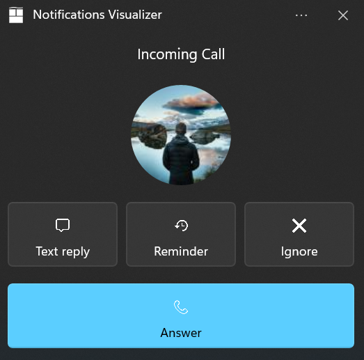

# App Notification Content Builder

# Background

App Notifications are UI popups that contain rich text, controls and images to display a message to
the user. With the Windows App SDK, developers can define an XML payload and display an
AppNotification using the AppNotificationManager::Show API, but defining these XML payloads can be
tedious when written by hand.

To generate an AppNotification like this one:


Developers have to write something like this:

```c++
int sequenceId {1234};
std::wstring pathToImage {LR"(path\to\my\image.png)"};

winrt::hstring xmlPayload{
    L"<toast launch = \"action=AppNotificationClick;sequence=" + to_wstring(sequenceId) + L"\">\
        <visual>\
            <binding template = \"ToastGeneric\">\
                <image placement = \"appLogoOverride\" hint-crop=\"circle\" src = \"" + pathToImage + L"\"/>\
                <text>App Notification with Avatar Image</text>\
                <text>This is an example message using XML</text>\
            </binding>\
        </visual>\
        <actions>\
            <action\
                content = \"Open App\"\
                arguments = \"action=OpenApp&amp;sequence=" + to_wstring(sequenceId) + L"\"/>\
        </actions>\
    </toast>" };

auto appNotification{ winrt::AppNotification(xmlPayload) };
winrt::AppNotificationManager::Default().Show(appNotication);
```

# Description

To improve the AppNotification construction experience, the Windows App SDK is introducing
AppNotificationContent, a builder that constructs simple or rich App Notifications for the
developer.

```c++
AppNotificationContent(
    .AddArgument(L"AppNotificationClick")
    .AddArgument(L"sequence", 1234)
    .SetAppLogoOverrideWithCircleCrop(winrt::Windows::Foundation::Uri(L"http://www.contoso.com"))
    .AddText(L"App Notification with Avatar Image")
    .AddText(L"This is an example message")
    .AddButton(Button(L"Open App")
        .AddArgument(L"action", "OpenAppButton")
        .AddArgument(L"sequence", sequenceId)));
```

# API Components

# AppNotificationContent

The AppNotificationContent component sets up the xml for a \<toast\>. This is the wrapper content
that will include any component adding to the AppNotification UI.

**WinAppSDK 1.2 \<toast\> Schema**:

```c#
<toast
    launch? = string
    duration? = "long" | "short"
    displayTimeStamp? = string
    scenario? = "reminder" | "alarm" | "incomingCall" | "urgent"
    useButtonStyle? = boolean>
      <!-- Child elements -->
    visual, audio?, actions?
</toast>
```

These attributes are abstracted away through the AppNotificationContent component APIs:

-   AppNotificationContent();
-   AddArgument(String key, String value)
-   SetTimeStamp(String timeStamp)
    -   Must be in ISO 8601 format
        -   Example: 2022-06-19T08:30:00Z
-   SetScenarioType(ScenarioType scenarioType)
    -   ScenarioType::Reminder
    -   ScenarioType::Alarm
    -   ScenarioType::IncomingCall
    -   ScenarioType::Urgent

useButtonStyle will only be set if Button::SetButtonStyle is used.

All the UI components are able to be appended through the AppNotificationContent component APIs:

-   AddText(...)
-   AddButton(Button button)
-   Set[type]Image(...)
    - Inline
    - AppLogoOverride
    - Hero
-   SetAudio(...)
-   AddTextBox(...)
-   AddComboBox(...)

Below is an example usage:

```c#
AppNotificationContent(
    .AddArgument(L"action", L"answer")
    .AddArgument(L"callId", 938163)
    .SetDuration(Duration::Long)
    .SetTimeStamp(L"2022-06-19T08:30:00Z")
    .SetScenarioType(ScenarioType::IncomingCall)
        .AddText(L"Incoming Call", TextProperties().UseCallScenarioAlign())
        .AddInlineImageWithCircleCrop(winrt::Windows::Foundation::Uri(LR"(https://unsplash.it/100?image=883)"))
        .AddButton(Button(L"Text Reply")
            .AddArgument(L"action", L"textReply")
            .AddArgument(L"callId", 938163)
            .SetIconUri(winrt::Windows::Foundation::Uri(LR"(Assets/Icons/message.png)")))
        .AddButton(Button(L"Reminder")
            .AddArgument(L"action", L"reminder")
            .AddArgument(L"callId", 938163)
            .SetIconUri(winrt::Windows::Foundation::Uri(LR"(Assets/Icons/reminder.png)")))
        .AddButton(Button(L"Ignore")
            .AddArgument(L"action", L"ignore")
            .AddArgument(L"callId", 938163)
            .SetIconUri(winrt::Windows::Foundation::Uri(LR"(Assets/Icons/cancel.png)")))
        .AddButton(Button(L"Answer")
            .AddArgument(L"action", L"answer")
            .AddArgument(L"callId", 938163)
            .SetIconUri(winrt::Windows::Foundation::Uri(LR"(Assets/Icons/telephone.png)")))
    .GetXml();
```

Result from GetXml():

```c#
<toast launch="action=answer;callId=938163" scenario="incomingCall"
        displayTimestamp="2022-06-19T08:30:00Z">

  <visual>
    <binding template="ToastGeneric">
      <text>Incoming Call</text>
      <image hint-crop="circle" src="https://unsplash.it/100?image=883"/>
    </binding>
  </visual>

  <actions>

    <action
      content="Text reply"
      imageUri="Assets/Icons/message.png"
      activationType="foreground"
      arguments="action=textReply;callId=938163"/>

    <action
      content="Reminder"
      imageUri="Assets/Icons/reminder.png"
      activationType="background"
      arguments="action=reminder;callId=938163"/>

    <action
      content="Ignore"
      imageUri="Assets/Icons/cancel.png"
      activationType="background"
      arguments="action=ignore;callId=938163"/>

    <action
      content="Answer"
      imageUri="Assets/Icons/telephone.png"
      arguments="action=answer;callId=938163"/>

  </actions>

</toast>
```

Example result:



If the developer wants the XML payload to add more components, AppNotificationContent::GetXml will
return the current version of their AppNotificationContent in a string format.

```c#
winrt::hstring xmlPayload{ AppNotificationContent()
      .AddText(L"Content")
    .GetXml() };
```

Output

```c#
<toast>
  <visual>
    <binding template="ToastGeneric">
      <text>Content</text>
    </binding>
  </visual>
</toast>
```

## Limitations

-   ScenarioType::Urgent is only supported for to builds 19041 (20H1) and above. Using this
    attribute on lower builds will not prevent the AppNotification from being constructed, but
    developers will receive a debug warning that the attribute is not supported.

# Text

The Text component sets up the xml for a \<text\> element. Developers can define the content,
language, and placement of the text on the AppNotification.

**WinAppSDK 1.2 \<text\> Schema**:

```c#
<text lang? = string
      placement? = "attribution"
      hint-callScenarioCenterAlign? = 
      hint-maxLines? = integer />
```

These attributes are abstracted with the TextProperties component APIs:

-   SetLanguage(String language)
-   SetHintMaxLines(Int32)
-   UseCallScenarioAlign()

Below are some example usages:

```c#
AppNotificationContent()
    .AddText(L"Content")
    .SetAttributionText(L"Attribution Text")
    .GetXml();
```

XML output:

```c#
<toast>
  <visual>
    <binding template="ToastGeneric">
      <text>Content</text>
      <text placement="attribution">Attribution Text</text>
    </binding>
  </visual>
</toast>
```


Developers can use UseCallScenarioAlign() to center the text like an incoming call. This feature
will be ignored unless the AppNotification scenario is set to IncomingCall using
AppNotificationContent::SetScenarioType(enum ScenarioType). 

```c#
AppNotificationContent()
    .SetScenarioType(ScenarioType::IncomingCall)
    .AddText(L"Incoming Call", TextProperties()
        .UseCallScenarioAlign())
    .AddText(L"Andrew Barnes", TextProperties()
        .UseCallScenarioAlign())
    .AddInlineImageWithCircleCrop(winrt::Windows::Foundation::Uri(L"https://unsplash.it/100?image=883"))
    .AddButton(Button()
        .SetIconUri(winrt::Windows::Foundation::Uri(L"https://www.shareicon.net/data/256x256/2015/10/17/657571_video_512x512.png"))
        .SetButtonStyle(ButtonStyle::Success)
        .SetToolTip(L"Answer video call"))
    .GetXml();
```

XML output:

```c#
<toast scenario="incomingCall" useButtonStyle="true">
    <visual>
        <binding template="ToastGeneric">
            <text hint-callScenarioCenterAlign = "true">Incoming Call</text>
            <text hint-callScenarioCenterAlign = "true">Andrew Barnes</text>
            <image hint-crop="circle"  src="https://unsplash.it/100?image=883"/>
        </binding>
    </visual>

    <actions>
        <action
              arguments="videoCallId"
              content=""
              imageUri="https://www.shareicon.net/data/256x256/2015/10/17/657571_video_512x512.png"
              hint-buttonStyle = "Success"
              hint-toolTip = "Asnwer video call"/>
</toast>
```


# Button

The Button component API sets up the xml for the \<action\> element. Buttons are user-clickable
components meant to start an action from the app.

**WinAppSDK 1.2 \<action\> Schema**:

```c#
<action content = string
        arguments = string 
        placement? = "contextMenu"
        imageUri? = string
        hint-inputid? = string
        hint-buttonStyle? = "success" | "critical"
        hint-toolTip? = string />
```

These attributes are abstracted with the Button component APIs:

-   Button()
-   Button(String content)
-   SetIconUri(Windows.Foundation.Uri iconUri)
-   SetToolTip(String toolTip)
-   UseContextMenuPlacement()
-   SetInputId(String inputId)

Below are some example usages:

```c#
AppNotificationContent()
    .AddText(L"Content")
    .AddTextBox(L"textBox", L"Reply")
    .AddButton(Button(L"Send")
        .AddArgument(L"action", L"textReply")
        .SetIconUri(winrt::Windows::Foundation::Uri(LR"(Assets/Icons/send.png)"))
        .SetInputId(L"textBox"))
    .GetXml();
```

XML output:

```c#
<toast>
  <visual>
    <binding template="ToastGeneric">
      <text>Content</text>
    </binding>
  </visual>

    <actions>
        <input id="textBox" type="text" placeHolderContent="Reply"/>
        <action
          content="Send"
          imageUri="Assets/Icons/send.png"
          hint-inputId="textBox"
          arguments="action=textReply"/>
    </actions>
</toast>
```

Example result: 

Developers can change the color of the button using SetButtonStyle(ButtonStyle). The two button
styles are ButtonStyle::Success (green) and ButtonStyle::Critical (red).

```c#
AppNotificationContent()
    .SetScenarioType(ScenarioType::IncomingCall)
    .AddText(L"Incoming Call", TextProperties()
        .UseCallScenarioAlign())
    .AddText(L"Andrew Barnes", TextProperties()
        .UseCallScenarioAlign())
    .AddInlineImageWithCircleCrop(winrt::Windows::Foundation::Uri(L"https://unsplash.it/100?image=883"))
    .AddButton(Button()
        .AddArgument(L"videoCall", L"938465")
        .SetIconUri(winrt::Windows::Foundation::Uri(L"https://www.shareicon.net/data/256x256/2015/10/17/657571_video_512x512.png"))
        .SetButtonStyle(ButtonStyle::Success)
        .SetToolTip(L"Answer video call"))
    .AddButton(Button()
        .AddArgument(L"voiceCall", L"938465")
        .SetIconUri(winrt::Windows::Foundation::Uri(L"https://www.nicepng.com/png/full/379-3794777_white-phone-icon-white-phone-call-icon.png"))
        .SetButtonStyle(ButtonStyle::Success)
        .SetToolTip(L"Answer voice call"))
    .AddButton(Button()
        .AddArgument(L"declineCall", L"938465")
        .SetIconUri(winrt::Windows::Foundation::Uri(L"https://static.thenounproject.com/png/5012-200.png"))
        .SetButtonStyle(ButtonStyle::Critical)
        .SetToolTip(L"Decline all"))
    .GetXml();
```

Xml result:

```c#
<toast scenario="incomingCall" useButtonStyle="true">
    <visual>
        <binding template="ToastGeneric">
            <text hint-callScenarioCenterAlign = "true">Incoming Call</text>
            <text hint-callScenarioCenterAlign = "true">Andrew Barnes</text>
            <image hint-crop="circle"  src="https://unsplash.it/100?image=883"/>
        </binding>
    </visual>

    <actions>
        <action
              arguments="videoCall=938465;action=accept"
              content=""
              imageUri="https://www.shareicon.net/data/256x256/2015/10/17/657571_video_512x512.png"
              hint-buttonStyle = "Success"
              hint-toolTip = "Answer video call"/>
        <action
              arguments="voiceCall=938465"
              content=""
              imageUri="https://www.nicepng.com/png/full/379-3794777_white-phone-icon-white-phone-call-icon.png"
              hint-buttonStyle = "Success"
              hint-toolTip = "Answer voice call"/>
        <action
              arguments="declineCall=938465"
              content=""
              imageUri="https://static.thenounproject.com/png/5012-200.png"
              hint-buttonStyle = "Critical"
              hint-toolTip = "Decline all"/>
      </actions>
</toast>
```

Example result: 

The ToolTip is useful for buttons with icons and no content. Users can hover over the button with
the cursor and a text will display describing what the button does.

```c#
AppNotificationContent()
    .AddText(L"Content")
    .AddTextBox(L"textBox", L"Reply")
    .AddButton(Button()
        .AddArgument(L"action", L"textReply")
        .SetInputId(L"textBox")
        .SetToolTip(L"Send")
        .SetIconUri(winrt::Windows::Foundation::Uri(LR"(Assets/Icons/message.png)")))
    GetXml();
```

XML output:

```c#
<toast>
  <visual>
    <binding template="ToastGeneric">
      <text>Content</text>
    </binding>
  </visual>

    <actions>
            <input id="textBox" type="text" placeHolderContent="Reply"/>
            <action
            content=""
            imageUri="Assets/Icons/message.png"
            hint-inputId="textBox"
            hint-toolTip="Send"
            arguments="action=textReply"/>
    </actions>
</toast>
```

Example result: 

The placement attribute defines action for a user to interact with when the AppNotification is
right-clicked. This would typically be used by developers to ask the user for setting changes.

```c#
AppNotificationContent()
    .AddText(L"Content")
    .AddTextBox(L"textBox", L"Reply"))
    .AddButton(Button(L"Modify app settings")
        .AddArgument(L"action", L"textReply")
        .UseContextMenuPlacement())
    .GetXml();
```

XML output:

```c#
<toast>
  <visual>
    <binding template="ToastGeneric">
      <text>Content</text>
    </binding>
  </visual>

    <actions>
            <input id="textBox" type="text" placeHolderContent="Reply"/>
            <action
            placement="contextMenu"
            content="Modify app settings"
            imageUri="Assets/Icons/message.png"
            arguments="action=textReply"/>
    </actions>
</toast>
```

Example result: 

## Limitations

-   hint-toolTip and hint-buttonStyle are only supported for builds 19041 (20H1) and above. Using
    these attributes on lower builds will not prevent the AppNotification from being constructed,
    but developers will receive a debug warning that the attributes are not supported.

# Image

The Image component API sets up the xml for the \<image\> element. Images are visual elements that
are used to enhance an AppNotification.

The image source can be pulled using one of these protocol handlers:

-   http:// or https:// (A web-based image) (unavailable for unpackageds on build 22000)
-   ms-appx:/// (An image included in the app package) (only for packaged applications)
-   ms-appdata:///local/ (An image saved to local storage) (only for packaged applications)
-   file:/// (A local image)

**WinAppSDK 1.2 \<image\> Schema**:

```c#
<image src = string
       alt? = string
       placement? = "appLogoOverride" | "hero"
       hint-crop? = "circle" />
```

Images can be displayed in three different ways:

## Inline

A full-width inline-image that appears when you expand the AppNotification.

```c#
AppNotificationContent()
    .AddText(L"Below is an inline image")
    .SetInlineImage(winrt::Windows::Foundation::Uri(LR"(https://unsplash.it/360/202?image=883)"))
    .GetXml();
```

XML output:

```c#
<toast>
  <visual>
    <binding template="ToastGeneric">
      <text>Below is an inline image</text>
      <image src="https://unsplash.it/360/202?image=883">
    </binding>
  </visual>
</toast>
```

Example result: 

## AppLogoOverride

An image that is left-aligned with notification text.

```c#
AppNotificationContent()
    .AddText(L"To the left is an AppLogoOverride")
    .SetAppLogoOverride(winrt::Windows::Foundation::Uri(LR"(https://unsplash.it/64?image=669)"))
  .GetXml();
```

XML output:

```c#
<toast>
  <visual>
    <binding template="ToastGeneric">
      <text>To the left is an AppLogoOverride</text>
      <image src="https://unsplash.it/64?image=669"
                placement="appLogoOverride" />
    </binding>
  </visual>
</toast>
```

Example result: 

## Hero

Prominently displays image within the AppNotification banner and while inside Notification Center.

```c#
AppNotificationContent()
    .AddText(Text(L"Above is a Hero image"))
    .SetHeroImage(winrt::Windows::Foundation::Uri(LR"(https://unsplash.it/360/180?image=1043)"))
  .GetXml();
```

XML output:

```c#
<toast>
  <visual>
    <binding template="ToastGeneric">
      <text>Above is a Hero image</text>
      <image src="https://unsplash.it/360/180?image=1043"
                placement="hero" />
    </binding>
  </visual>
</toast>
```

Example result: 

For both Inline and AppLogoOverride, developers can set how the image will be cropped.

## Cropped AppLogoOverride

```c#
AppNotificationContent()
    .AddText(L"To the left is a cropped AppLogoOverride")
    .SetAppLogoOverrideWithCircleCrop(winrt::Windows::Foundation::Uri(LR"(https://unsplash.it/64?image=669)"))
    .Show();
```

XML output:

```c#
<toast>
  <visual>
    <binding template="ToastGeneric">
      <text>To the left is a cropped AppLogoOverride</text>
      <image src="https://unsplash.it/64?image=669"
                hint-crop="circle"
                placement="appLogoOverride" />
    </binding>
  </visual>
</toast>
```

Example result: 

# Audio

The Audio component allows the developer to define a custom audio to play when an AppNotification is
displayed. The audio file can be defined by string value pointing to an app asset or one of the
[ms-winsoundevents](https://docs.microsoft.com/en-us/uwp/schemas/tiles/toastschema/element-audio).

**WinAppSDK 1.2 \<audio\> Schema**:

```c#
<audio src? = string
       loop? = boolean
       silent? = boolean />
```

These attributes are abstracted with the Audio component APIs:

-   SetAudio(Windows.Foundation.Uri audioUri)
-   SetAudio(MSWinSoundEvent winSoundEvent)
-   SetAudio(Windows.Foundation.Uri audioUri, Duration duration)
-   SetAudio(MSWinSoundEvent winSoundEvent, Duration duration)
-   MuteAudio()

Below are some example usages:

```c#
AppNotificationContent()
      .SetAudio(MSWinSoundEvent::Reminder)
    GetXml();
```

XML output:

```c#
<toast>
  <visual>
    <binding template="ToastGeneric">
    </binding>
  </visual>
  <audio src="ms-winsoundevent:Notification.Reminder" />
</toast>
```

Developers can define if the audio should be looped using SetLoopDuration(bool), which can
be short or long.

```c#
AppNotificationContent()
    .AddText(L"Content")
    .SetAudio(MSWinSoundEvent::Alarm, Duration::Long)
    .GetXml();
```

XML output:

```c#
<toast duration="long">
  <visual>
    <binding template="ToastGeneric">
        <text>Above is a Hero image</text>
    </binding>
  </visual>
  <audio src="ms-winsoundevent:Notification.Looping.Alarm" loop="true" />
</toast>
```

An AppNotification that does not want to play any audio including the default, can use
SetIsMuted(bool) to mute the audio.

```c#
AppNotificationContent()
    .AddText(L"Content")
    .MuteAudio()
    .Show();
```

XML output:

```c#
<toast duration="long">
  <visual>
    <binding template="ToastGeneric">
        <text>Content</text>
    </binding>
  </visual>
  <audio silent="true" />
</toast>
```

# TextBox

TextBox is an \<input\> component that allows users to type custom responses on an AppNotification.

**WinAppSDK 1.2 TextBox Schema**:

```c#
<input id = string
        type="text"
        placeHolderContent? = string>
</input>
```

These attributes are abstracted with the TextBox component APIs:

-   TextBox(String id)
-   TextBox(String id, String placeHolderContent)

Below is an example use:

```c#
AppNotificationContent()
    .AddTextBox(L"textBox", L"reply")
    .AddButton(Button(L"Send")
        .AddArguments(L"action", L"Send")
        .SetInputId(L"textBox"))
    .GetXml();
```

XML output:

```c#
<toast>
  <visual>
    <binding template="ToastGeneric">
    </binding>
  </visual>

  <actions>
    <input id="textBox" type="text" />
    <action
      arguments="action=Send"
      content="Send"
      hint-inputId="textBox" />
  </actions>

</toast>
```

Example result: 

# ComboBox

ComboBox is an \<input\> component that allows users to pick from a dropdown menu of values on
an AppNotification.

**WinAppSDK 1.2 ComboBox Schema**:

```c#
<input id = string
        type="selection"
        defaultInput? = string>
    <!-- Child elements -->
    selection{0,5}
</input>
```

These attributes are abstracted with the ComboBox component APIs:

-   ComboBox(String id)
-   SetDefaultSelection(String id)
-   AddSelection(String id, String content)

Below is an example use:

```c#
AppNotificationContent()
    .AddComboBox(ComboBox(L"ComboBox")
        .SetDefaultSelection(L"yes")
        .AddSelection(L"yes", L"Going")
        .AddSelection(L"maybe", L"Maybe")
        .AddSelection(L"no", L"Decline"))
    .AddButton(Button(L"Send")
        .AddArgument(L"action", L"Send"))
        .SetInputId(L"ComboBox"))
    .GetXml();
```

XML output:

```c#
<toast>
  <visual>
    <binding template="ToastGeneric">
    </binding>
  </visual>

  <actions>
    <input id="ComboBox" type="selection" defaultInput="yes">
      <selection id="yes" content="Going" />
      <selection id="maybe" content="Maybe" />
      <selection id="no" content="Decline" />
    </input>
    <action
      arguments="action=Send"
      hint-inputId="ComboBox"
      content="Send"/>

  </actions>
</toast>
```

Example result: 

# ProgressBar

ProgressBar is a component that builds the \<progress\> xml. ProgressBar is used to update an
AppNotification that is currently displayed. This allows developers to inform users about the status
of certain operations such as download or install.

**WinAppSDK 1.2 \<progress\> Schema**:

```c#
<progress title? = string
    status = string
    value = string
    valueStringOverride? = string
/>
```

ProgressBar uses data binding to update the active UI. In the WindowsAppSDK, this is done by using
AppNotificationProgressData. Click
[Here](https://github.com/microsoft/WindowsAppSDK/blob/main/specs/AppNotifications/AppNotifications-spec.md#notification-progress-updates)
for an example.

All the attributes have static data binding constants:

-   Status = "{progressStatus}"
-   Value = "{progressValue}"
-   Title = "{progressTitle}"
-   ValueStringOverride = "{progressValueString}

Every ProgressBar component will have the binded status and value. Title and ValueStringOverride are
not required so those constants will not be added unless the developers call the ProgressBar
component APIs

-   UseTitle()
-   UseStaticTitle(String title)
-   UseValueStringOverride()

Below is an example use:

```c#
// Using AppNotificationContent, build the Xml payload with ProgressBar.
winrt::hstring xmlPayload { AppNotificationContent()
    .AddText(L"Downloading this week's new music...")
    .SetProgressBar(ProgressBar()
        .UseTitle()
        .UseValueStringOverride())
    .GetXml() };
```

Xml result:

```c#
<toast>
  <visual>
    <binding template="ToastGeneric">
      <text>Downloading this week's new music...</text>
      <progress
        title="{progressTitle}"
        value="{progressValue}"
        valueStringOverride="{progressValueString}"
        status="{progressStatus}"/>
    </binding>
  </visual>
</toast>
```

Construct an AppNotification with the string xml payload from AppNotificationContent

```c#
winrt::Microsoft::Windows::AppNotifications::AppNotification notification(xmlPayload);
notification.Tag(L"Tag");
notification.Group(L"Group");
```

Assign initial values for first notification progress UI

```c#
winrt::Microsoft::Windows::AppNotifications::AppNotificationProgressData data(1 /* Sequence number */);
data.Title(L"Katy Perry"); // Binds to {progressTitle} in xml payload
data.Value(0.5); // Binds to {progressValue} in xml payload
data.ValueStringOverride(L"1/2 songs"); // Binds to {progressValueString} in xml payload
data.Status(L"Downloading..."); // Binds to {progressStatus} in xml payload

notification.Progress(data); // Updates the AppNotification values
winrt::AppNotificationManager::Default().Show(notification);
```

Example result: 

Then update the ProgressBar using AppNotificationProgressData:

```c#
data.SequenceNumber(2);
data.Title(L"Katy Perry"); // Binds to {progressTitle} in xml payload
data.Value(1.0); // Binds to {progressValue} in xml payload
data.ValueStringOverride(L"2/2 songs"); // Binds to {progressValueString} in xml payload
data.Status(L"Downloaded!"); // Binds to {progressStatus} in xml payload

auto result = co_await winrt::Microsoft::Windows::AppNotifications::AppNotificationManager::Default().UpdateAsync(data, L"Tag", L"Group");
```

Example result: 

# Retrieving Arguments
AppNotificationContent and Button return arguments to the activated application when the user clicks on the component. Developers can
add multiple key/value pairs and Windows App SDK will serialize them into a string.

Below is an example with AppNotificationContent and Button:

```c#
AppNotificationContent(
    .AddArgument(L"action", L"appNotificationBodyTouch")
    .AddArgument(L"user", 938163)
    .AddButton(Button(L"Send")
        .AddArgument(L"action", L"buttonTouch")
        .AddArgument(L"user", 938163)));
```

When the user clicks on the AppNotification body, the resulting argument string is:
- "action=appNotificationBodyTouch;user=938163"

When the user clicks on the Button, the result argument string is:
- "action=buttonTouch;callId=938163"

Notice that ';' is used as the delimiter between each argument.

To retrieve the arguments from the serialized string, developers will use
AppNotificationReceivedEventArgs::Arguments to get the values from the argument string as a map.

Below is an example usage:
```c#
using namespace winrt::Microsoft::Windows::AppLifecycle;
using namespace winrt::Microsoft::Windows::AppNotifications;

// Retrieve the activation args using Windows App SDK AppLifecycle functions
AppActivationArguments args { AppLifecycle::AppInstance::GetCurrent().GetActivatedEventArgs() };
ExtendedActivationKind kind { args.Kind() };

// Check the activation kind
if (kind == ExtendedActivationKind::AppNotification)
{
    AppNotificationActivatedEventArgs appActivatedArgs { args.Data().as<AppNotificationActivatedEventArgs>() };

    // Retrieve the serialized arguments from AppNotificationActivatedEventArgs
    winrt::Windows::Foundation::Collections::IMap<winrt::hstring, winrt::hstring> argumentMap { appActivatedArgs.Argument() };
}
```
# Full API Details

```c#
namespace Microsoft.Windows.AppNotifications.Builder
{
    runtimeclass TextProperties
    {
        // Contains the set of <text> attributes
        TextProperties();

        TextProperties SetLanguage(String language);
        TextProperties UsesCallScenarioAlign();
        TextProperties SetMaxLines(Int32 maxLines);

        String GetXml();
    }

    enum ButtonStyle
    {
        Success, // The button will be green
        Critical, // The button will be red
    };

    runtimeclass Button
    {
        // Button can use ToolTip instead of content which requires empty content.
        // Argument attribute is required and uses the ArgumentSerializer construct
        // to add arguments to the button.
        Button();
        Button(String content);

        Button AddArgument(String key, String value);

        // Sets the IconUri for the button.
        Button SetIconUri(Windows.Foundation.Uri iconUri);

        // The tooltip for a button, if the button has an empty content string.
        Button SetToolTip(String toolTip);

        // Sets the Button as context menu action.
        Button UseContextMenuPlacement();

        // Sets the ButtonStyle to Success or Critical
        Button SetButtonStyle(ButtonStyle buttonStyle);

        // Sets the ID of an existing TextBox in order to have this button display to the right of the input.
        Button SetInputId(String inputId);

        // Launches the URI passed into the button when activated.
        Button SetProtocolActivation(Windows.Foundation.Uri protocolUri);
        Button SetProtocolActivation(Windows.Foundation.Uri protocolUri, String targetApplicationPfn);

        // Retrieves the XML content of the button.
        String GetXml();
    };

    runtimeclass ComboBox
    {
        ComboBox(String id);

        // Add a selection item to the ComboBox if InputType is ComboBox. The id parameter is used to retrieve the user input when the app is activated
        // and content is the displayed text for the item.
        ComboBox AddSelection(String id, String content);

        // Sets the default selection to be displayed by the ComboBox
        ComboBox SetDefaultSelection(String id);

        // Retrieves the XML content of the input.
        String GetXml();
    };

    runtimeclass ProgressBar
    {
        // ProgressBar binds to AppNotificationProgressData so the AppNotification will
        // receive every update to the status and value. In the WinAppSDK, these binding
        // values are static, so developers won't need to define these binding values
        // themselves.
        ProgressBar();

        // Adds the title binding value.
        ProgressBar UseTitle();

        // Adds the valueStringOverride value.
        ProgressBar UseValueStringOverride();

        // Retrieves the XML content of the ProgressBar
        String GetXml();
    };

    enum MSWinSoundEvent
    {
        Default,
        IM,
        Mail,
        Reminder,
        SMS,
        Alarm,
        Alarm2,
        Alarm3,
        Alarm4,
        Alarm5,
        Alarm6,
        Alarm7,
        Alarm8,
        Alarm9,
        Alarm10,
        Call,
        Call2,
        Call3,
        Call4,
        Call5,
        Call6,
        Call7,
        Call8,
        Call9,
        Call10,
    };

    enum ScenarioType
    {
        Default, // The normal AppNotification behavior. The AppNotification appears for a short duration, and then automatically dismisses into Notification Center.
        Reminder, // The notification will stay on screen until the user dismisses it or takes action.
        Alarm,    // Alarms behave like Reminder, but alarms will additionally loop audio with a default alarm sound.
        IncomingCall, // Incoming call notifications are displayed pre-expanded in a special call format and stay on the user's screen till dismissed.
        Urgent, // Important notifications allow users to have more control over what 1st party and 3rd party apps can send them high-priority AppNotifications (urgent/important) that can break through Focus Assist.
    };

    enum Duration
    {
        Short, // Default value. AppNotification appears for a short while and then goes into Notification Center.
        Long, // AppNotification stays on-screen for longer, and then goes into Notification Center.
    };

    runtimeclass AppNotificationContent
    {
        AppNotificationContent();

        // Adds arguments to the launch attribute to return when AppNotification is clicked.
        AppNotificationContent AddArgument(String key, String value);

        // Sets the timeStamp of the AppNotification to when it was constructed instead of when it was sent.
        AppNotificationContent SetTimeStamp(Windows.Foundation.DateTime timeStamp);

        // Sets the scenario of the AppNotification.
        AppNotificationContent SetScenarioType(ScenarioType scenarioType);

        // Adds text to the AppNotification.
        AppNotificationContent AddText(String text);
        AppNotificationContent AddText(String text, TextProperties properties);

        AppNotificationContent SetAttributionText(String text);
        AppNotificationContent SetAttributionText(String text, String language);

        // Sets the full-width inline-image that appears when you expand the AppNotification
        AppNotificationContent SetInlineImage(Windows.Foundation.Uri imageUri);
        AppNotificationContent SetInlineImage(Windows.Foundation.Uri imageUri, String alternateText);

        AppNotificationContent SetInlineImageWithCircleCrop(Windows.Foundation.Uri imageUri);
        AppNotificationContent SetInlineImageWithCircleCrop(Windows.Foundation.Uri imageUri, String alternateText);
        
        // Sets the image that is left-aligned with notification text
        AppNotificationContent SetAppLogoOverride(Windows.Foundation.Uri imageUri);
        AppNotificationContent SetAppLogoOverride(Windows.Foundation.Uri imageUri, String alternateText);

        AppNotificationContent SetAppLogoOverrideCirleCrop(Windows.Foundation.Uri imageUri);
        AppNotificationContent SetAppLogoOverrideCirleCrop(Windows.Foundation.Uri imageUri, String alternateText);
        
        // Sets the image that displays within the banner of the AppNotification.
        AppNotificationContent SetHeroImage(Windows.Foundation.Uri imageUri);
        AppNotificationContent SetHeroImage(Windows.Foundation.Uri imageUri, String alternateText);

        // SetAudio
        [default_overload]
        AppNotificationContent SetAudio(Windows.Foundation.Uri audioUri);
        AppNotificationContent SetAudio(MSWinSoundEvent msWinSoundEvent);

        [default_overload]
        AppNotificationContent SetAudio(Windows.Foundation.Uri audioUri, Duration duration);
        AppNotificationContent SetAudio(MSWinSoundEvent msWinSoundEvent, Duration duration);

        AppNotificationContent MuteAudio();

        // Add an input textbox to retrieve user input.
        AppNotificationContent AddTextBox(String id);
        AppNotificationContent AddTextBox(String id, String placeHolderText, String title);

        // Adds a button to the AppNotificationContent
        AppNotificationContent AddButton(Button button);

        // Add an input ComboBox to retrieve user input.
        AppNotificationContent AddComboBox(ComboBox comboBox);

        AppNotificationContent SetProgressBar(ProgressBar progressBar);
        
        // Retrieves the notification XML content so that it can be used with a local
        // AppNotification constructor.
        String GetXml();
    };
}
```
