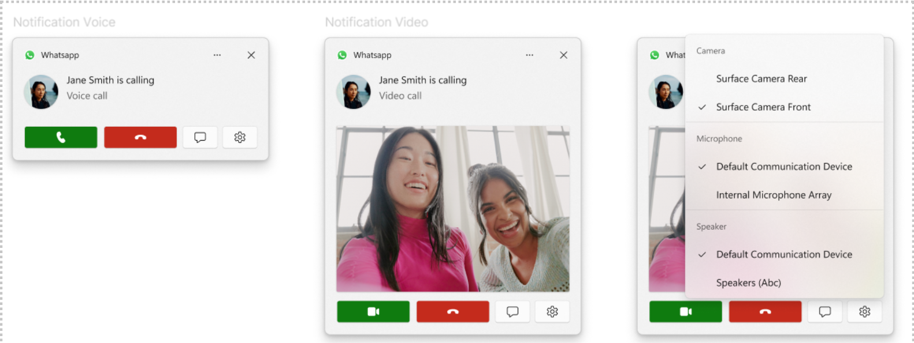

# App Notifications in Windows App SDK

# Background

App Notifications are UI popups that contain rich text, controls and images to display a message to
the user. It is not sufficient for a Notification popup on the screen to simply be displayed to the
user, it should be actionable. The user should be able to click on a Notification popup to launch an
app in the correct context. For example, a news article related Notification is expected to launch
the News app along with the article in question in the foreground. Another actionable scenario is
for the user to actually interact with the contents of the Notification popup like a UI control
button. For example, a messaging app like Teams that displays a message from another user could have
a "Respond To" textbox and button so that the user can directly respond to the message in the popup
without having to launch the application. This scenario triggers a background process on behalf of
the application (with no UI) which inturn processes the "Reply To" message and forwards the response
to the other device.

Notifications could have a local or cloud based origin. In the case of Local Notifications, the
message always originates from the app installed on the device. For Cloud Notifications, the message
always originates from a remote application service that targets the locally installed app in
question.

Here is a visual representation of a simple Notification with no interactive controls:


Here is a visual representation of a Notification with simple button controls:


Here is a visual representation of a Notification with a Message "Reply To" option:


For more details see:

-   [Toast Notification WinRT APIs](https://docs.microsoft.com//uwp/api/Windows.UI.Notifications.ToastNotification?view=winrt-20348)
    Defines all the API constructs that we have for Notifications in WinRT today.
-   [Toast Notification UX Guidance using Toolkit](https://docs.microsoft.com/windows/apps/design/shell/tiles-and-notifications/toast-ux-guidance)
    Defines the UX Guidance for developers who want to display Notifications.
-   [Sending Local Toasts using C# using Toolkit](https://docs.microsoft.com/windows/apps/design/shell/tiles-and-notifications/send-local-toast?tabs=uwp)
    Defines how an app developer can send interactive Notifications to the user and configure these
    Notifications to respond to user actions.

## The problems today

**Cloud Notification integration with Windows App SDK**: While we support Push scenarios for Raw
Notifications in WinAppSDK, we do not support Cloud Sourced App Notifications. We need to fill this
gap.

**API fragmentation**: There are too many API technologies that display Notifications and setup
their activation handlers today: Windows SDK, Desktop App Activations via the COM Model and the
Windows Toolkit which is a Nuget library. It gets overwhelming for a developer who does not
understand all these technologies to ramp up and get Notifications working for their app.

**Support and Troubleshooting Notifcation Issues**: Because of the API fragmentation mentioned
above, it is also very difficult to diagnose issues when developers hit them and a large portion of
developer cycles are spent diagnosing and troubleshooting problems in various API stacks instead of
a single stack.

**Registration**: The Windows SDK today provides AppId overloads to developers who can specify their
own Identifier for Unpackaged apps. This overloaded AppId causes all sorts of problems including
string size limits being hit, Personally Identifiable Information stored as part of AppIds, invalid
Desktop Registrations etc. The WinApp SDK gets rid of the AppId overloads in the Public APIs and
ensures that we don't hit any of the above issues.

**Activation**: Setting up activation handlers using Background Triggers is challenging for
developers because we don't have downlevel support for versions prior to 1903. Moreover, the steps
for setting up activation handlers vary greatly for different app types: MSIX Vs Unpackaged Vs UWP.
We will abstract away the activation technology and simplify this process for OS SKUs from RS5
onwards.

# Description

The WinAppSDK AppNotification APIs enable all Desktop applications to display the same rich UI
pop-ups that they are used to doing today minus all the complexities and overhead described above.
Desktop applications include Unpackaged apps and Packaged win32 (MSIX Desktop Bridge, Sparse Signed
Packages). The SDK implementation will ensure that all Notification scenarios will adhere to OS
resource management policies like Power Saver, Network Attribution (reporting the amount of data an
app uses), Group Policies, etc. The SDK will also abstract away the complexities of dealing with
Notification delivery and related activations as much as possible freeing the developer to focus on
other app related challenges.

The App Notification API allows Packaged and Unpackaged apps to:

-   Use common APIs to Register and Unregister Notifications.
-   Use common APIs to display Cloud Sourced Notifications.
-   Use common APIs to display Local Notifications.
-   Use common APIs to Update/Delete Notifications.
-   Use AppLifecycle constructs and event handlers to process invoke operations on behalf of the
    user.

# Examples

## Registering and handling a notification

Packaged and Unpackaged Desktop apps will need to register themselves to handle App Notifications.
For Packaged apps, WinAppSDK will use the CLSID defined in the appx manifest to register the current
process as the COM Server for Notification invokes. The process.exe declared in the manifest will
have to be the same process calling into Register() for the API call to succeed. For Unpackaged
apps, WinAppSDK will determine appropriate DisplayName and and Icon. The current process module(.exe
file) will be the COM Server for Notification invokes.

```cpp

int main()
{
    // To ensure all Notification handling happens in this process instance, register for
    // NotificationInvoked before calling Register(). Without this a new process will
    // be launched to handle the notification.
    const auto token = winrt::AppNotificationManager::Default().NotificationInvoked([](const auto&, const winrt::AppNotificationActivatedEventArgs& notificationActivatedEventArgs)
    {
        ProcessNotificationArgs(notificationActivatedEventArgs);
    });

    auto manager = winrt::AppNotificationManager::Default();
    manager.Register();

    auto args = winrt::AppInstance::GetCurrent().GetActivatedEventArgs();
    auto kind = args.Kind();

    if (kind == winrt::ExtendedActivationKind::Launch)
    {
        // App does Launch Stuff Here
    }
    else if (kind == winrt::ExtendedActivationKind::AppNotification)
    {
        auto notificationActivatedEventArgs = args.Data().as<winrt::AppNotificationActivatedEventArgs>();
        ProcessNotificationArgs(notificationActivatedEventArgs);
    }

    // other app init and then message loop here

    // Cleanup event handler
    manager.NotificationInvoked(token);

    // Call Unregister() before exiting main so that subsequent invocations will launch a new process
    manager.Unregister();
    return 0;
}
```

## Registering for App Notifications using assets

For Unpackaged applications, the developer can Register using a custom Display Name and Icon.
WinAppSDK will register the application and display these assets when an App Notification is received.
The developer should provide both the assets or not provide them at all. Icon provided by the developer
should be a valid supported format. The API supports the formats - png, bmp, jpg, ico. The icon
should reside on the local machine only otherwise the API throws an exception. For Packaged applications,
this API is not applicable and will throw an exception. Below are some examples of usage:

```cpp
int main()
{
    auto manager = winrt::AppNotificationManager::Default();

    std::wstring iconFilepath{ std::filesystem::current_path() / "icon.ico" };
    winrt::hstring displayName{ L"AppNotifications" };

    manager.Register(displayName, winrt::Windows::Foundation::Uri {iconFilepath});

    // other app init and then message loop here

    // Call Unregister() before exiting main so that subsequent invocations will launch a new process
    manager.Unregister();
    return 0;
}
```

```cpp
int main()
{
    auto manager = winrt::AppNotificationManager::Default();

    std::wstring iconFilepath{ std::filesystem::current_path() / "icon.ico" };

    std::wstring displayName{};
    wil::GetModuleFileNameExW(GetCurrentProcess(), nullptr, displayName);

    manager.Register(displayName.c_str(), winrt::Windows::Foundation::Uri {iconFilepath});

    // other app init and then message loop here

    // Call Unregister() before exiting main so that subsequent invocations will launch a new process
    manager.Unregister();
    return 0;
}
```

## Displaying an App Notification

To display a Notification, an app needs to define a payload in xml. In the example below, the
developer wants to do a bunch of things: Replace a prior chat notification from a friend for a
specific chat group. The developer also wants to make sure that the notification is deleted in case
the user reboots the machine.

```cpp
void DisplayNotificationForFriend(winrt::hstring const& payload, winrt::hstring const& friendId, winrt::hstring const& chatGroupId)
{
    winrt::AppNotification notification(payload);

    // Setting GroupId here ensures that the Notification is only replaced for a specific chat group
    notification.Group(chatGroupId);

    // Setting friend id here ensures that the Notification only replaces the one from this specific friend
    notification.Tag(friendId);

    // Developer sets the Expiry property on reboot to true to delete the notification on reboot
    notification.ExpiresOnReboot(true);
    winrt::AppNotificationManager::Default().Show(notification);
}
```

## Processing a user generated Action on the Notification

The app will need to process the invocation in response to a User interacting with the Notification
in Action Centre. There are 2 common scenarios here after the invoke takes place:

1. The developer can choose to have the app launch in a specific UI context OR
2. The developer can choose to have the app evaluate an action specific behavior (like a button
   press in the payload body) without rendering any UI.

The example below goes through a scenario where the developer evaluates the Activation Arguments to
determine whether a foreground window needs to be rendered or whether some background business logic
needs to be run without any special UI rendering.

Note: activationType="background" in the Notification payload body is ignored for Desktop apps. It
is upto the developer to process the Activation Arguments and decide whether to display UI or not.

```cpp
//<toast launch="action=openThread&amp;threadId=92187">
//  <visual>
//      <binding template="ToastGeneric">
//          <text hint-maxLines="1">Jill Bender</text>
//          <text>Check out where we camped last weekend! Incredible!!</text>
//          <image placement="hero" src="https://constoso.com/360/180?image=1043" />
//      </binding>
//  </visual>
//  <actions>
//      <input id="textBox" type="text" placeHolderContent="reply" / >
//      <action
//          content="Send"
//          imageUri="Assets/Icons/send.png"
//          hint-inputId="textBox"
//          activationType="background"
//          arguments="action=reply&amp;threadId=92187" />
//  </actions>
//</toast>

void ProcessNotificationArgs(const winrt::AppNotificationActivatedEventArgs& notificationActivatedEventArgs)
{
    // If the user clicks on a toast, the code will need to launch the chat thread window
    if (std::wstring(notificationActivatedEventArgs.Argument().c_str()).find(L"openThread") != std::wstring::npos)
    {
        GenerateChatThreadWindow();
    }
    else // If the user responds to a message by clicking a button in the notification, we will need to reply back to the other user
    if (std::wstring(notificationActivatedEventArgs.Argument().c_str()).find(L"reply") != std::wstring::npos)
    {
        auto input = notificationActivatedEventArgs.UserInput();
        auto replyBoxText = input.Lookup(L"ReplyBox");

        // Process the reply text
        SendReplyToUser(replyBoxText);
    }
}
```

## Processing Active Notifications

We define Active Notifications as payloads that have already been displayed by the app and show up
in the Action Centre. In this example, the developer want to delete all Active Notifications from a
former friend except if the Notification falls under the Archived group.

```cpp
winrt::Windows::Foundation::IAsyncAction RemoveAllNotificationsFromFormerFriendAsync(const std::wstring friendId)
{
    winrt::AppNotificationManager manager = winrt::AppNotificationManager::Default();
    auto notifications = co_await manager.GetAllAsync();

    for (auto notification : notifications)
    {
        // We remove all notifications with the friend who sent them.The tag is the friendId.
        // We target all possible chat groups where this friend is present except the Archived group
        if (notification.Tag() == friendId && notification.Group() != L"Archived")
        {
            co_await manager.RemoveByTagAndGroupAsync(notification.Tag(), notification.Group());
        }
    }
}
```

## Notification Progress Updates

Sometimes a developer would like to show progress bar related updates in a Notification:


To accomplish that, the developer will need to use the AppNotificationProgressData construct to
update the progress bar on the screen.

```cpp

const winrt::hstring c_tag = L"weekly-playlist";
const winrt::hstring c_group = L"downloads";

// Send first Notification Progress Update
void SendUpdatableNotificationWithProgress()
{
    winrt::hstring payload =
        LR"(<toast launch="action = viewDownload &amp; downloadId = 9438108">
        <visual>
            <binding template = "ToastGeneric">
                <text>Downloading this week's new music...</text>
                <progress
                    title = "{progressTitle}"
                    value = "{progressValue}"
                    valueStringOverride = "{progressValueString}"
                    status = "{progressStatus}" />
            </binding>
        </visual>
    </toast>)";

    winrt::AppNotification notification(payload);
    notification.Tag(c_tag);
    notification.Group(c_group);

    // Assign initial values for first notification progress UI
    winrt::AppNotificationProgressData data(1);
    data.Title(L"Weekly playlist"); // Binds to {progressTitle} in xml payload
    data.Value(0.6); // Binds to {progressValue} in xml payload
    data.ValueStringOverride(L"15/26 songs"); // Binds to {progressValueString} in xml payload
    data.Status(L"Downloading..."); // Binds to {progressStatus} in xml payload

    notification.Progress(data);
    winrt::AppNotificationManager::Default().Show(notification);
}

// Send subsequent progress updates
winrt::Windows::Foundation::IAsyncAction UpdateProgressAsync()
{
    // Assign new values
    winrt::AppNotificationProgressData data(2 /* Sequence number */ );
    data.Title(L"Weekly playlist"); // Binds to {progressTitle} in xml payload
    data.Value(0.7); // Binds to {progressValue} in xml payload
    data.ValueStringOverride(L"18/26 songs"); // Binds to {progressValueString} in xml payload
    data.Status(L"Downloading..."); // Binds to {progressStatus} in xml payload

    auto result = co_await winrt::AppNotificationManager::Default().UpdateAsync(data, c_tag, c_group);
    if (result == winrt::AppNotificationProgressResult::AppNotificationNotFound)
    {
        // Toast Progress Update Failed since the previous notification update is dismissed by the user! So account for this in your logic by stopping updates or starting a new Progress Update flow.
    }
}
```

## Enhanced UX Notification for Video and Audio Call
The Enhanced UI for Calling Notifications introduces a series of design improvements aimed at making video call notifications clearer, more interactive, and user-friendly. This feature is designed to increase the likelihood of users responding to calls promptly and efficiently by optimizing how notifications are presented and interacted with. We are adding improvements below to video calling UI/UX.  
 
### Interactive Elements: 

- Quick Actions: Integrated buttons for mic and camera to allow users to manage their audio device and camera directly from the notification without needing to switch apps or windows. 
 
- Live camera feed preview: Users can view a live feed of themselves when they make/receive a video call. This will help users be better prepared for video calls and also potentially avoid embarrassing situations.

A screenshot of a Audio and video call



#### Screenshot 1 
Displays an example of Audio Call with new element as the setting button on click of that buttons it should show devices list for Audio Input and Output Devices. 
#### Screenshot 2 and 3
Displays an example of Audio Call with 2 new elements - Camera Preview and Setting Button. Setting button click shows devices list for Audio Input and Output Devices. 

> Note
>  - If the camera device is changed, then the camera preview element should also display the selected device preview. 
>  - The camera preview would be displayed locally on the user machine and camera feed data on notification toast is not sent to app/caller.
>  - The preview will shown only after verifying camera access permissions for both the app and notifications.
  
### Sample Code using notification builder (C++)
```cpp
void SendVideoCallNotification()  
{  
    winrt::AppNotification notification =   
    AppNotificationBuilder()
    .SetScenario(AppNotificationScenario::IncomingCall) 
    .AddText(L"Jill Bender", AppNotificationTextProperties().SetMaxLines(1)) 
    .AddText(L"Incoming Video Call", AppNotificationTextProperties().SetMaxLines(1)) 
    .AddCameraPreview()                                                              /*NEW API*/
    .AddButton(AppNotificationButton() 
        .SetIcon(winrt::Windows::Foundation::Uri(LR"(ms-appx://Assets/Icons/Setting.png)")) 
        .SetSettingType(AppNotificationButtonSettingStyle::VideoCallConfig))                      /*NEW API*/
    .AddButton(AppNotificationButton() 
        .AddArgument(L"action", L"acceptCall") 
        .AddArgument(L"threadId", L"92187") 
        .SetIcon(winrt::Windows::Foundation::Uri(LR"(ms-appx://Assets/Icons/Accept.png)")) 
        .SetButtonStyle(AppNotificationButtonStyle::Success)) 
    .AddButton(AppNotificationButton()
        .AddArgument(L"action", L"declineCall") 
        .AddArgument(L"threadId", L"92187") 
        .SetIcon(winrt::Windows::Foundation::Uri(LR"(ms-appx://Assets/Icons/Decline.png)")) 
        .SetButtonStyle(AppNotificationButtonStyle::Critical)) 
    .AddButton(AppNotificationButton() 
        .AddArgument(L"action", L"message") 
        .AddArgument(L"threadId", L"92187") 
        .SetIcon(winrt::Windows::Foundation::Uri(LR"(ms-appx://Assets/Icons/Message.png)"))) 
    .BuildNotification();

    if(winrt::AppNotificationConferencingConfig::IsCallingPreviewSupported()) /*NEW API*/
    {     
       // Assign Devices Data values for the video call notification
       winrt::AppNotificationConferencingConfig conferencingConfig;                       /*NEW API*/

       conferencingConfig.VideoDeviceId(L"\\?\USB#VID_045E&PID_0990&MI_00#6&db32c28&0&0000#{e5323777-f976-4f5b-9b55-b94699c46e44}\GLOBAL");                            /*NEW API*/
       conferencingConfig.AudioInputDeviceId(L"\\?\SWD#MMDEVAPI#{0.0.1.00000000}.{a19be0b4-e6e9-404b-b3ae-e98dc182e850}#{2eef81be-33fa-4800-9670-1cd474972c3f}");      /*NEW API*/
       conferencingConfig.AudioOutputDeviceId(L"\\?\SWD#MMDEVAPI#{0.0.1.00000000}.{a19be0b4-e6e9-404b-b3ae-e98dc182e850}#{2eef81be-33fa-4800-9670-1cd474972c3f}");     /*NEW API*/
       notification.ConferencingConfig(conferencingConfig); /*NEW API*/
    } 

    winrt::AppNotificationManager::Default().Show(notification);  
}
```
### Sample Code using payload xml (C++)
```cpp
// Send video call notification  
void SendVideoCallNotification()  
{  
    winrt::hstring payload =  LR"( 
<toast scenario="incomingCall" useButtonStyle="true">  
    <visual>  
        <binding template="ToastGeneric">  
            <text hint-maxLines="1">Jill Bender</text>  
            <text hint-maxLines="1">Incoming Video Call</text>  
           <cameraPreview/>  /*NEW TAG*/
      </binding> 
    </visual> 
    <actions>  
        <action  
          content=""  
          imageUri="Assets/Icons/Setting.png"  
          settingType="videoDevices”      /*NEW TAG*/
          arguments=""/>   
        <action  
          content=""  
          imageUri="Assets/Icons/Accept.png"  
         hint-buttonStyle="Success"  
          activationType="background"  
          arguments="action=reply&amp;threadId=92187"/>  
        <action  
          content=""  
          imageUri="Assets/Icons/Decline.png"  
          activationType="background"  
          hint-buttonStyle="Critical"  
          arguments="action=reply&amp;threadId=92187"/>  
         <action  
          content=""  
          imageUri="Assets/Icons/Message.png"  
          activationType="background"  
          arguments="action=reply&amp;threadId=92187"/>  
    </actions>  
</toast> 
)”  

    winrt::AppNotification notification(payload);  

    if(winrt::AppNotificationConferencingConfig::IsCallingPreviewSupported()) /*NEW API*/
    {     
       // Assign Devices Data values for the video call notification  
       winrt::AppNotificationConferencingConfig conferencingConfig;                       /*NEW API*/
       conferencingConfig.VideoDeviceId(L"\\?\USB#VID_045E&PID_0990&MI_00#6&db32c28&0&0000#{e5323777-f976-4f5b-9b55-b94699c46e44}\GLOBAL");  /*NEW API*/
       conferencingConfig.AudioInputDeviceId(L"\\?\SWD#MMDEVAPI#{0.0.1.00000000}.{a19be0b4-e6e9-404b-b3ae-e98dc182e850}#{2eef81be-33fa-4800-9670-1cd474972c3f}");  /*NEW API*/
       conferencingConfig.AudioOutputDeviceId(L"\\?\SWD#MMDEVAPI#{0.0.1.00000000}.{a19be0b4-e6e9-404b-b3ae-e98dc182e850}#{2eef81be-33fa-4800-9670-1cd474972c3f}");  /*NEW API*/

       notification.ConferencingConfig(conferencingConfig); /*NEW API*/
    } 

     winrt::AppNotificationManager::Default().Show(notification);  
} 
```
### Sample code for getting user selection on the Application code (C++)
 - Contoso Calling App will get the selected device ids from User B from below invoke API on any button clicked accept/ decline/ message
```cpp
//Example playload
//<toast >
//  <visual>
//      <binding template="ToastGeneric">
//          <text hint-maxLines="1">Jill Bender</text>
//      </binding>
//  </visual>
//  <actions>
//        <action  
//          content=""  
//          imageUri="Assets/Icons/Setting.png"  
//          settingType="VideoDevices”  // New Property
//          arguments=""/>   
 //       <action  
 //         content=""  
  //        imageUri="Assets/Icons/Accept.png"  
 //        hint-buttonStyle="Success"  
 //         activationType="background"  
 //         arguments="action=accept"/> 
//  </actions>
//</toast>

void ProcessNotificationArgs(const winrt::AppNotificationActivatedEventArgs& notificationActivatedEventArgs)
{
    // If the user clicks on a toast, the code will need to launch the chat thread window
    if (std::wstring(notificationActivatedEventArgs.Argument().c_str()).find(L"openThread") != std::wstring::npos)
    {
        GenerateChatThreadWindow();
    }
    else // If the user responds to a notification by clicking a accept button in the toast, we will need to initiate call to the other user
    if (std::wstring(notificationActivatedEventArgs.Argument().c_str()).find(L"accept") != std::wstring::npos)
    {
        auto input = notificationActivatedEventArgs.UserInput(); // Below 3 User Input key-values would be provided from OS 
        auto selectedCameraDeviceId  = input.Lookup(L"videoDeviceId");
        auto selectedMicrophoneDeviceId  = input.Lookup(L"audioInputDeviceId");
        auto selectedSpeakerDeviceId  = input.Lookup(L"audioOutputDeviceId");

        // Process the selected device ids and launch video / audio call 
        ActivateCallToUser(selectedCameraDeviceId  , selectedMicrophoneDeviceId  , selectedSpeakerDeviceId  );
    }
}
```

# Remarks

## Registration

Call AppNotificationManager::Register() first to register the current process as the target for
Notification invokes. When the app is terminating, the developer should call
AppNotificationManager::Unregister() to free up COM and allow for subsequent invokes to launch a new
process.

## Event Handlers

Subscribe to Notification event handlers to handle invocations if the process happens to be already
running. If this isn't done, the OS will launch a new process for every subsequent invocation.

## Manifest Registration

For Packaged applications, the COM activator CLSID and the process module(.exe file) need to be
specified in the manifest as part of the desktop and com extensions. In the example below, we use an
activatorId = "1920DBA9-0F64-4F0D-8A4B-5E207B812E61". The launch args would need to be pre-set to
"----AppNotificationActivated:" to ensure that WinAppSDK can process the payload as an
AppNotification Kind.

```xml
<Extensions>
    <desktop:Extension Category="windows.toastNotificationActivation">
		<desktop:ToastNotificationActivation ToastActivatorCLSID="1920DBA9-0F64-4F0D-8A4B-5E207B812E61" />
	</desktop:Extension>
    <com:Extension Category="windows.comServer">
        <com:ComServer>
            <com:ExeServer Executable="SampleBackgroundApp\SampleBackgroundApp.exe" DisplayName="SampleBackgroundApp" Arguments="----AppNotificationActivated:">
                <com:Class Id="1920DBA9-0F64-4F0D-8A4B-5E207B812E61" />
            </com:ExeServer>
        </com:ComServer>
    </com:Extension>
</Extensions>
```

# API Details

```c#
namespace Microsoft.Windows.AppNotifications
{
    // Event args for the Notification Activation
    runtimeclass AppNotificationActivatedEventArgs
    {
        // Arguments from the invoked button. Empty for Default Activation with no launch args specified in payload.
        String Argument{ get; };

        // The data from the input elements of a Notification like a TextBox
        Windows.Foundation.Collections.IMap<String, String> UserInput{ get; };
    }

    // Notification Progress Data
    runtimeclass AppNotificationProgressData
    {
        // Initializes a new Instance of NotificationProgressData
        // The sequence number is non-zero or this will throw.
        AppNotificationProgressData(UInt32 sequenceNumber);

        // Gets or sets a non-zero sequence number of this notification data.
        // When multiple NotificationProgressData objects are received, the system displays the data with the greatest non-zero number.
        UInt32 SequenceNumber;

        // Gets/Sets the value for the title. Binds to {progressTitle} in progress xml tag.
        String Title;

        // Gets/Sets the Value for the numerical Progress percentile: a number between 0 and 1. Binds to {progressValue} in progress xml tag.
        Double Value;

        // Gets/Sets the Value for the Progress String. Binds to {progressValueString} in progress xml tag
        String ValueStringOverride;

        // Gets/Sets the Value for the Status. Binds to {progressStatus} in progress xml tag
        String Status;
    }

    // The Notification User Setting or Notification Group Policy Setting
    enum AppNotificationSetting
    {
        Enabled, // Notification is not blocked by settings or group policy
        DisabledForApplication, // Notification is blocked by a user defined App Setting
        DisabledForUser, // Notification is blocked by a user defined Global Setting
        DisabledByGroupPolicy, // Notification is blocked by Group Policy
        DisabledByManifest, // Notification is blocked by a setting in the manifest. Only for packaged applications.
    };

    // The Result for a Notification Progress related operation
    enum AppNotificationProgressResult
    {
        Succeeded, // The progress operation succeeded
        AppNotificationNotFound, // The progress operation failed to find a Notification to process updates
    };

    // The Priority of the Notification UI associated with it's popup in the Action Centre
    enum AppNotificationPriority
    {
        Default, // The notification should have default behavior in terms of delivery and display priority during connected standby mode.
        High, // The notification should be treated as high priority. For desktop PCs, this means during connected standby mode the incoming notification can turn on the screen for Surface-like devices if it doesn't have a closed lid detected.
    };

    runtimeclass AppNotification
    {
        // The notification payload representation in xml
        AppNotification(String payload);

        // Unique identifier used to replace a notification within a group.
        String Tag;

        // Unique identifier for a Notification group in the app
        String Group;

        // A unique identifier for the Notification generated by the platform.
        UInt32 Id { get; };

        // The notification payload representation in XML
        String Payload{ get; };

        // Gets or sets additional information about the Notification progress.
        AppNotificationProgressData Progress;

        // Gets or sets the time after which a Notification should not be displayed.
        Windows.Foundation.DateTime Expiration;

        // Indicates whether the Notification will remain in the Action Center after a reboot.
        Boolean ExpiresOnReboot;

        // Gets or sets the priority for a Notification.
        // Hints on how and at what urgency level a notification should be presented to the user (whether to wake up the screen, etc).
        AppNotificationPriority Priority;

        // Gets or sets whether a Notification's pop-up UI is displayed on the user's screen.
        Boolean SuppressDisplay;

        // Gets or sets the Notification Device Data
        AppNotificationConferencingConfig conferencingConfig;
    }

    // The Notification Device Data
    runtimeclass AppNotificationConferencingConfig
    {
        // Initializes a new Instance of NotificationDevicesData
        AppNotificationConferencingConfig();

        // Checks if Video or Audio Calling is supported
        static Boolean IsCallingPreviewSupported();

        // Gets or sets the Video Device Id
        String VideoDeviceId;

        // Gets or sets the Microphone Device Id
        String AudioInputDeviceId;

        // Gets or sets the Speaker Device Id
        String AudioOutputDeviceId;
    }

    // The manager class which encompasses all App Notification API Functionality
    runtimeclass AppNotificationManager
    {
        // Gets a Default instance of a AppNotificationManager
        static AppNotificationManager Default{ get; };

        // Registers an application for Notifications
        // For Packaged apps, the COM server is defined in the manifest. The Process calling Register() and the process defined as the COM server are required to be the same.
        // For Unpackaged apps, the caller process will be registered as the COM server. And assets like displayname and icon will be gleaned from Shell and registered as well.
        void Register();

         // For Unpackaged apps only, the caller process will be registered as the COM server.
        void Register(String displayName, Windows.Foundation.Uri iconUri);

        // Unregisters the COM Service so that a subsequent activation will launch a new process
        void Unregister();

        // Cleans up all Registration related data for toasts. After this, toasts will not work until Register() is called again
        void UnregisterAll();

        // Event handler for Notification Activations
        event Windows.Foundation.TypedEventHandler<AppNotificationManager, AppNotificationActivatedEventArgs> NotificationInvoked;

        // Displays the Notification in Action Center
        void Show(AppNotification notification);

        // Updates the Notification for a Progress related operation using Tag and Group
        Windows.Foundation.IAsyncOperation<AppNotificationProgressResult> UpdateAsync(AppNotificationProgressData data, String tag, String group);

        // Updates the Notification for a Progress related operation using Tag
        Windows.Foundation.IAsyncOperation<AppNotificationProgressResult> UpdateAsync(AppNotificationProgressData data, String tag);

        // Get the Notification Setting status for the app
        AppNotificationSetting Setting { get; };

        // Removes a specific Notification with a specific NotificationIdentifier from Action Centre
        Windows.Foundation.IAsyncAction RemoveByIdAsync(UInt32 notificationId);

        // Removes a Notification having a specific tag
        Windows.Foundation.IAsyncAction RemoveByTagAsync(String tag);

        // Removes a Notification having a specific tag and group
        Windows.Foundation.IAsyncAction RemoveByTagAndGroupAsync(String tag, String group);

        // Remove all Notifications for a specific group
        Windows.Foundation.IAsyncAction RemoveByGroupAsync(String group);

        // Removes all the Notifications for the App from Action Centre
        Windows.Foundation.IAsyncAction RemoveAllAsync();

        // Gets all the Notifications for the App from Action Centre
        Windows.Foundation.IAsyncOperation<Windows.Foundation.Collections.IVector<AppNotification> > GetAllAsync();
    }
}
```

# Appendix

-   To support Cloud Sourced Notifications, the Windows App SDK will have to implement some
    specialized mapping for Local and Push Registrations in the WinAppSDK Singleton Package.
-   Since building XML payloads at runtime is non-trivial, we encourage developers to utilize the
    [Windows Community Toolkit](https://docs.microsoft.com/windows/communitytoolkit/), specifically
    the
    [ToastContentBuilder](https://docs.microsoft.com/dotnet/api/microsoft.toolkit.uwp.notifications.toastcontentbuilder)
    APIs to construct the XML payload in the short term.
