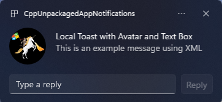

# App Notifications Content Builder

# Examples
## App Notification with Avatar Image

To generate a toast like this one:


developpers have to write something like this:

``` c++
    winrt::hstring xmlPayload{
        L"<toast launch = \"action=ToastClick&amp;\">\
            <visual>\
                <binding template = \"ToastGeneric\">\
                    <image placement = \"appLogoOverride\" hint-crop=\"circle\" src = \"Path\\To\\My\\Image.png\"/>\
                    <text>This is an example message</text>\
                </binding>\
            </visual>\
            <actions>\
                <action\
                    content = \"Open App\"\
                    arguments = \"action=OpenAppButton&amp;Sequence=1234\"/>\
            </actions>\
        </toast>" };

    auto toast{ winrt::AppNotification(xmlPayload) };
    winrt::AppNotificationManager::Default().Show(toast);
```

but it doesn't have to be. They could write something like this instead:

``` c++
AppNotificationContentBuilder("ToastClick")
    .AddImage(new Image(L"Path\\To\\My\\Image.png")
        .Placement(Placement::appLogoOverride)
        .Crop(Crop::Circle))
    .AddText(L"Toast Notification with Avatar Image")
    .AddText(L"This is an example message")
    .AddButton(new Button(L"Open App", L"OpenAppButton"))
    .AddArgument(L"Sequence", L"1234")
    .Show();
```
## App Notification with Avatar And Text Box

To generate a toast like this one:



Developers have to write something like this:

``` c++
    winrt::hstring xmlPayload{
        L"<toast launch = \"action=ToastClick&amp;\">\
            <visual>\
                <binding template = \"ToastGeneric\">\
                    <image placement = \"appLogoOverride\" hint-crop=\"circle\" src = \"Path\\To\\My\\Image.png\"/>\
                    <text>This is an example message</text>\
                </binding>\
            </visual>\
            <actions>\
                <input\
                    id = \"textboxReply"\"\
                    type = \"text\"\
                    placeHolderContent = \"Type a reply\"/>\
                <action\
                    content = \"Reply\"\
                    arguments = \"action=ReplyButton&amp;Sequence=1234\"/>\
                    hint-inputId=\"textboxReply\"/>\
            </actions>\
        </toast>" };

    auto toast{ winrt::AppNotification(xmlPayload) };
    winrt::AppNotificationManager::Default().Show(toast);
```

but it doesn't have to be. They could write something like this instead:

``` c++
AppNotificationContentBuilder("ToastClick")
    .AddImage(new Image(L"Path\\To\\My\\Image.png")
        .Placement(Placement::appLogoOverride)
        .Crop(Crop::Circle))
    .AddText(L"Toast Notification with Avatar Image")
    .AddText(L"This is an example message")
    .AddTextBox(new TextBox("textboxReply")
        .PlaceHolderContent("Type a reply"))
    .AddButton(new Button(L"Reply", L"ReplyButton")
        .GroupingHint("textboxReply"))
    .AddArgument(L"Sequence", L"1234")
    .Show();
```

