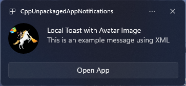

# App Notifications Content Builder

# Examples
## Toast Notification with Avatar Image


We want devs to write something like this to post a toast:

``` c++
auto contentBuilder{ new AppNotificationContentBuilder()
    .AddImage(L"Path\\To\\My\\Image.png", Placement::appLogoOverride, Crop::Circle)
    .AddText(L"Toast Notification with Avatar Image")
    .AddText(L"This is an example message")
    .AddButton(L"Open App", L"OpenAppAction")
    .AddArgument(L"Sequence", L"1234") };
    .Show();
auto appNotification{ new AppNotification(contentBuilder.GetXml()) };
AppNotificationManager.Default.Show(toast);
```

Instead of:
``` c++
    winrt::hstring xmlPayload{
        L"<toast launch = \"action=ToastClick&amp;\">\
            <visual>\
                <binding template = \"ToastGeneric\">\
                    <image placement = \"appLogoOverride\" hint-crop=\"circle\" src = \"Path\\To\\My\\Image.png\"/>\
                    <text>This is an example message</text>\
                </binding>\
            </visual>\
            <actions>\
                <action\
                    content = \"Open App\"\
                    arguments = \"action=OpenApp&amp;Sequence=1234\"/>\
            </actions>\
        </toast>" };

    auto toast{ winrt::AppNotification(xmlPayload) };
    winrt::AppNotificationManager::Default().Show(toast);
```

``` c++
winrt::hstring xmlPayload{
L"<toast>
    <visual>
        <binding template="ToastGeneric">
            <image placement="appLogoOverride" hint-crop="circle" src="Path\To\MyLittleUnicorn.png"/>
            <text>Toast Notification with Avatar Image</text>
            <text>This is an example message using content builder</text>
        </binding>
    </visual>
    <actions>
        <action
            content="Open App"
            arguments="action="OpenAppAction""&amp;"Sequnce="1234""/>
    </actions>
</toast>