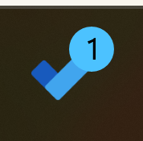
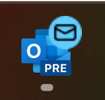

# Badge notifications in Windows App SDK

<!-- Put an index here - see how dynamic dependencies doc do it -->

- [1. Background](#background)
- [2. Limitations of the Windows SDK APIs](#limitations-of-the-windows-sdk-apis)
- [3. API proposal](#api-proposal)
- [4. Remarks](#remarks)
- [5. IDL details](#idl-details)

## Background

Badges are a type of notifications indicating a summary or status information specific to an app. It is represented either by a number or a glyph sitting over the top-right corner of the taskbar app icon.

Here is an example of a numeric badge posted by Microsoft To-Do List:



Another example of a badge, in this case featuring a new message glyph posted by Outlook:



## Limitations of the Windows SDK APIs

Badge notification Windows SDK APIs have three main limitations:

- They doesn't support Win32 apps, whether the app is packaged or not.

- The Badge Windows SDK APIs expect an XML payload that contains the information about the badge to pin, even though the XML is a single line of content. There are no APIs where developers can directly send the number or specify the glyph type.

- As of today, Badge APIs support a limited set of glyphs. If the app doesn't find any suitable glyph to convey their status, there is no option to pin a custom overlay.

More information about Windows SDK Badge API usage can be found [here](https://learn.microsoft.com/en-us/windows/apps/design/shell/tiles-and-notifications/badges#create-a-badge).

## API proposal

As part of bringing badges into Windows App SDK, we propose addressing the issues explained the previous section. With this proposal, developers will be able to pin and clear badges writing less code than what is required in the Windows SDK.

### 1. Posting a numeric badge

```cpp
BadgeNotificationManager::PostValue(4);
```

Posting a badge will require a single line of code, instead of 5-6 lines that developers must write using the Windows SDK APIs.

Notes:

- Developers won't be able to post 0 or negative numbers for their badges.

- If the specified number is greater than 99, a **99+** text will be rendered.

### 2. Posting a glyph badge

We will provide an enum that contains all glpyhs already supported in the Windows SDK. This enum will be named `BadgeNotificationGlyph`.

```cpp
BadgeNotificationManager::PostGlyph(BadgeNotificationGlyph::Busy);
```

For a complete list of predefined glyphs, see the IDL details section.

### 3. Posting a custom overlay

```cpp
// using winrt::Windows::Foundation;

std::wstring iconFilepath{ std::filesystem::current_path() / "MyCustomBadge.png" };
BadgeNotificationManager::PostCustomBadge(Uri{iconFilepath});
```

Note: The URI is expected to be a full path.

### 4. Clear a badge

```cpp
BadgeNotificationManager::Clear();
```

## Remarks

- Any subsequent call from any of the `BadgeNotificationManager::Post` APIs will replace any previous badge.

- Badges will be tied to the lifetime of the app window. If the app is closed, the badge will be cleared. This behavior is managed by the Taskbar.

## IDL details

``` idl
namespace Microsoft.Windows.AppNotifications.Badges
{
    [contractversion(1)]
    apicontract BadgeNotificationsContract {}

    // The following glyphs are based on what's currently available in the Windows SDK:
    // https://learn.microsoft.com/en-us/windows/apps/design/shell/tiles-and-notifications/badges
    [contract(BadgeNotificationsContract, 1)]
    enum BadgeNotificationGlyph
    {
        Activity,
        Alarm,
        Alert,
        Attention,
        Available,
        Away,
        Busy,
        Error,
        NewMessage,
        Paused,
        Playing,
        Unavailable
    };

    [contract(BadgeNotificationsContract, 1)]
    static runtimeclass BadgeNotificationManager
    {
        static void PostValue(UInt32 value);

        static void PostGlyph(BadgeNotificationGlyph glyph);

        static void PostCustomBadge(Windows.Foundation.Uri customBadgeUri);

        static void Clear();
    }
}
```
