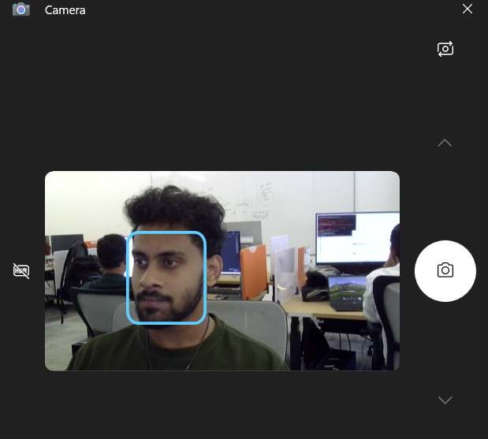

CameraCaptureUI API
===

This is the spec for proposal: [Issue #1034](https://github.com/microsoft/WindowsAppSDK/issues/1034)

This spec details the API of a new `CameraCaptureUI` in WinAppSDK,
enabling desktop applications such as WinUI3 to seamlessly integrate native camera capture 
functionality across diverse Windows platforms.


# Background

The current OS 
[CameraCaptureUI](https://docs.microsoft.com/uwp/api/Windows.Media.Capture.CameraCaptureUI),
primarily designed for UWP applications,
presents several challenges when used in desktop environments. 
Key issues include the dependency on `CoreWindow`, 
which are not compatible with desktop app frameworks and the lack of support for `IInitializeWithWindow`. 
As a result, developers are forced to resort to workarounds involving interop interfaces and 
additional code to integrate camera capture functionality into their WinUI 3 desktop applications.

In response to this feedback, this `CameraCaptureUI` API for WinAppSDK aims to provide 
a streamlined solution that meets the expectations of our developer community. 
The goal is to offer seamless integration of camera capture capabilities with 
full feature parity across all Windows platforms supported by WinAppSDK. 
This new API eliminates the need for cumbersome workarounds and 
simplifies the process of incorporating camera functionality into desktop applications.


This new WinAppSDK version of the `CameraCaptureUI` is essentially the same as the existing public
[CameraCaptureUI](https://learn.microsoft.com/en-us/uwp/api/windows.media.capture.cameracaptureui?view=winrt-22621) 
API, with a minor adjustment to the CameraCapture constructor to require a
[WindowId](https://docs.microsoft.com/windows/windows-app-sdk/api/winrt/Microsoft.UI.WindowId).


# Conceptual pages

## Capture a photo (C++)

A C++ example that tests whether a photo was successfully taken using the CaptureFileAsync method.

```c++
    // Get the WindowId for the window
    Microsoft::UI::WindowId windowId = this->AppWindow().Id();

    // Initialize CameraCaptureUI with a window handle
    winrt::Microsoft::Windows::Media::Capture::CameraCaptureUI cameraUI(windowId);

    // Configure Photo Settings
    cameraUI.PhotoSettings().Format(CameraCaptureUIPhotoFormat::Jpeg);
    cameraUI.PhotoSettings().AllowCropping(false);

    // Capture a photo asynchronously
    auto photo = co_await cameraUI.CaptureFileAsync(CameraCaptureUIMode::Photo);

    // Assert the result
    if (photo != nullptr)
    {
        // Log success if photo capture was successful
        Log::Comment(L"Photo capture was successful.");
    }
    else
    {
        // Log error if photo capture failed or was canceled
        Log::Error(L"Photo capture failed or was canceled.");
    }
 ```

 ## Capture a video (c#)

 The code is from file
 [CaptureVideo.xaml.cs](https://github.com/microsoftarchive/msdn-code-gallery-microsoft/tree/master/Official%20Windows%20Platform%20Sample/Windows%208%20app%20samples/%5BC%23%5D-Windows%208%20app%20samples/C%23/Windows%208%20app%20samples/CameraCaptureUI%20Sample%20(Windows%208)/C%23) of the Camera capture UI C# sample with a small modification to include the window ID in the CameraCaptureUI constructor.

 ```c#
// Get the WindowId for the window
 Microsoft.UI.WindowId windowId = this.AppWindow.Id;

 // Initialize CameraCaptureUI with a window handle
 CameraCaptureUI dialog = new CameraCaptureUI(windowId);

// Configure Video Settings
dialog.VideoSettings.Format = CameraCaptureUIVideoFormat.Mp4;

// Capture a video asynchronously
StorageFile file = await dialog.CaptureFileAsync(CameraCaptureUIMode.Video);

if (file != null)
{
    // Open the captured file for reading
    using (IRandomAccessStream fileStream = await file.OpenAsync(FileAccessMode.Read))
    {
        // Log success if video capture was successful
        // Add any additional logic or UI updates here
    }
}
else
{
    // Log message if no video was captured
    // Consider adding your own logging mechanism here
    // For example: logger.Log("No video captured.");
}
```


# API Pages


## CameraCaptureUI class

Provides a full window UI for capturing audio, video, and photos from a camera.
As well as controls for trimming video, time delayed capture, and camera settings.

This example shows how to use the CameraCaptureUI Class to take a picture.
The dialog with the user occurs when you call the asynchronous method CaptureFileAsync.

```c#
// Using Microsoft.Windows.Media.Capture.CameraCaptureUI API to capture a photo
CameraCaptureUI dialog = new CameraCaptureUI(windowId);
Size aspectRatio = new Size(16, 9);
dialog.PhotoSettings.CroppedAspectRatio = aspectRatio;

StorageFile file = await dialog.CaptureFileAsync(CameraCaptureUIMode.Photo);
if(file != null)
{
    // The user didn't cancel
    this.ProcessFile(file);
}
```
Screenshot of the UI:





## CameraCaptureUI constructor

| Name | Description |
|-|-|
| CameraCaptureUI(windowId) | Create a new CameraCaptureUI object.|


> Note: After you create a new CameraCaptureUI object, 
you may want to set the PhotoSettings or VideoSettings property of the object before 
calling CaptureFileAsync.

CameraCaptureUI provides a full window UI experience for capturing audio, video, and images. 
It provides controls for setting a time delay on photo captures, trimming video, 
and for adjusting the camera's settings such as video resolution, 
the audio device, brightness, and contrast.

Call CaptureFileAsync to launch the UI. 
The user has control over when to start the capture. 
When the asynchronous CaptureFileAsync operation completes, a StorageFile object is returned. 


## CameraCaptureUI Properties

| Name | Description | Value |
|-|-|-|
|PhotoSettings| Provides settings for capturing photos. The settings include aspect ratio, image size, format, resolution, and whether or not cropping is allowed by the user interface (UI).|CameraCaptureUIPhotoCaptureSettings (An object containing settings for capturing photos) |
|VideoSettings| Provides settings for capturing videos. The settings include format, maximum resolution, maximum duration, and whether or not to allow trimming.| CameraCaptureUIVideoCaptureSettings (An object that provides settings for capturing videos) |


## CameraCaptureUI Methods

| Name | Description | Parameters | Returns |
|-|-|-|-|
| CaptureFileAsync(CameraCaptureUIMode) | Launches the CameraCaptureUI user interface.| __mode__ CameraCaptureUIMode | __IAsyncOperation< StorageFile >__ |


## CameraCaptureUIPhotoCaptureSettings Class
Provides settings for capturing photos with CameraCaptureUI. 
The settings include aspect ratio, image size, format, resolution, 
and whether or not cropping is allowed by the user interface (UI).

**Important Note**:  
- By default, `AllowCropping` is true.
- Don't specify both size and aspect ratio in the `PhotoSettings`, doing so will cause an invalid argument exception.  
- `PhotoSettings` can't have a ratio or size specified with cropping disabled. Attempting to do so will result in an invalid argument exception.


## CameraCaptureUIPhotoCaptureSettings Properties

| Name | Description | Value |
|-|-|-|
| AllowCropping | Determines whether photo cropping will be enabled in the user interface for capture a photo.| Boolean |
| CroppedAspectRatio | The aspect ratio of the captured photo.| Windows.Foundation.Size |
| CroppedSizeInPixels |The exact size in pixels of the captured photo.| Windows.Foundation.Size |
| Format |Determines the format that captured photos will be stored in.| CameraCaptureUIPhotoFormat |
| MaxResolution | Determines the maximum resolution the user will be able to select. | CameraCaptureUIMaxPhotoResolution |


## CameraCaptureUIVideoCaptureSettings Class
Provides settings for capturing videos. 
The settings include format, maximum resolution, maximum duration, and whether or not to allow trimming.

**Important Note**:  
- By default, `AllowTrimming` is true.
- `MaxDurationInSeconds` must be a valid value (i.e., the duration should be in the range of 0 to `UINT32_MAX`). Specifying an invalid value will result in an invalid argument exception.
- `MaxDurationInSeconds` cannot be set if `AllowTrimming` is false. Attempting to do so will result in an invalid argument exception.


## CameraCaptureUIVideoCaptureSettings Properties
| Name | Description | Value |
|-|-|-|
| AllowTrimming | Determines whether the user can trim the captured video.| Boolean |
| Format | Determines the format that captured videos will be stored in.| CameraCaptureUIVideoFormat |
| MaxDurationInSeconds | The maximum duration of the video that the user can capture.| Single |
| MaxResolution | Determines the maximum resolution the user will be able to select.| CameraCaptureUIMaxVideoResolution |


## CameraCaptureUIMode enum

Determines whether the user interface for capturing from the attached camera allows capture of photos, 
videos, or both photos and videos.

| Name | Value | Description |
|-|-|-|
| PhotoOrVideo | 0 | The user interface allows capture of photos and videos. |
| Photo | 1 | The user interface allows capture of photos only.|
| Video | 2 | The user interface allows capture of videos only. |


## CameraCaptureUIPhotoFormat enum
Determines the format for photos captured with CameraCaptureUI.

| Name | Value | Description |
|-|-|-|
| Jpeg | 0 |JPEG format. |
| Png | 1 | PNG format. |
| JpegXR | 2 | JPEG-XR format. |


## CameraCaptureUIVideoFormat enum
Determines the format for saving captured videos.

| Name | Value | Description |
|-|-|-|
| Mp4 | 0 |MP4/H.264/AAC format.|
| Wmv | 1 | WMV format. |

## CameraCaptureUIMaxPhotoResolution enum
Determines the highest resolution the user can select for capturing photos.

| Name | Value | Description |
|-|-|-|
| HighestAvailable | 0 | The user can select any resolution. |
| VerySmallQvga | 1 |The user can select resolutions up to 320 X 240, or a similar 16:9 resolution. |
| SmallVga | 2 | The user can select resolutions up to 320 X 240, or a similar 16:9 resolution.|
| MediumXga | 3 | The user can select resolutions up to 1024 X 768, or a similar 16:9 resolution. |
| Large3M | 4 | The user can select resolutions up to 1920 X 1080, or a similar 4:3 resolution. |
| VeryLarge5M | 5 | The user can select resolutions up to 5 MP.|


## CameraCaptureUIMaxVideoResolution enum
Determines the highest resolution the user can select for capturing video.

| Name | Value | Description |
|-|-|-|
| HighestAvailable | 0 | The user can select any resolution. |
| LowDefinition | 1 | The user can select resolutions up to low definition resolutions.|
| StandardDefinition | 2 | The user can select resolutions up to standard definition resolutions.|
| HighDefinition | 3 | The user can select resolutions up to high definition resolutions. |


# API Details

> Note: all of this new WinAppSDK API is the same as the existing UWP
[CameraCaptureUI](https://docs.microsoft.com/uwp/api/Windows.Media.Capture.CameraCaptureUI)
API, only changing the constructor to take a
[WindowId](https://docs.microsoft.com/windows/windows-app-sdk/api/winrt/Microsoft.UI.WindowId).

 
```c++ (but really MIDL3)
namespace Microsoft.Windows.Media.Capture
{
    [contractversion(1)]
    apicontract CameraCaptureUIContract {};
 
    [contract(CameraCaptureUIContract, 1)]
    typedef enum CameraCaptureUIMode
    {
        PhotoOrVideo = 0,
        Photo,
        Video,
    } CameraCaptureUIMode;
 
    [contract(CameraCaptureUIContract, 1)]
    typedef enum CameraCaptureUIPhotoFormat
    {
        Jpeg = 0,
        Png,
        JpegXR,
    } CameraCaptureUIPhotoFormat;
 
    [contract(CameraCaptureUIContract, 1)]
    typedef enum CameraCaptureUIVideoFormat
    {
        Mp4 = 0,
        Wmv,
    } CameraCaptureUIVideoFormat;
 
    [contract(CameraCaptureUIContract, 1)]
    typedef enum CameraCaptureUIMaxVideoResolution
    {
        HighestAvailable = 0,
        LowDefinition,
        StandardDefinition,
        HighDefinition,
    } CameraCaptureUIMaxVideoResolution;
 
    [contract(CameraCaptureUIContract, 1)]
    typedef enum CameraCaptureUIMaxPhotoResolution
    {
        HighestAvailable = 0,
        VerySmallQvga,
        SmallVga,
        MediumXga,
        Large3M,
        VeryLarge5M,
    } CameraCaptureUIMaxPhotoResolution;
 
    [contract(CameraCaptureUIContract, 1)]
    runtimeclass CameraCaptureUIPhotoCaptureSettings
    {
        CameraCaptureUIPhotoCaptureSettings();
 
        Boolean AllowCropping;
        Windows.Foundation.Size CroppedAspectRatio;
        Windows.Foundation.Size CroppedSizeInPixels;
        Microsoft.Windows.Media.Capture.CameraCaptureUIPhotoFormat Format;
        Microsoft.Windows.Media.Capture.CameraCaptureUIMaxPhotoResolution MaxResolution;
    }
 
    [contract(CameraCaptureUIContract, 1)]
    runtimeclass CameraCaptureUIVideoCaptureSettings
    {
        CameraCaptureUIVideoCaptureSettings();
 
        Boolean AllowTrimming;
        Microsoft.Windows.Media.Capture.CameraCaptureUIVideoFormat Format;
        Single MaxDurationInSeconds;
        Microsoft.Windows.Media.Capture.CameraCaptureUIMaxVideoResolution MaxResolution;
    }
 
    [contract(CameraCaptureUIContract, 1)]
    runtimeclass CameraCaptureUI
    {
        CameraCaptureUI(Microsoft.UI.WindowId window);
 
        CameraCaptureUIPhotoCaptureSettings PhotoSettings{ get; };
        CameraCaptureUIVideoCaptureSettings VideoSettings{ get; };
 
        Windows.Foundation.IAsyncOperation<Windows.Storage.StorageFile> CaptureFileAsync(Microsoft.Windows.Media.Capture.CameraCaptureUIMode mode);
    }
}
```
