# Toast Notifications in Windows App SDK

# Background

Toast Notifications are UI popups that are added that contain rich text, controls and images to
display a message to the user. They are developer driven and originate from a target application
that is installed by a user on the local device. It is not sufficient for a toast popup on the
screen to simply be displayed to the user, it also needs to be actionable. For example, the user
should be able to click on a toast popup to launch an app in the correct context. For example, a
news article related toast is expected to launch the News app along with the article in question in
the foreground. Another actionable scenario is for the user to actually interact with the contents
of the toast popup like a UI control button. For example, a messaging app like Teams that displays a
message from another user could have a "Respond To" textbox and button so that the user can directly
respond to the message in the popup without having to launch the application. This scenario triggers
a background process on behalf of the application (with no UI) which inturn processes the "Reply To"
message and forwards the response to the other device.

Toast messages could have a local or cloud based origin. In the case of local toasts, the message
always originates from the app installed on the device. For cloud toasts, the message always
originates from a remote application service that targets the locally installed app in question.

Here is a visual representation of a Simple Toast with no interactive controls:


Here is a visual representation of a Toast with simple button controls:


Here is a visual representation of a Toast with a Message "Reply To" option:


For more details see:

-   [Toast Notification WinRT APIs](https://docs.microsoft.com//uwp/api/Windows.UI.Notifications.ToastNotification?view=winrt-20348)
    Defines all the API constructs that we have for Toast Notifications in WinRT today using the
    Windows SDK.
-   [Toast Notification UX Guidance using Toolkit](https://docs.microsoft.com/windows/apps/design/shell/tiles-and-notifications/toast-ux-guidance)
    Defines the UX Guidance for developers who want to display toasts using the toolkit libraries.
-   [Sending Local Toasts using C# using Toolkit](https://docs.microsoft.com/windows/apps/design/shell/tiles-and-notifications/send-local-toast?tabs=uwp)
    Defines how an app developer can send interactive toasts to the user and setup activation
    handlers for these toasts using the Toolkit libraries.

## The problems today

**Cloud Toast integration with Windows SDK**: While we support Push scenarios for Raw notification
on behalf of unpackaged applications in the Windows SDK 1.0, we do not support Cloud Toasts. We need
to fill this gap for 1.1 and beyond.

**API fragmentation**: There are too many API technologies that are published today to simply
Display toasts and setup their activation handlers: Windows SDK, Win32 Toast Activations via the
Nitro Model and the Windows Toolkit which is a Nuget library. It gets overwhelming for a developer
who does not understand all these technologies to ramp up and get toast support working for their
app.

**Support and Troubleshooting Toast Issues**: Because of the API fragmentation mentioned above, it
is also very difficult to diagnose issues when developers hit them and a large portion of developer
cycles are spent dignosing and troubleshooting problems in various API stacks instead of a single
stack.

**Registration**: The Windows SDK today provides AppId overloads to developers who can specify their
own Identifier for Unpackaged apps. The platform is currently designed to create an explicit
Registration for this overloaded AppId which causes all sorts of problems (string size limits being
hit, Personally Identifiable Information stored as part of AppIds, Registrations tagged with
incorrect App Type etc). The WinApp SDK hopes to get rid of the AppId overloads in the Public APIs
with the goal of specifying the correct AppId delegated to the Win App SDK Framework instead.

**Activation**: Setting up activation handlers using Background Toast Triggers is challenging for
developers because we don't have downlevel support for all OS SKUs. Moreover, the steps for setting
up activation handlers vary greatly for different app types MSIX Vs Unpackaged Vs UWP. We will need
to abstract away the activation technology and simplify this process for developers for all
supported downlevel OS SKUs.

**Toast Composition**: There are well known gaps in the Windows SDK today in the area of composing
the Toast content. The Windows Toolkit gets around this limitation by providing a well-defined
object model to compose toasts but all developers don't use the Toolkit. We will provide well
defined Toast templates as part of our API constructs with a plan to build a Windows Toolkit like
ToastBuilder model in the near future.

# Description

At a high level, we need to provide a way for all Win32 applications to display toasts irrespective
of their app type. This includes unpackaged apps and packaged win32 (MSIX Desktop Bridge, MSIX
Win32App, Sparse Signed Packages). Moreover, all Toast scenarios should adhere to OS resource
management policies like Power Saver, Network Attribution (amount of data an app uses), enterprise
group policies, etc. The Windows App SDK Push component will abstract away the complexities of
dealing with Toast delivery and toast related activations as much as possible freeing the developer
to focus on other app related challenges.

We will prioritize the following feature set for Toast Notifications in Windows App SDK:

-   Toast Registrations for Unpackaged apps.
-   Toast Registrations for Packaged apps
-   Cloud sourced Toasts for Unpackaged Win32 apps.
-   Cloud sourced Toasts for Packaged Win32 apps.
-   Local Toast delivery and Create/Update/Delete support for Packaged Win32 apps.
-   Local Toasts delivery and Create/Update/Delete support for unpackaged Win32 apps.

The following feature set will not be prioritized for the future include:

-   Object Model to compose Toasts without having to rely on Xml templates.
-   Support for toast collections.

# Examples

## Packaged App Toast Registration

This scenario is specifically geared towards Packaged apps that need to send a toast. An app
Developer Registers their app for Toast Notifications and sets it up for background\foreground
activation. Adding a ToastActivated event handler signals that the app is ready to accept and handle
an action in the foreground where the user clicks on a Toast in the action centre or a UI element in
the toast body (like a Button). The developer can inturn run some business logic in their app in
response to the Toast Action.

```cpp
int main()
{
     auto activationInfo = ToastActivationInfo::CreateFromActivationGuid(winrt::guid(c_comServerId));
    ToastNotificationManager::Default().RegisterActivator(activationInfo);

    auto args = AppInstance::GetCurrent().GetActivatedEventArgs();
    auto kind = args.Kind();

    if (kind == ExtendedActivationKind::Launch)
    {
        // App is launched in Foreground. So intercept toast activators via Foreground event
        const auto token = ToastNotificationManager::Default().ToastActivated([](const auto&, const ToastActivatedEventArgs& toastActivatedEventArgs)
        {
                ProcessToastArgs(toastActivatedEventArgs);
        });

        // App does Foreground Stuff Here

        // Cleanup
        ToastNotificationManager::Default().ToastActivated(token);
    }
    else if (kind == ExtendedActivationKind::ToastNotification)
    {
        auto toastActivatedEventArgs = args.Data().as<ToastActivatedEventArgs>();
        ProcessToastArgs(toastActivatedEventArgs);
    }

    return 0;
}
```

## Unpackaged app Toast Registration

Similar to packaged apps, unpackaged apps can also Register themselves to send toasts and act as
targets for toast activation events. There is one basic difference in the Registration for
Unpackaged apps versus their packaged counterparts: they will need to specify their own friendly App
DisplayName and IconUri since they don't have an app manifest file that contains the same.

```cpp
int main()
{
    Uri absoluteFilePath(LR"(C:\test\icon.png)");
    ToastAssets assets(L"SampleApp", absoluteFilePath);
    auto activationInfo = ToastActivationInfo::CreateFromToastAssets(assets);
    ToastNotificationManager::Default().RegisterActivator(activationInfo);

    auto args = AppInstance::GetCurrent().GetActivatedEventArgs();
    auto kind = args.Kind();

    if (kind == ExtendedActivationKind::Launch)
    {
        // App is launched in FG. So intercept toast activators via FG event
        const auto token = ToastNotificationManager::Default().ToastActivated([](const auto&, const ToastActivatedEventArgs& toastActivatedEventArgs)
            {
                ProcessToastArgs(toastActivatedEventArgs);
            });

        // App does Foreground Stuff Here

        // Cleanup
        ToastNotificationManager::Default().ToastActivated(token);
    }
    else if (kind == ExtendedActivationKind::ToastNotification)
    {
        auto toastActivatedEventArgs = args.Data().as<ToastActivatedEventArgs>();
        ProcessToastArgs(toastActivatedEventArgs);
    }

    return 0;
}
```

## Displaying a Toast

The app will need to display a toast to the user. In addition, the developer can set a tag and group
field for the toast which allows the app to replace the notification with an updated version.
Finally, the ExpiresOnReboot property ensures that the notification is automatically deleted from
the Action Centre on device reboots.

```cpp
// Display a toast with tag and group
void DisplayToast(const winrt::Windows::Data::Xml::Dom::XmlDocument& doc)
{
    ToastNotification toast(doc);
    // Setting Tag, Group and ExpiresOnReboot properties are optional
    toast.Tag(L"Tag");
    toast.Group(L"Group");
    toast.ExpiresOnReboot(true);
    ToastNotificationManager::Default().ShowToast(toast);
}
```

## Create a Toast Payload using Preexisting Toast XML templates

We will provide a set of templates that developers can use to compose payloads. The developer can
then use the Document Object Model (DOM) to customize the content in the payload. The templates that
we are introducing are as follows:

| Template Name                  | Scenario Examples                                                                                             | Example                                                  |
| :----------------------------- | :------------------------------------------------------------------------------------------------------------ | :------------------------------------------------------- |
| BasicToast                     | Simple alerts                                                                                                 | 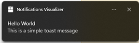                     |
| ToastWithTwoButtons            | Quick actions (2 options) such as view more information or remind me later                                    | 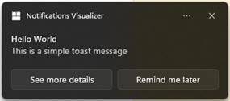            |
| ToastWithThreeButtons          | Quick actions (3 options) such as view/archive/delete an email                                                | 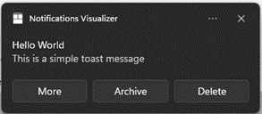          |
| ToastWithThreeButtonsWithIcons | Quick actions with icons (3 options) such as view/archive/delete an email                                     | 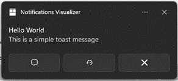 |
| ToastWithProgressBar           | Show the progress of an operation such as downloading music, syncing files, or updating a game                | 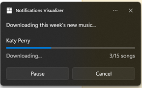           |
| ToastWithAvatarAndProgressBar  | Show the progress of an operation such as downloading music, syncing files, or updating a game (with image)   | 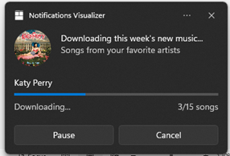  |
| ToastWithAvatar                | Simple alerts (with image) such as message or email from an individual or group                               | 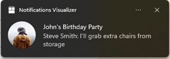                |
| ToastWithAvatarAndTextBox      | Reply to message from an individual or group                                                                  | 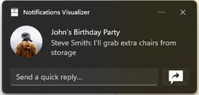      |
| ToastWithAvatarAndDropdown     | Respond to a message from options in a selection menu (with image)                                            |      |
| ToastWithDropdown              | Respond to a message from options in a selection menu                                                         | 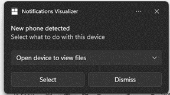              |
| ToastWithReminder              | Reminder for calendar event, etc that is displayed pre-expanded and stays on the user's screen till dismissed | 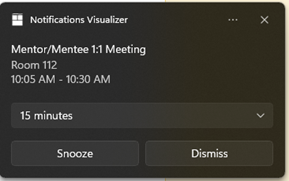              |
| ToastWithAlarm                 | Reminder with alarm audio that is displayed pre-expanded and stays on the user's screen till dismissed        | 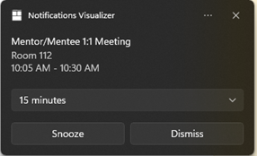                 |
| ToastWithHeroImage             | Captivate user with an image displayed prominently, such as for a news article or other entertainment content | 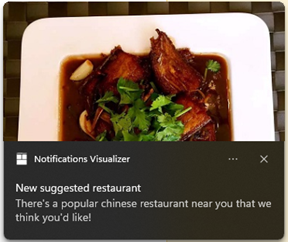             |
| ToastWithInlineImage           | Display an inline image that appears when toast is expanded                                                   | 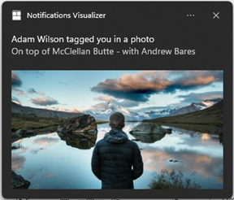           |

The XML for these templates are as follows:

```xml
<!-- BasicToast -->
<toast>

  <visual>
    <binding template="ToastGeneric">
      <text id="1"></text>
      <text id="2"></text>
      <text id="3"></text>
    </binding>
  </visual>

</toast>

<!-- ToastWithTwoButtons -->
<toast>

  <visual>
    <binding template="ToastGeneric">
      <text id="1"></text>
      <text id="2"></text>
      <text id="3"></text>
    </binding>
  </visual>

  <actions>

    <action
        content=""
        arguments=""
        activationType=""/>

     <action
        content=""
        arguments=""
        activationType=""/>

  </actions>

</toast>

<!-- ToastWithThreeButtons -->
<toast>

  <visual>
    <binding template="ToastGeneric">
      <text id="1"></text>
      <text id="2"></text>
      <text id="3"></text>
    </binding>
  </visual>

  <actions>

    <action
        content=""
        arguments=""
        activationType=""/>

     <action
        content=""
        arguments=""
        activationType=""/>

     <action
        content=""
        arguments=""
        activationType=""/>

  </actions>

</toast>

<!-- ToastWithThreeButtonsWithIcons -->
<toast>

  <visual>
    <binding template="ToastGeneric">
      <text id="1"></text>
      <text id="2"></text>
      <text id="3"></text>
    </binding>
  </visual>

  <actions>

    <action
        content=""
        arguments=""
        activationType=""
        imageUri=""/>

     <action
        content=""
        arguments=""
        activationType=""
        imageUri=""/>

     <action
        content=""
        arguments=""
        activationType=""
        imageUri=""/>

  </actions>
</toast>

<!-- ToastWithProgressBar -->
<toast>

  <visual>
    <binding template="ToastGeneric">
      <text id="1"></text>
      <text id="2"></text>
      <text id="3"></text>
      <progress
        title="{progressTitle}"
        value="{progressValue}"
        valueStringOverride="{progressValueString}"
        status="{progressStatus}"/>
    </binding>
  </visual>

  <actions>

    <action
      activationType=""
      arguments=""
      content=""/>

    <action
      activationType=""
      arguments=""
      content=""/>

  </actions>

</toast>

<!-- ToastWithAvatarAndProgressBar -->
<toast>

  <visual>
    <binding template="ToastGeneric">
      <text id="1"></text>
      <text id="2"></text>
      <text id="3"></text>
      <image placement="appLogoOverride" hint-crop="circle" id="1" src=""/>
      <progress
        title="{progressTitle}"
        value="{progressValue}"
        valueStringOverride="{progressValueString}"
        status="{progressStatus}"/>
    </binding>
  </visual>

  <actions>

    <action
      activationType=""
      arguments=""
      content=""/>

    <action
      activationType=""
      arguments=""
      content=""/>

  </actions>

</toast>

<!-- ToastWithAvatar -->
<toast>

  <visual>
    <binding template="ToastGeneric">
      <text id="1"></text>
      <text id="2"></text>
      <text id="3"></text>
      <image placement="appLogoOverride" hint-crop="circle" id="1" src=""/>
    </binding>
  </visual>

</toast>

<!-- ToastWithAvatarAndTextBox -->
<toast>

  <visual>
    <binding template="ToastGeneric">
      <text id="1"></text>
      <text id="2"></text>
      <text id="3"></text>
      <image placement="appLogoOverride" hint-crop="circle" id="1" src=""/>
    </binding>
  </visual>

    <actions>

        <input id="textBox" type="text" placeHolderContent=""/>

        <action
          content="send"
          hint-inputId="textBox"
          activationType=""
          arguments=""/>

    </actions>

</toast>

<!-- ToastWithAvatarAndDropdown -->
<toast>

    <visual>
        <binding template="ToastGeneric">
          <text id="1"></text>
          <text id="2"></text>
          <text id="3"></text>
          <image placement="appLogoOverride" hint-crop="circle" id="1" src=""/>
        </binding>
    </visual>

  <actions>

    <input id="1" type="selection" defaultInput="1">
      <selection id="1" content=""/>
      <selection id="2" content=""/>
      <selection id="3" content=""/>
    </input>

    <action
      activationType=""
      arguments=""
      content=""/>

    <action
      activationType=""
      arguments=""
      content=""/>

  </actions>

</toast>

<!-- ToastWithDropdown -->
<toast>

    <visual>
        <binding template="ToastGeneric">
          <text id="1"></text>
          <text id="2"></text>
          <text id="3"></text>
        </binding>
    </visual>

  <actions>

    <input id="1" type="selection" defaultInput="1">
      <selection id="1" content=""/>
      <selection id="2" content=""/>
      <selection id="3" content=""/>
    </input>

    <action
      activationType=""
      arguments=""
      content=""/>

    <action
      activationType=""
      arguments=""
      content=""/>

  </actions>

</toast>

<!-- ToastWithReminder -->
<toast scenario="reminder">

  <visual>
    <binding template="ToastGeneric">
          <text id="1"></text>
          <text id="2"></text>
          <text id="3"></text>
    </binding>
  </visual>

  <actions>

    <input id="snoozeTime" type="selection" defaultInput="1">
      <selection id="1" content=""/>
      <selection id="2" content=""/>
      <selection id="3" content=""/>
    </input>

    <action
      activationType="system"
      arguments="snooze"
      hint-inputId="snoozeTime"
      content=""/>

    <action
      activationType="system"
      arguments="dismiss"
      content=""/>

  </actions>

</toast>

<!-- ToastWithAlarm -->
<toast scenario="alarm">

  <visual>
    <binding template="ToastGeneric">
          <text id="1"></text>
          <text id="2"></text>
          <text id="3"></text>
    </binding>
  </visual>

  <actions>

    <input id="snoozeTime" type="selection" defaultInput="1">
      <selection id="1" content=""/>
      <selection id="2" content=""/>
      <selection id="3" content=""/>
    </input>

    <action
      activationType="system"
      arguments="snooze"
      hint-inputId="snoozeTime"
      content=""/>

    <action
      activationType="system"
      arguments="dismiss"
      content=""/>

  </actions>

</toast>

<!-- ToastWithHeroImage -->
<toast>

  <visual>
    <binding template="ToastGeneric">
      <text id="1"></text>
      <text id="2"></text>
      <text id="3"></text>
      <image placement="hero" id="1" src=""/>
    </binding>
  </visual>

</toast>

<!-- ToastWithInlineImage -->
<toast>

  <visual>
    <binding template="ToastGeneric">
      <text id="1"></text>
      <text id="2"></text>
      <text id="3"></text>
      <image placement="hero" id="1" src=""/>
    </binding>
  </visual>

</toast>

```

Below is an example of such customization using a simple payload with Image and Text. Here the
developer adds an attribute to the image element and sets the text fields in the payload.

```cpp
// Uses an API template to Compose and Display a toast
// Uses an API template to Compose and Display a toast
void CreateToastPayload()
{
    auto doc = ToastNotificationManager::Default().GetXmlTemplateContent(ToastTemplateType::ToastWithAvatar);
    auto srcAttribute = doc.CreateAttribute(L"src");
    srcAttribute.Value(L"images/toastImageAndText.png");
    auto images = doc.GetElementsByTagName(L"image");
    images.GetAt(0).Attributes().SetNamedItem(srcAttribute);

    auto textNodes = doc.GetElementsByTagName(L"text");

    for (auto&& textNode : textNodes)
    {
        textNode.AppendChild(doc.CreateTextNode(L"This is some notification text!"));
    }

    DisplayToast(doc);
}
```

## Processing a Toast Activation

The app will need to process the activator in response to a User activating the toast. 2 common
scenarios here are

1. Have the app launch in the foreground in a specific UI context OR
2. Have the app process a toast action (like a button press in the toast body) in the background.

```cpp
//<toast launch="action=openThread&amp;threadId=92187">
//  <visual>
//      <binding template="ToastGeneric">
//          <text hint-maxLines="1">Jill Bender</text>
//          <text>Check out where we camped last weekend! Incredible!!</text>
//          <image placement="hero" src="https://unsplash.it/360/180?image=1043" />
//      </binding>
//  </visual>
//  <actions>
//      <input id="textBox" type="text" placeHolderContent="reply" / >
//      <action
//          content="Send"
//          imageUri="Assets/Icons/send.png"
//          hint-inputId="textBox"
//          activationType="background"
//          arguments="action=reply&amp;threadId=92187" />
//  </actions>
//</toast>

const winrt::hstring c_toastLaunchAction = L"action=openThread&amp;threadId=92187";
const winrt::hstring c_toastReplyButtonAction = L"action=reply&amp;threadId=92187";

void ProcessToastArgs(const ToastActivatedEventArgs& toastActivatedEventArgs)
{
    if (toastActivatedEventArgs.ActivationArgs() == c_toastLaunchAction)
    {
        // The user clicks on the toast: So use the launchAction to do stuff
        // Do LaunchAction Stuff
    }
    else if (toastActivatedEventArgs.ActivationArgs() == c_toastReplyButtonAction)
    {
        // The user clicked on the reply button on the toast. So query the input field
        auto input = toastActivatedEventArgs.UserInput();
        auto replyBoxText = input.Lookup(L"ReplyBox");

        // Process the reply text
        ProcessReply(replyBoxText);
    }
}
```

## Processing Toast History

The ToastHistory component is always used to perform Delete and Get operations on behalf of the app.

```cpp
// Get a List of all toasts from the Action Centre
winrt::Windows::Foundation::IAsyncOperation<Windows::Foundation::Collections::IVector<ToastNotification>> GetToastListASync()
{
    auto toastHistory = ToastNotificationManager::Default().History();
    auto toasts = co_await toastHistory.GetAllAsync();
    co_return toasts;
}

// Remove a prior toast using tag and group
winrt::Windows::Foundation::IAsyncAction RemoveToast(const winrt::hstring& tag, const winrt::hstring& group)
{
    auto toastHistory = ToastNotificationManager::Default().History();
    co_await toastHistory.RemoveWithTagGroupAsync(tag, group);
}
```

## Toast Progress Updates

Sometimes a developer would like to show progress bar related updates in a toast:


To accomplish that, the developer will need to use the ToastProgressData construct.

```cpp
// Send first Toast Progress Update
void SendUpdatableToastWithProgress()
{
    winrt::hstring tag = L"weekly-playlist";
    winrt::hstring group = L"downloads";

    winrt::hstring payload = LR"(<toast launch="action = viewDownload &amp; downloadId = 9438108">
                                <visual>
                                   <binding template = "ToastGeneric">
                                        <text>Downloading this week's new music...</text>
                                        <progress
                                            title = "{progressTitle}
                                            value = "{progressValue}"
                                            valueStringOverride = "{progressValueString}"
                                            status = "{progressStatus}" />
                                    </binding>
                                </visual>
                            </toast>)";

    XmlDocument doc;
    doc.LoadXml(payload);
    ToastNotification toast(doc);
    toast.Tag(tag);
    toast.Group(group);

    // Assign initial values for first toast progress UI
    ToastProgressData data;
    data.Title(L"Weekly playlist"); // Binds to {progressTitle} in xml payload
    data.Value(0.6); // Binds to {progressValue} in xml payload
    data.ValueStringOverride(L"15/26 songs"); // Binds to {progressValueString} in xml payload
    data.Status(L"Downloading..."); // Binds to {progressStatus} in xml payload
    data.SequenceNumber(1);

    toast.Progress(data);
    ToastNotificationManager::Default().ShowToast(toast);
}

// Send subsequent progress updates
winrt::Windows::Foundation::IAsyncAction UpdateProgressAsync()
{
    winrt::hstring tag = L"weekly-playlist";
    winrt::hstring group = L"downloads";

    // Assign new values
    // Note that you only need to assign values that changed. In this example we don't assign progressStatus since we don't need to change it
    ToastProgressData data;
    data.Value(0.7); // Binds to {progressValue} in xml payload
    data.ValueStringOverride(L"18/26 songs"); // Binds to {progressValueString} in xml payload
    data.SequenceNumber(2);

    auto result = co_await ToastNotificationManager::Default().UpdateToastProgressDataAsync(data, tag, group);
    if (result != ToastProgressResult::Succeeded)
    {
        LOG_HR_MSG(E_UNEXPECTED, "Toast Progress Update Failed!");
    }
}
```

# Remarks

## Registration

The developer should always call the Toast Registration API first to register the current process as
the Activator target.

## Foreground API calls

The developer should always subscribe to toast activation foreground events to intercept toasts if
the app happens to be running in the foreground.

## Manifest Registration

For MSIX, the COM activator GUID and the exe need to be registered in the manifest. The launch args
would need to be pre-set to a well-known string that defines Toast Activation Triggers.

```xml
<Extensions>
  <com:Extension Category="windows.comServer">
    <com:ComServer>
      <com:ExeServer Executable="SampleBackgroundApp\SampleBackgroundApp.exe" DisplayName="SampleBackgroundApp" Arguments="----ToastActivationServer">
        <com:Class Id="{GUIDEntryPoint}" />
      </com:ExeServer>
    </com:ComServer>
  </com:Extension>
</Extensions>
```

# API Details

```c#

// Copyright (c) Microsoft Corporation. All rights reserved.
// Licensed under the MIT License. See LICENSE in the project root for license information.

namespace Microsoft.Windows.ToastNotifications
{
    [experimental]
    // The Shell asset details for Unpackaged App Registrations 
    runtimeclass ToastAssets
    {
        // Initialize using Shell assets like DisplayName and iconPath
        ToastAssets(String displayName, Windows.Foundation.Uri iconUri);

        // The App friendly DisplayName for the toast in Action Centre 
        String DisplayName { get; };

        // The full file path for the icon image
        Windows.Foundation.Uri IconUri { get; };
    }

    [experimental]
    // The Registration Info for Packaged and Unpackaged Toast Activations
    runtimeclass ToastActivationInfo
    {
        // Initialize using a manifest defined COM Activator Id. Only applicable to Packaged Win32 applications
        static ToastActivationInfo CreateFromActivationGuid(Guid taskClsid);

        // Initialize using Toast Assets. Only applicable to Unpackaged Win32 applications which need to specify their own assets like DisplayName and Icon.
        static ToastActivationInfo CreateFromToastAssets(ToastAssets assets);

        // The CLSID associated with the Client COM server that Windows App SDK will activate
        Guid TaskClsid{ get; };

        // The Shell assets associated with the Unpackaged app
        ToastAssets Assets{ get; };
    };

    [experimental]
    // Event args for the Toast Activation
    runtimeclass ToastActivatedEventArgs
    {
        // Arguments from the invoked button. Empty for Default Activation with no launch args specified in payload.
        String ActivationArgs{ get; };

        // The data from the input elements of a toast like a TextBox
        Windows.Foundation.Collections.IMapView<String, String> UserInput{ get; };
    };

    [experimental]
    // Toast Progress Data
    runtimeclass ToastProgressData
    {
        // Initializes a new Instance of ToastProgressData
        ToastProgressData();

        // Gets or sets the sequence number of this notification data.
        // When multiple ToastProgressData objects are received, the system displays the data with the greatest non-zero number. 
        UInt32 SequenceNumber;

        // Gets/Sets the value for the title. Binds to {progressTitle} in progress xml tag.
        String Title;

        // Gets/Sets the Value for the numerical Progress percentile: a number between 0 and 1. Binds to {progressValue} in progress xml tag.
        Double Value;

        // Gets/Sets the Value for the Progress String. Binds to {progressValueString} in progress xml tag
        String ValueStringOverride;

        // Gets/Sets the Value for the Status. Binds to {progressStatus} in progress xml tag
        String Status;
    };

    [experimental]
    // The Toast User Setting or Toast Group Policy Setting
    enum ToastNotificationSetting
    {
        Enabled, // Toast is not blocked by settings or group policy
        DisabledForApplication, // Toast is blocked by a user defined App Setting
        DisabledForUser, // Toast is blocked by a user defined Global Setting
        DisabledByGroupPolicy, // Toast is blocked by Group Policy
        DisabledByManifest, // Toast is blocked by a setting in the manifest. Only for packaged applications.
    };

    [experimental]
    // Some basic predefined Toast Payload Templates
    enum ToastTemplateType
    {
        BasicToast,
        ToastWithTwoButtons,
        ToastWithThreeButtons,
        ToastWithProgressBar,
        ToastWithAvatarAndProgressBar,
        ToastWithAvatar,
        ToastWithAvatarAndTextBox,
        ToastWithAvatarAndDropdown,
        ToastWithDropdown,
        ToastWithReminder,
        ToastWithAlarm,
        ToastWithHeroImage,
        ToastWithInlineImage,
    };

    [experimental]
    // The Result for a Toast Progress related operation
    enum ToastProgressResult
    {
        Succeeded, // The progress operation succeeded
        Failed, // The progress operation failed
        NotificationNotFound, // The progress operation failed to find a toast to process updates
    };

    [experimental]
    enum ToastPriority
    {
        Default, // The notification should have default behavior in terms of delivery and display priority during connected standby mode.
        High, // The notification should be treated as high priority. For desktop PCs, this means during connected standby mode the incoming notification can turn on the screen for Surface-like devices if it doesn't have a closed lid detected.
    };

    [experimental]
    // Represent a toast Notification construct
    runtimeclass ToastNotification
    {
        // Initialize a new Toast using an XML Payload.
        ToastNotification(Windows.Data.Xml.Dom.XmlDocument payload);

        // Unique identifier used to replace a notification within a group.
        String Tag;

        // Unique identifier for a toast group in the app
        String Group;

        // A unique identifier for the Toast generated by the platform.
        UInt32 Id;

        // The notification Xml Payload
        Windows.Data.Xml.Dom.XmlDocument Payload{ get; };

        // Gets or sets additional information about the toast progress.
        ToastProgressData Progress;

        // Gets or sets the time after which a toast notification should not be displayed.
        Windows.Foundation.DateTime Expiration;

        // Indicates whether the toast will remain in the Action Center after a reboot.
        Boolean ExpiresOnReboot;

        // Gets or sets the priority for a Toast.
        // Hints on how and at what urgency level a notification should be presented to the user (whether to wake up the screen, etc).
        ToastPriority Priority;

        // Gets or sets whether a toast's pop-up UI is displayed on the user's screen.
        Boolean SuppressDisplay;
    };

    [experimental]
    // Supports Toast related operations for all prior displayed Toasts in Action Centre
    runtimeclass ToastNotificationHistory
    {
        // Removes a specific toast with a specific toastIdentifier from Action Centre
        Windows.Foundation.IAsyncAction RemoveWithIdentiferAsync(UInt32 toastIdentifier);

        // Removes a toast having a specific tag
        Windows.Foundation.IAsyncAction RemoveWithTagAsync(String tag);

        // Removes a toast having a specific tag and group
        Windows.Foundation.IAsyncAction RemoveWithTagGroupAsync(String tag, String group);

        // Remove all toasts for a specific group
        Windows.Foundation.IAsyncAction RemoveGroupAsync(String group);

        // Removes all the toasts for the App from Action Centre
        Windows.Foundation.IAsyncAction RemoveAllAsync();

        // Gets all the toasts for the App from Action Centre
        Windows.Foundation.IAsyncOperation<Windows.Foundation.Collections.IVector<ToastNotification> > GetAllAsync();
    };

    [experimental]
    // The manager class which encompasses all Toast API Functionality
    runtimeclass ToastNotificationManager
    {
        // Gets a Default instance of a ToastNotificationManager
        static ToastNotificationManager Default{ get; };

        // Register an activator using an ActivationInfo context and caches the token for unregister
        void RegisterActivator(ToastActivationInfo details);

        // Unregisters the activator and removes the cached Registration token.
        void UnregisterActivator();

        // Event handler for Toast Activations
        event Windows.Foundation.EventHandler<ToastActivatedEventArgs> ToastActivated;

        // Displays the Toast in Action Center
        void ShowToast(ToastNotification toast);

        // Updates the Toast for a Progress related operation using Tag and Group
        Windows.Foundation.IAsyncOperation<ToastProgressResult> UpdateToastProgressDataAsync(ToastProgressData data, String tag, String group);

        // Updates the Toast for a Progress related operation using Tag
        Windows.Foundation.IAsyncOperation<ToastProgressResult> UpdateToastProgressDataAsync(ToastProgressData data, String tag);

        // Get the Toast Setting status for the app
        ToastNotificationSetting Setting{ get; };

        // Gets an instance of ToastHistory
        ToastNotificationHistory History{ get; };

        // Gets an Xml Payload based on a predefined Toast Template
        Windows.Data.Xml.Dom.XmlDocument GetXmlTemplateContent(ToastTemplateType type);
    };
}
```

# Appendix

-   To support cloud toasts, the developer will need to register the Toast Activator in
    addition to the Push Activator registrations that are already being done. The Windows SDK will
    in turn figure out the complexity of mapping cloud based toasts to the correct Toast Activator.
-   Since building Toast XML payloads at runtime is non-trivial, we encourage developers to
    utilize the [Windows Community Toolkit](https://docs.microsoft.com/windows/communitytoolkit/), specifically the [ToastContentBuilder](https://docs.microsoft.com/dotnet/api/microsoft.toolkit.uwp.notifications.toastcontentbuilder) APIs to
    construct the XML payload in the short term. Alternatively, they can also use the ToastTemplates that the Windows App SDK will provide to build their own toasts.
