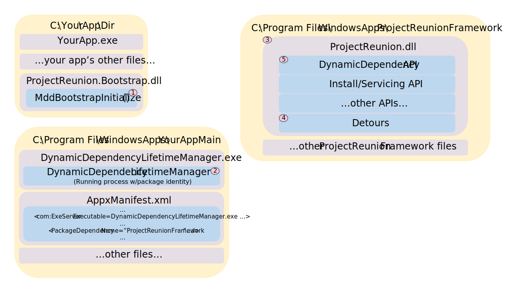

# 1. MSIX Dynamic Dependencies

This feature makes Framework packages accessible to all kinds of apps, packaged and unpackaged. The
package loader - which you carry with your app - lets you pin, bind, resolve, and consume framework
package content including WinRT APIs and 'flat C' exports.

DynamicDependencies enable access to packaged content via APIs at runtime. This supplements the
appmodel's static dependency support (via `<PackageDependency>` in `appxmanifest.xml`) with a
dynamic runtime equivalent. It also allows non-packaged processes (which have no `appxmanifest.xml`)
to use packaged content.

- [1. MSIX Dynamic Dependencies](#1-msix-dynamic-dependencies)
- [2. Background](#2-background)
- [3. Description](#3-description)
  - [3.1. Dynamic Package Graph](#31-dynamic-package-graph)
    - [3.1.1. LoadPackageLibrary](#311-loadpackagelibrary)
    - [3.1.2. Detours to Enhance Package Graph APIs](#312-detours-to-enhance-package-graph-apis)
    - [3.1.3. Add to the Package Graph](#313-add-to-the-package-graph)
      - [3.1.3.1. Resolve Package](#3131-resolve-package)
      - [3.1.3.2. Package Graph](#3132-package-graph)
      - [3.1.3.3. Add to Package Graph](#3133-add-to-package-graph)
    - [3.1.4. Remove from the Package Graph](#314-remove-from-the-package-graph)
    - [3.1.5. DLL Search Order](#315-dll-search-order)
      - [3.1.5.1. Non-Packaged Processes](#3151-non-packaged-processes)
      - [3.1.5.2. Packaged Processes](#3152-packaged-processes)
  - [3.2. Known Issues for Packaged Processes](#32-known-issues-for-packaged-processes)
    - [3.2.1. Known Issue: DLL Search Order ignores uap6:LoaderSearchPathOverride](#321-known-issue-dll-search-order-ignores-uap6loadersearchpathoverride)
    - [3.2.2. Known Issue: DLL Search Order ignores uap6:AllowExecution](#322-known-issue-dll-search-order-ignores-uap6allowexecution)
  - [3.3. Install-time 'Pinning' aka Prevent Removal](#33-install-time-pinning-aka-prevent-removal)
  - [3.4. Runtime 'Pinning' aka Prevent Update While In-Use](#34-runtime-pinning-aka-prevent-update-while-in-use)
- [4. Examples](#4-examples)
- [5. Remarks](#5-remarks)
  - [5.1. API Overview](#51-api-overview)
  - [5.2. Package Dependency Resolution is Per-User](#52-package-dependency-resolution-is-per-user)
  - [5.3. LocalSystem is not Supported](#53-localsystem-is-not-supported)
  - [5.4. Packaging - ProjectReunion.dll and ProjectReunion.Bootstrap.dll](#54-packaging---projectreuniondll-and-projectreunionbootstrapdll)
    - [5.4.1. Boostrapper - Find and Load/Run the per-application 'helper' Main package](#541-boostrapper---find-and-loadrun-the-per-application-helper-main-package)
    - [5.4.2. Boostrapper - Find and Load ProjectReunion.dll](#542-boostrapper---find-and-load-projectreuniondll)
  - [5.5. Dynamic Dependencies vis a vis Static Dependencies](#55-dynamic-dependencies-vis-a-vis-static-dependencies)
  - [5.6. Known Limitations in v1](#56-known-limitations-in-v1)
    - [5.6.1. uap6:LoaderSearchPathOverride not supported](#561-uap6loadersearchpathoverride-not-supported)
    - [5.6.2. uap6:AllowExecution not supported](#562-uap6allowexecution-not-supported)
- [6. API Details](#6-api-details)
  - [6.1. Win32 API - MsixDynamicDependency.h](#61-win32-api---msixdynamicdependencyh)
  - [6.2. WinRT API](#62-winrt-api)
- [7. Static Package Dependency Resolution Algorithm](#7-static-package-dependency-resolution-algorithm)
  - [7.1. Frequently Asked Questions (FAQ)](#71-frequently-asked-questions-faq)

# 2. Background

MSIX supports the ability for packaged applications to access components and other files distributed
as Framework packages. However this functionality provides a rather 'static' world view, where
dependencies are known at development time and resolved at install-time. There is no support at
runtime to define a Framework dependency based on machine state, user interface or other
post-development factors of the developer's choosing. Access to Framework package content is also
limited to packaged applications; non-packaged applications cannot use content provided via
Framework packages.

Microsoft-internal task [23447728](https://task.ms/23447728)

This is the spec for proposal [MSIX Dynamic Dependencies - allow any process to use MSIX Framework
packages #89](https://github.com/microsoft/ProjectReunion/issues/89).

# 3. Description

This feature provides APIs to enable access to packaged content at runtime, regardless if the caller
is packaged or not. This supplements the MSIX appmodel's current static dependency support (via an
appxmanifest.xml) with a dynamic runtime equivalent. It also allows non-packaged processes (which
have no appxmanifest.xml) to use packaged content.

Dynamic selection and access of packaged content is challenged by several issues:

## 3.1. Dynamic Package Graph

A process' Package Graph has historically been fixed at process creation. There has been no affordance to alter a process'
package graph at runtime.

Packaged processes are initialized with a package graph based on package dependencies declared in
their `appxmanifest.xml`. See [Static Package Dependency Resolution Algorithm](#7-static-package-dependency-resolution-algorithm)
for more details. Non-packaged processes have no declared dependencies as they
have no `appxmanifest.xml`, thus non-packaged processes are created with an
empty Package Graph. Once a process is created its package graph was constant for the rest of its lifetime.

We'll provide new APIs to alter the current process' Package Graph at runtime.

Windows provides access to a process' package graph primarily via
[GetCurrentPackageInfo](https://docs.microsoft.com/windows/win32/api/appmodel/nf-appmodel-getcurrentpackageinfo)
and
[GetCurrentPackageInfo2](https://docs.microsoft.com/windows/win32/api/appmodel/nf-appmodel-getcurrentpackageinfo2).
Equivalent information is available via
[Windows.ApplicationModel.Package.Current](https://docs.microsoft.com/uwp/api/windows.applicationmodel.package.current?view=winrt-19041)
and
[Package.Current.Dependencies](https://docs.microsoft.com/uwp/api/windows.applicationmodel.package.dependencies?view=winrt-19041).
These correspond to PackageGraph[0] and PackageGraph[1+]. These APIs provide access to the static
package graph.

This information is used by several Windows components to find resources across packages available
to a process (aka across a process' package graph) including:

- **DLLs** - the Loader searches the package graph for DLLs (per [Dynamic-Link Library Search Order](https://docs.microsoft.com/windows/win32/dlls/dynamic-link-library-search-order))
- **CLR** - the CLR searches the package graph for assemblies (similar to how the Loader does so for DLLs)
- **WinRT** - WinRT searches the package graph for WinRT activation. Type resolution is constrained to types provided by packages in a process' package graph (and those provided by Windows via the `Windows.*` namespace). Thius include metadata resolution (i.e. *.winmd).
- **MRT** - MRT searches the package graph for resources (resources.pri, images, etc)
- **ms-appx URI scheme** - [ms-appx URIs](https://docs.microsoft.com/windows/uwp/app-resources/uri-schemes) are resolved to packages across the package graph

If we can alter the package graph as seen by `GetCurrentPackageInfo` and like APIs we can provide
the desired dynamic behavior.

We'll manage our own package graph to supplement the static package graph (if any) with dynamic
dependencies. We'll use [Detours](https://github.com/Microsoft/Detours) to hook
`GetCurrentPackageInfo` and related APIs to redirect to our own Dynamic Dependencies savvy variants.

### 3.1.1. LoadPackageLibrary

[LoadPackageLibrary()](https://docs.microsoft.com/windows/win32/api/winbase/nf-winbase-loadpackagedlibrary) provides a restricted form of LoadLibrary,
but restricted to packaged processes. We'll enlighten LoadPackageLibrary to support the dynamic package graph and work as expected, regardless if the
process is packaged or not.

### 3.1.2. Detours to Enhance Package Graph APIs

Package Graph information is available for packages registered to the current user via
[OpenPackageInfoByFullName](https://docs.microsoft.com/windows/win32/api/appmodel/nf-appmodel-openpackageinfobyfullname).
We'll keep track of the expanded package graph (static + dynamic) via a global variable filled with
PACKAGE_INFO_REFRENCE objects. Our Detour'd API variants walk this information to produce their
answers seamlessly spanning static and dynamic package information for the process.

```c++ (C++ish pseudocode)
// An instance with no PACKAGE_INFO_REFERENCE (nullptr) is a placeholder for the static package graph
class PackageGraphNode
{
...
private:
    PACKAGE_INFO_REFERENCE m_packageInfoReference{};
    MDD_PACKAGE_DEPENDENCY_CONTEXT m_context{};
    DLL_DIRECTORY_COOKIE m_addDllDirectoryCookie{};
};

static std::mutex g_lock;
std::vector<PackageGraphNode> g_packageGraph;

static LONG (WINAPI * TruGetCurrentPackageInfo)(...) = CurrentPackageInfo;
LONG DynamicGetCurrentPackageInfo(...);
...

BOOL DllMain(...)
{
    if (DetourIsHelperProcess())
    {
        return TRUE;
    }

    if (dwReason == DLL_PROCESS_ATTACH)
    {
        DetourRestoreAfterWith();

        DetourTransactionBegin();
        DetourUpdateThread(GetCurrentThread());
        DetourAttach(&TrueGetCurrentPackageInfo, DynamicGetCurrentPackageInfo);
        ...
        DetourTransactionCommit();
    }
    else if (dwReason == DLL_PROCESS_DETACH)
    {
        DetourTransactionBegin();
        DetourUpdateThread(GetCurrentThread());
        DetourDetach(&TrueGetCurrentPackageInfo, DynamicGetCurrentPackageInfo);
        ...
        DetourTransactionCommit();
    }
    return TRUE;
}

LONG DynamicGetCurrentPackageInfo(...PACKAGE_INFO* packageInfo...UINT32* count)
{
    *count = 0;

    std::unique_lock<std::mutex> lock(g_lock);

    for (node : g_packageGraph)
    {
        auto packageInfoReference = node.get();
        if (node)
        {
            packageInfo += GetPackageInfo(packageInfoRefernce...);
        }
        else
        {
            packageInfo += TrueGetCurrentPackageInfo(...);
        }
        ++count
    }
    return ERROR_SUCCESS;
}
...

HRESULT MddAddPackageDependency(...)
{
    ...

    std::unique_lock<std::mutex> lock(g_lock);
}
```

### 3.1.3. Add to the Package Graph

`MddAddPackageDependency` has 2 responsibilities:

1. Resolve a package dependency to a specific package
2. Update the package graph

Updating the package graph also requires the DLL Search Order be updated. See below for more details.

```c++ (C++ish pseudocode)
HRESULT MddAddPackageDependency(...)
{
    std::unique_lock<std::mutex> lock(g_lock);

    auto packageFullName = ResolvePackageDependency(packageFamilyName, minVersion, architectureFilter, ...);
    if (!packageFullName)
    {
        return ERROR;
    }
    return AddToPackageGraph(packageFullName, ...);
}
```

#### 3.1.3.1. Resolve Package

Resolve the package dependency to a (specific) package, per the following conditions:

1. Packages in Package Family
2. PackageType = Framework
3. Packages registered to the user
4. Highest version
5. Version >= packageDependency.MinVersion
6. Architecture meets ArchitectureFilter criteria (see below)
7. PackageStatus = usable (not Bad, not NotAvailable, etc)

If 2+ meet the criteria due, then the best-fit is...

1. Highest version
2. Architecture exactly matches caller's architecture
3. Architecture=Neutral

Thus v5 is better than v4, but choosing amongst v5-x86 vs v5-x64 vs v5-neutral
depends on the caller's architecture. For example, assuming multiple package
candiates only varying by version and/or architecture:

Given v1 and v2

- Best-Fit = v2

Given v1-x86 and v1-x64

- Best-Fit for x64 callers = v1-x64
- Best-Fit for x86 callers = v1-x86
- Best-Fit for arm callers = --no match--

Given v1-x86 and v1-neutral

- Best-Fit for x64 callers = v1-neutral
- Best-Fit for x86 callers = v1-x86
- Best-Fit for arm callers = v1-neutral

**NOTE:** `MddAddPackageDependency` can only resolve to packages registered for the user. Thus as
packages cannot be registered to LocalSystem a process running as LocalSystem cannot use Dynamic
Dependencies. Impersonation is irrelevant here. Only the process' user identity is relevant to
determine the packages registered to the user.

```c++ (C++ish pseudocode)
string ResolvePackageDependency(packageFamily, minVersion, architectureFilter, ...)
{
    string[] packageFullNames = FindPackagesByPackageFamily(packageFamilyName, packageTypeFilter=Framework, ...);
    count = packageFullNames.size();
    if (count == 0)
    {
        return ERROR;
    }

    string bestFit = null;
    for (packageFullName : packageFullNames)
    {
        // Do we already have a higher version under consideration?
        if (bestFit && bestFit.Version > packageFullName.Version)
        {
            continue;
        }

        // Package version must meet the minVersion filter
        if (packageFullName.Version < minVersion)
        {
            continue;
        }

        // Package architecture must meet the architecture filter
        if (architectureFilter == PackageDependencyArchitectureFilters.None)
        {
            if (!IsPackageABetterFitPerArchitecture(bestFit, packageFullName))
            {
                continue;
            }
        }
        else
        {
            if (packageFullName.Architecture not in architectureFilter)
            {
                continue;
            }
        }

        // Package status must be OK to use a package
        auto packageManager = ActivateInstance(Windows.Management.Deployment.PackageManager);
        auto currentUser = "";
        auto package = packageManager.FindPackageForUser(currentUser, packageFullName);
        if (!package.VerifyIsOK())
        {
            continue;
        }

        // The new candidate is better than the current champion
        bestFit = packageFullName;
    }
    return bestFit;
}

bool IsPackageABetterFitPerArchitecture(string bestFit, string packageFullName)
{
    // Is the package a contender?
    const auto currentArchitecture = GetCurrentArchitecture();
    if (packageFullName.Architecture != Neutral && packageFullName.Architecture != currentArchitecture)
    {
        return false;
    }

    // Do we have a best-fit candidate yet?
    if (!bestFit)
    {
        // We do now :-)
        return true;
    }

    // Is the new package a better fit than the current champion?

    // Architecture-specific is always better than architecture-neutral
    if (bestFit.Architecture == Neutral && packageFullName.Architecture != Neutral)
    {
        return false;
    }

    // We have a new winner!
    return true;
}

Architecture GetCurrentArchitecture()
{
#if defined(_M_ARM)
    return Arm;
#elif defined(_M_ARM64)
    return Arm64;
#elif defined(_M_IX86)
    return X86;
#elif defined(_M_X64)
    return X64;
#else
#   error "Unknown processor architecture"
#endif
}
```

#### 3.1.3.2. Package Graph

A package graph is a package dependency graph flattened into an ordered list.

Searches using this list start with the lowest rank and proceed in ascending order through the list. For example, when the Loader searches the package graph for DLLs (per [Dynamic-Link Library Search Order](https://docs.microsoft.com/windows/win32/dlls/dynamic-link-library-search-order)).

Package processes start with a package graph containing the package and its dependencies,
as resolved resolved at install time. This can be accessed via
[Windows.ApplicationModel.Package](https://docs.microsoft.com/uwp/api/Windows.ApplicationModel.Package)
followed by [Windows.ApplicationModel.Package.Dependencies](https://docs.microsoft.com/uwp/api/windows.applicationmodel.package.dependencies).
This is referred to as the 'static package graph' as it's fixed at
process creation and cannot be altered.

Non-packaged processes start with an empty package graph.

A process' package graph can be altered dynamically at runtime
via the Dynamic Dependency API.

#### 3.1.3.3. Add to Package Graph

Packages can be added dynamically to the package graph,
managed as as a sorted list based on `rank`. The list is sorted in ascending order
i.e. -&infin;...0...+&infin;.

Packages in the static package graph have a rank
of MDD_PACKAGE_DEPENDENCY_RANK_DEFAULT (0).

If a package graph node already exists with the same rank as a new addition the new node is, by
default, appended to the nodes of matching rank. If
`MddAddPackageDependencyOptionsPrependIfRankCollision` is specified the new node is prepended to
those of matching rank.

```c++ (C++ish pseudocode)
HRESULT AddToPackageGraph(string packageFullName, ...)
{
    auto packageInfoReference = OpenPackageInfoByFullName(packageFullName);
    auto packageGraphNode = PackageGraphNode(packageInfoReference);

    // Find the insertion point where to add the new package graph node to the package graph
    int index = 0;
    for (; index < g_packageGraph.size(); ++index)
    {
        auto& node = g_packageGraph[index];
        if (node.rank() < rank)
        {
            // Too soon. Keep looking
            continue;
        }
        else if (rank < node.rank())
        {
            // Gotcha!
            break;
        }

        if (node.rank() == rank)
        {
            // Match! Insert before or after items of the same rank?
            if (options.PrependIfRankCollision)
            {
                // Gotcha!
                break;
            }
            else
            {
                // Append to items of this rank
                for (int nextIndex=index+1; nextIndex < g_packageGraph.size(); ++nextIndex)
                {
                    auto& nextNode = g_packageGraph[nextIndex];
                    if (nextNode.rank() > rank)
                    {
                        // Gotcha!
                        break;
                    }
                }
            }
        }
    }

    // Add the new node to the package graph
    if (index <> g_packageGraph.size())
    {
        g_packageGraph.insert(index, packageGraphNode);
    }
    else
    {
        g_packageGraph.append(packageGraphNode);
    }

    // The DLL Search Order must be updated when we update the package graph
    AddToDllSearchOrder(node);
}
```

NOTE: This pseudo-code can be expressed more consisely as:

```c++
HRESULT AddToPackageGraph(string packageFullName, ...)
{
    auto packageInfoReference = OpenPackageInfoByFullName(packageFullName);
    auto node = PackageGraphNode(packageInfoReference);

    auto by_rank = [](auto&& left, auto&& right) { return left.rank < right.rank; });
    auto where = options.PrependIfRankCollision ?
        std::lower_bound(g_packageGraph.begin(), g_packageGraph.end(), node, by_rank) :
        std::upper_bound(g_packageGraph.begin(), g_packageGraph.end(), node, by_rank);
    g_packageGraph.insert(where, node);
    return S_OK;
}
```

### 3.1.4. Remove from the Package Graph

`MddRemovePackageDependency` undoes the work done by MddRemovePackageDependency:

1. Update the package graph

Updating the package graph also requires the DLL Search Order be updated. See below for more details.

```c++ (C++ish pseudocode)
HRESULT MddRemovePackageDependency(MDD_PACKAGE_DEPENDENCY_CONTEXT context)
{
    std::unique_lock<std::mutex> lock(g_lock);

    for (int index=0; index < g_packageGraph.size(); ++index)
    {
        auto& node = g_packageGraph[index];
        if (node.context() == context)
        {
            // The DLL Search Order must be updated when we update the package graph
            RemoveFromDllSearchOrder(node);

            g_packageGraph.erase(index);

            return S_OK;
        }
    }
    return HRESULT_FROM_WIN32(ERROR_INVALID_HANDLE);
}
```

### 3.1.5. DLL Search Order

Windows informs the Loader when the package graph is defined, but this doesn't help after process
creation (and non-packaged processes never have a static package graph).

The Dynamic Dependencies API informs the loader when the package graph changes.

#### 3.1.5.1. Non-Packaged Processes

For non-packaged processes we'll update the DLL Search Order via the PATH environment variable and
[AddDllDirectory](https://docs.microsoft.com/windows/win32/api/libloaderapi/nf-libloaderapi-adddlldirectory).
Neither technique alone suffices as one or the other can be ignored depending on
[LoadLibraryEx](https://docs.microsoft.com/windows/win32/api/libloaderapi/nf-libloaderapi-adddlldirectory)
parameters. We'll set both to cover the bases. Worst case a directory is listed twice in the search
order, incurring a small cost when failing to find a file in the directory (two misses instead of one).

```c++ (C++ish pseudocode)
void AddToDllSearchOrder(PackageGraphNode package)
{
    // Update the PATH environment variable
    UpdatePath();

    // Update the AddDllDirectory list
    auto cookie = AddDllDirectory(package.path());
    package.addDllDirectoryCookie(cookie);
}

void RemoveFromDllSearchOrder(PackageGraphNode package)
{
    // Update the PATH environment variable
    UpdatePath();

    // Update the AddDllDirectory list
    RemoveDllDirectory(package.addDllDirectoryCookie());
}

static string g_pathListLastAddedToPath;

void UpdatePath()
{
    // Build the package graph path list (semi-colon delimited)
    string pathList;
    for (PackageGraphNode node : g_packageGraph)
    {
        const auto flags = PACKAGE_FILTER_HEAD | PACKAGE_FILTER_DIRECT | PACKAGE_FILTER_OPTIONAL_IN_RELATED_SET;
        UINT32 count = 0;
        auto packageInfoReference = node.get();
        if (packageInfoReference)
        {
            PACKAGE_INFO[] packageInfos = GetPackageInfo(packageInfoReference, flags, ...);
        }
        else
        {
            PACKAGE_INFO[] packageInfos = TrueGetCurrentPackageInfo(packageInfoReference, flags, ...);
        }
        AppendPathsToList(pathList, packageInfos);
    }

    // Add the path list to the PATH enironment variable
    // If not present in PATH then add the path list to the front of PATH
    // If already present then replace it with the updated path list

    // package graph environment variable's at the fron ot the PATH environment variable
    string path = GetEnvironmentVariable("PATH");
    if (g_pathListLastAddedToPath.length() == 0)
    {
        // First time we're changing PATH. Prepend the path list to PATH
        path = pathList + ";" + path;
    }
    else
    {
        // Find the previous path list in PATH (if present)
        ...find g_pathg_pastListLastAddedToPath in path...
        if (found)
            ...path.replace(g_pastListLastAddedToPath, pathList)...
        else
            path = pathlist + ";" + path;
    }
    SetEnvironmentVariable("PATH", path);

    // Remember the path list we added to PATH for future updates
    g_pathListLastAddedToPath = pathList;
}

void AppendPathsToList(string& pathList, PACKAGE_INFO[] packageInfos)
{
    for (packageInfo : packageInfos)
    {
        if (pathList.size() > 0)
        {
            path += ";";
        }
        path += packageInfo.path;
    }
}
```

#### 3.1.5.2. Packaged Processes

Loader path modifications (via PATH environment variable and [AddDllDirectory](https://docs.microsoft.com/windows/win32/api/libloaderapi/nf-libloaderapi-adddlldirectory))
are ignored for packaged processes. The loader instead uses:

0. DLL Redirection (aka `pkgdir\microsoft.system.package.metadata\Application.Local`) if [DevOverideEnable=1](https://docs.microsoft.com/windows/win32/dlls/dynamic-link-library-redirection)
1. APIsets
2. _[DesktopBridge processes]_ SxS manifest DLL redirection
3. Loaded Module List (i.e. DLLs already loaded into memory)
4. Known DLLs
5. Package Graph
6. Executeable's directory _OR_ top-loading module's directory if `LOAD_WITH_ALTERED_SEARCH_PATH` is specified
7. %SystemRoot%\system32

None of these are sufficiently flexible to leverage for Dynamic Dependencies.

**TODO** Perhaps the [uap7:ImportRedirectionTable](https://docs.microsoft.com/uwp/schemas/appxpackage/uapmanifestschema/element-uap7-importredirectiontable)
supporting machinery can help out here?

## 3.2. Known Issues for Packaged Processes

### 3.2.1. Known Issue: DLL Search Order ignores [uap6:LoaderSearchPathOverride](https://docs.microsoft.com/uwp/schemas/appxpackage/uapmanifestschema/element-uap6-loadersearchpathoverride)

The current design and implementation don't consult [uap6:LoaderSearchPathOverride](https://docs.microsoft.com/uwp/schemas/appxpackage/uapmanifestschema/element-uap6-loadersearchpathoverride)
when updating the Loader's path list to find DLLs.

### 3.2.2. Known Issue: DLL Search Order ignores [uap6:AllowExecution](https://docs.microsoft.com/uwp/schemas/appxpackage/uapmanifestschema/element-uap6-allowexecution)

The current design and implementation don't consult [uap6:AllowExecution](https://docs.microsoft.com/uwp/schemas/appxpackage/uapmanifestschema/element-uap6-allowexecution)
to determine if a package should be in the DLL Search Order.

For packaged processes only packages with execution rights are included in the DLL Search Order.
This can be explicitly controlled via the [uap6:AllowExecution](https://docs.microsoft.com/uwp/schemas/appxpackage/uapmanifestschema/element-uap6-allowexecution)
element in appxmanifest.xml. The default value varies, depending on package:

AllowExecution default = True

- Main
- Framework
- Optional, if InRelatedSet

AllowExecution default = False

- Resource
- Optional, if not InRelatedSet

There are no public APIs to get this information so we'll build the DLL Search Order only based
on package types (as above), regardless if a package manifests [uap6:AllowExecution](https://docs.microsoft.com/uwp/schemas/appxpackage/uapmanifestschema/element-uap6-allowexecution).

## 3.3. Install-time 'Pinning' aka Prevent Removal

Deployment uses a form of 'garbage collection' to decide if a package is unused and can be removed
from a system.

When a Main package is registered for a user its manifested `<PackageDependency>` are resolved to
specific packages and saved to disk. A Main package and its resolved package dependencies are
referred to as a 'package graph'. When evaluating packages if Deployment sees there are no package
graphs referencing a Framework package, Deployment may decide to remove the package from the system.
This is a classic garbage collection model - an object (package) can be removed if there are no
outstanding object references (dependencies in package graphs) for it.

This 'garbage collection' evaluation is based on manifested dependencies. Packages used via Dynamic
Dependencies express no such manifested dependency and are unknown to Deployment.

To prevent Deployment from prematurely removing a package a packaged application can add a
`<PackageDependency>` on the Framework package.

Applications can install a `Main` package with a manifested `<PackageDependency>` referencing the
Framework package. This Main package requires a minimal manifest. For example:

```xml
<Package
    xmlns:uap10="http://schemas.microsoft.com/appx/manifest/uap/windows10/10"
    IgnorableNamespaces="uap10">

    <Identity Name="LolzKitten" Publisher="CN=Fabrikam" Version="1.2.3.4" />

    <Properties>
        <DisplayName>Lolz! Kitten!</DisplayName>
        <PublisherDisplayName>Fabrikam Incorporated</PublisherDisplayName>
        <Logo>logo.png</Logo>
    </Properties>

    <Resources>
        <Resource Language="" />
    </Resources>

    <Dependencies>
        <TargetDeviceFamily Name="Windows.Universal" MinVersion="10.0.17763" MaxVersionTested="10.0.17763" />
        <PackageDependency Name="Contoso.Muffins" MinVersion="1.0.1967.0" />
    </Dependencies>
</Package>
```

When this package is registered for a user the `<PackageDependency>` element will be resolved to a
(specific) Framework package. That Framework package will be 'pinned' for the user as long as this
Main package is registered for the user. Deployment will not remove the Framework because it now
sees a dependency needing it.

A future version of Windows should be more savvy to Dynamic Dependencies and not require this
'helper' Main package to prevent unintended premature removal of a Framework package. Until then,
this is the recommended technique for install-time pinning.

## 3.4. Runtime 'Pinning' aka Prevent Update While In-Use

Registering an updated package for a user poses a complication for applications using Dynamic Dependencies.

Framework packages support concurrent versioning semantics. This differs from other package types:

- A user can only have 0-1 Main package in a package family registered at a time
- A user can have 0+ Framework packages in a package family registered at a time

If Main-v1 is registered to a user and Main-v2 is registered, Deployment ***changes*** the user to
have v2 registered instead of v1. Frameworks have no such 'There Can Be Only One' restriction. If
Fwk-v1 is registered for a user when Fwk-v2 is registered...

- All Main packages dependent on Fwk-v1 but not in use have their package graphs changed to reference Fwk-v2 (instead of Fwk-v1)
- All Main packages dependent on Fwk-v1 that are in use **are not modified**. When the last running packaged process for a user terminates, the Framework package is no longer in use by that Main package and will be updated to Fwk-v2.

where 'in use' is defined as 'one or more packaged processes with static package graphs referencing
the Framework package'.

When a Main package is updated it means the next time a process runs with that Main package's
identity it will include Fwk-v2 in its package graph (not Fwk-v1).

This 'do not service package graphs for running packaged processes' behavior relies on manifested
package dependencies to detect which processes use which Framework packages. A Framework package
used via Dynamic Dependencies has no such static information and thus is effectively invisible and
unknown. Deployment determines no one is used Fwk-v1 and will happily deregister it for the user,
breaking any future calls to MddAddPackageDependency (which only resolves package dependencies to
packages registered to the user).

If no other user has the Framework package registered and it's not provisioned Deployment
determines there's no need for Fwk-v1 to stay on the machine and removes it from the system.
DLLs loaded by running processes cannot be deleted, but DLLS not already loaded and other files
(data files etc) can and will be deleted. This can have minor to disastrous impact on an
appplication using Fwk-v1, e.g.

- an application is running using A.dll from Fwk-v1
- Deployment determines no one needs Fwk-v1
- Deployment deletes Fwk-v1's B.dll but cannot delete A.dll
- the application needs to `LoadLibrary("B.dll")` and fails because it's been deleted

This 'torn package' problem can be prevented by ensuring a process is running with the identity of a
Main package with a manifested dependency on the Framework.

One solution is to include a [COM OutOfProcess
server](https://docs.microsoft.com/uwp/schemas/appxpackage/uapmanifestschema/element-com-comserver)
in the 'helper' Main package. At runtime, instantiate the COM server before calling
`MddAddPackageDependency` and hang onto the COM server's interface pointer until after calling
`MddRemovePackageDependency` (or process termination).

Alternatively, the 'helper' Main package can declare an
[AppService](https://docs.microsoft.com/uwp/schemas/appxpackage/uapmanifestschema/element-uap-appservice).
At runtime, establish a connection with the AppService before `MddAddPackageDependency` and don't
close the connection until after `MddRemovePackageDependency`.

Deployment detects this process running with the 'helper' Main package's identity and will not
remove the referenced Framework package when updating the Framework.

**NOTE:** A single ProjectReunion Main package can provide the needed 'pin' support but
blocks servicing scenarios e.g. App1 is running when App2 installs a newer ProjectReunion
Framework package. These issues can be avoided via a per-app 'helper' Main package. See
TBD-link-to-per-app-helper-proposal for more details.

# 4. Examples

Samples illustrating the DynamicDependency APIs

- [Sample 1](sample-1.md) - Fabrikam app using Contoso's Muffins package [\[Win32\]](sample-1.md#win32) [\[WinRT\]](sample-1.md#winrt)
- [Sample 2](sample-2.md) - Fabrikam app using Contoso's Muffins package with smart class helpers [\[Win32\]](sample-2.md#win32)
- [Sample 3](sample-3.md) - LolzKitten app using Contoso's Muffins package via transient package dependency [\[Win32\]](sample-3.md#win32) [\[WinRT\]](sample-3.md#winrt)
- [Sample 4](sample-4.md) - LolzKitten Installer / Uninstaller with File+Registry LifetimeArtifacts [\[Win32\]](sample-4.md#win32) [\[WinRT\]](sample-4.md#winrt)
- [Sample 5](sample-5.md) - LolzKitten app using PackageDependency pinned by LolzKitten Installer [\[Win32\]](sample-5.md#win32) [\[WinRT\]](sample-5.md#winrt)
- [Sample 6](sample-6.md) - LolzKitten Installer / Uninstaller defining a 32bit PackageDependency [\[Win32\]](sample-6.md#win32) [\[WinRT\]](sample-6.md#winrt)
- [Sample 7](sample-7.md) - LolzKitten app ordering Packages in PackageGraph [\[Win32\]](sample-7.md#win32) [\[WinRT\]](sample-7.md#winrt)
- [Sample 8](sample-8.md) - LolzKitten app ordering Packages in PackageGraph with prepend [\[Win32\]](sample-8.md#win32) [\[WinRT\]](sample-8.md#winrt)

# 5. Remarks

All processes have a package graph. A process may be created with entries in its package graph; this
is referred to as the 'static package graph'.

Packaged processes (i.e. a process with package identity) are created with a static package graph
per their AppxManifest.xml. A process' static package graph cannot be altered, but it can be
supplemented at runtime via the Dynamic Dependency API.

Processes without package identity have an no static package graph. They can modify their package
graph using the Dynamic Dependency API.

## 5.1. API Overview

The API supports 4 main operations:

- Create
- Add
- Remove
- Delete

```MddTryCreatePackageDependency``` defines a package dependency.

```MddAddPackageDependency``` determines a package that satisfies a package dependency and updates
the caller's process. This includes adding the resolved package to the process' package graph,
updating the Loader to include the resolved package in the DLL Search Order, etc. The package
dependency is resolved to a specific package if not already resolved.

A resolved PackageDependency is represented by ```MDD_PACKAGE_DEPENDENCY_CONTEXT```.

Once a PackageDependency is resolved to a package all further ```MddAddPackageDependency``` calls
yield the same result until the package dependency is unresolved. Resolved package dependencies are
tracked by User + PackageDependencyId. This ensures multiple overlapping calls to
```MddAddPackageDependency``` yield the same result. A package dependency is unresolved when the
last ```MDD_PACKAGE_DEPENDENCY_CONTEXT``` is closed (via ```MddRemovePackageDependency``` or process
termination).

```MddRemovePackageDependency``` removes the resolved PackageDependency
from the calling process' package graph.

```MddDeletePackageDependency``` undefines a package dependency
previously defined via ```MddTryCreatePackageDependency```.

## 5.2. Package Dependency Resolution is Per-User

Package graphs are managed per-user, thus resolving a package dependency is a per-user operation.
Two users can resolve a package dependency to different answers, depending on the current machine state.

## 5.3. LocalSystem is not Supported

Package dependencies can only be resolved to packages registered for a user. As packages cannot be
registered for LocalSystem the Dynamic Dependencies feature is not available to callers running as LocalSystem.

## 5.4. Packaging - ProjectReunion.dll and ProjectReunion.Bootstrap.dll

The Dynamic Dependencies API is provided via ProjectReunion.dll in ProjectReunion's Framework package.

ProjectReunion.Bootstrap.dll is a redistributable for non-packaged applications.

Packaged applications can declare `<PackageDependency Name='ProjectReunion'...>` to access Framework packages.
Non-packaged applications need to use the 'boostrapper API' in ProjectReunion.Bootstrap.dll to get access to
ProjectReunion's Framework package. See [3.4. Runtime 'Pinning' aka Prevent Update While In-Use] for more details.

The 'bootstrapper API' provides an initialization function that performs the following actions:

1. Find the per-application 'helper' Main package and create a process with its identity
2. Find and load ProjectReunion.dll from the ProjectReunion Framework package

Here's an architectural diagram showing the primary actors and their flow:


1. An non-packaged app using Dynamic Dependencies calls `MddBootstrapInitialize()` exported from `ProjectReunion.Bootstrap.dll`.
2. `MddBootstrapInitialize()` calls `CoCreateInstance(clsid)` to instantiate the app's Packaged COM OOP Server from DynamicDependencyLifetimeManager.exe in the app's helper MSIX Main package.
3. `MddBootstrapInitialize()` calls `LoadLibrary(GetPath(ProjectReunionFramework) + "\ProjectReunion.dll"))` to load the dll containing the Dynamic Dependencies API.
4. `ProjectReunion.dll`'s DllMain() initializes Detours to support dynamic dependencies in the process' package graph.
This implicitly adds the ProjectReunionFramework package to the process' package graph.
5. The application is now free to call the Dynamic Depedencies API.

`YourAppMain.msix` contains the following information in its `AppxManifest.xml`:

```xml
<Package>
  ...
  <Applications>
    <Application Id="DynamicDependencyLifetimeManager" Executable="DynamicDependencyLifetimeManager.exe" EntryPoint="Windows.PartialTrustApplication">
      <uap:VisualElements AppListEntry="none" DisplayName="DynamicDependency Lifetime Manager" ...>
        <uap:SplashScreen ... uap5:Optional="true" />
      </uap:VisualElements>
      <Extensions>
        <com:Extension Category="windows.comServer">
          <com:ComServer>
            <com:ExeServer Executable="DynamicDependencyLifetimeManager.exe" DisplayName="DynamicDependency Lifetime Manager">
              <com:Class Id ="...clsid..." DisplayName="DynamicDependency Lifetime Manager" />
            </com:ExeServer>
          </com:ComServer>
        </com:Extension>
      </Extensions>
    </Application>
  </Applications>
  ...
  <Dependencies>
    <PackageDependency Name="ProjectReunionMain" ... />
    ...other Framework dependencies...
  </Dependencies>
  ...
</Package>
```

The `windows.comServer` extension defines a Packaged COM OOP Server provided by DynamicDependencyLifetimeManager.exe.
This ensures Windows knows the Framework package(s) are in use and cannot be serviced while this process is running.

The `windows.comServer` extension is an application-scope extension i.e. it requires an `<Application>`.
The application is a non-intrusive definition, i.e. `AppListEntry="none"` is specified to prevent it from appearing
in applists, as it serves no purpose other than providing a means to define the `windows.comServer` extension.

### 5.4.1. Boostrapper - Find and Load/Run the per-application 'helper' Main package

The per-application 'helper' Main package defines a [COM OutOfProcess
server](https://docs.microsoft.com/uwp/schemas/appxpackage/uapmanifestschema/element-com-comserver)
and `<PackageDependency Name="ProjectReunionFramework"...>`.

The bootstrapper API calls CoCreateInstance() to create a process with this package's identity.
The Dynamic Dependencies API can be used by non-packaged processes as long as that process runs.
The bootstrapper API holds a reference to the returned object until a 'bootstrapper shutdown' API
is called or process termination.

### 5.4.2. Boostrapper - Find and Load ProjectReunion.dll

The bootstrapper API finds the ProjectReunion Framework package and calls LoadLibrary("ProjectReunion.dll")
to load and initialize the Dynamic Dependencies API.

## 5.5. Dynamic Dependencies vis a vis Static Dependencies

Dynamic dependencies' package dependency is equivalent to an MSIX package's `<PackageDependency>` in
`appxmanifest.xml`. This defines criteria to be resolved to a package for use at runtime in a
process' package graph.

Packages dynamically added to a package graph can be removed. Packages in the package graph at
process creation (aka static package graph) cannot be removed; the static package graph is a part of
a process' DNA, from birth to death.

## 5.6. Known Limitations in v1

The initial implementation does not fully implement this spec.

### 5.6.1. [uap6:LoaderSearchPathOverride](https://docs.microsoft.com/uwp/schemas/appxpackage/uapmanifestschema/element-uap6-loadersearchpathoverride) not supported

See [3.2.1. Known Issue: DLL Search Order ignores uap6:LoaderSearchPathOverride](#321-known-issue-dll-search-order-ignores-uap6loadersearchpathoverride).

### 5.6.2. [uap6:AllowExecution](https://docs.microsoft.com/uwp/schemas/appxpackage/uapmanifestschema/element-uap6-allowexecution) not supported

See [3.2.2. Known Issue: DLL Search Order ignores uap6:AllowExecution](#322-known-issue-dll-search-order-ignores-uap6allowexecution).

# 6. API Details

## 6.1. Win32 API - MsixDynamicDependency.h

All Win32 APIs are prefixed with Mdd/MDD for MSIX Dynamic Dependencies.

```c++
enum class MddCreatePackageDependencyOptions : uint32_t
{
    None = 0,

    /// Disable dependency resolution when pinning a package dependency.
    DoNotVerifyDependencyResolution = 0x00000001,

     /// Define the package dependency for the system, accessible to all users
     /// (default is the package dependency is defined for a specific user).
     /// This option requires the caller has adminitrative privileges.
    ScopeIsSystem = 0x00000002,
};
DEFINE_ENUM_FLAG_OPERATORS(MddCreatePackageDependencyOptions)

enum class MddPackageDependencyLifetimeKind
{
    /// The current process is the lifetime artifact. The package dependency
    /// is implicitly deleted when the process terminates.
    Process = 0,

    /// The lifetime artifact is an absolute filename or path.
    /// The package dependency is implicitly deleted when this is deleted.
    FilePath = 1,

    /// The lifetime artifact is a registry key in the format
    /// 'root\\subkey' where root is one of the following: HKLM, HKCU, HKCR, HKU.
    /// The package dependency is implicitly deleted when this is deleted.
    RegistryKey = 2,
};

enum class MddAddPackageDependencyOptions : uint32_t
{
    None                   = 0,
    PrependIfRankCollision = 0x00000001,
};
DEFINE_ENUM_FLAG_OPERATORS(MddAddPackageDependencyOptions)

#define MDD_PACKAGE_DEPENDENCY_RANK_DEFAULT 0

enum class MddPackageDependencyProcessorArchitectures : uint32_t
{
    None       = 0,
    Neutral    = 0x00000001,
    X86        = 0x00000002,
    X64        = 0x00000004,
    Arm        = 0x00000008,
    Arm64      = 0x00000010,
    X86OnArm64 = 0x00000020,
};
DEFINE_ENUM_FLAG_OPERATORS(MddPackageDependencyProcessorArchitectures)

DECLARE_HANDLE(MDD_PACKAGEDEPENDENCY_CONTEXT);

/// Define a package dependency. The criteria for a PackageDependency
/// (package family name, minimum version, etc)
/// may match multiple packages, but ensures Deployment won't remove
/// a package if it's the only one satisfying the PackageDependency.
///
/// @note A package matching a PackageDependency pin can still be removed
///       as long as there's another package that satisfies the PackageDependency.
///       For example, if Fwk-v1 is installed and a PackageDependency specifies
///       MinVersion=1 and then Fwk-v2 is installed, Deployment could remove
///       Fwk-v1 because Fwk-v2 will satisfy the PackageDependency. After Fwk-v1
///       is removed Deployment won't remove Fwk-v2 because it's the only package
///       satisfying the PackageDependency. Thus Fwk-v1 and Fwk-v2 (and any other
///       package matching the PackageDependency) are 'loosely pinned'. Deployment
///       guarantees it won't remove a package if it would make a PackageDependency
///       unsatisfied.
///
/// A PackageDependency specifies criteria (package family, minimum version, etc)
/// and not a specific package. Deployment reserves the right to use a different
/// package (e.g. higher version) to satisfy the PackageDependency if/when
/// one becomes available.
///
/// @param user the user scope of the package dependency. If NULL the caller's
///        user context is used. MUST be NULL if MddCreatePackageDependencyOptions::ScopeIsSystem
///        is specified
/// @param lifetimeArtifact MUST be NULL if lifetimeKind=MddPackageDependencyLifetimeKind::Process
/// @param packageDependencyId allocated via HeapAlloc; use HeapFree to deallocate
///
/// @note MddTryCreatePackageDependency() fails if the PackageDependency cannot be resolved to a specific
///       package. This package resolution check is skipped if
///       MddCreatePackageDependencyOptions::DoNotVerifyDependencyResolution is specified. This is useful
///       for installers running as user contexts other than the target user (e.g. installers
///       running as LocalSystem).
STDAPI MddTryCreatePackageDependency(
    PSID user,
    _In_ PCWSTR packageFamilyName,
    PACKAGE_VERSION minVersion,
    MddPackageDependencyProcessorArchitectures packageDependencyProcessorArchitectures,
    MddPackageDependencyLifetimeKind lifetimeKind,
    PCWSTR lifetimeArtifact,
    MddCreatePackageDependencyOptions options,
    _Outptr_result_maybenull_ PWSTR* packageDependencyId);

/// Undefine a package dependency. Removing a pin on a PackageDependency is typically done at uninstall-time.
/// This implicitly occurs if the package dependency's 'lifetime artifact' (specified via MddTryCreatePackageDependency)
/// is deleted. Packages that are not referenced by other packages and have no pins are elegible to be removed.
///
/// @warn MddDeletePackageDependency() requires the caller have administrative privileges
///       if the package dependency was pinned with MddCreatePackageDependencyOptions::ScopeIsSystem.
STDAPI_(void) MddDeletePackageDependency(
    _In_ PCWSTR packageDependencyId);

/// Resolve a previously-pinned PackageDependency to a specific package and
/// add it to the invoking process' package graph. Once the dependency has
/// been added other code-loading methods (LoadLibrary, CoCreateInstance, etc)
/// can find the binaries in the resolved package.
///
/// Package resolution is specific to a user and can return different values
/// for different users on a system.
///
/// Each successful MddAddPackageDependency() adds the resolve packaged to the
/// calling process' package graph, even if already present. There is no
/// duplicate 'detection' or 'filtering' applied by the API (multiple
/// references from a package is not harmful). Once resolution is complete
/// the package dependency stays resolved for that user until the last reference across
/// all processes for that user is removed via MddRemovePackageDependency (or
/// process termination).
///
/// MddAddPackageDependency() adds the resolved package to the caller's package graph,
/// per the rank specified. A process' package graph is a list of packages sorted by
/// rank in ascending order (-infinity...0...+infinity). If package(s) are present in the
/// package graph with the same rank as the call to MddAddPackageDependency the resolved
/// package is (by default) added after others of the same rank. To add a package
/// before others o the same rank, specify MddAddPackageDependencyOptions::PrependIfRankCollision.
///
/// Every MddAddPackageDependency can be balanced by a MddRemovePackageDependency
/// to remove the entry from the package graph. If the process terminates all package
/// references are removed, but any pins stay behind.
///
/// MddAddPackageDependency adds the resolved package to the process' package
/// graph, per the rank and options parameters. The process' package
/// graph is used to search for DLLs (per Dynamic-Link Library Search Order),
/// WinRT objects and other resources; the caller can now load DLLs, activate
/// WinRT objects and use other resources from the framework package until
/// MddRemovePackageDependency is called. The packageDependencyId parameter
/// must match a package dependency defined for the calling user or the
/// system (i.e. pinned with MddCreatePackageDependencyOptions::ScopeIsSystem) else
/// an error is returned.
///
/// @param packageDependencyContext valid until passed to MddRemovePackageDependency()
/// @param packageFullName allocated via HeapAlloc; use HeapFree to deallocate
STDAPI MddAddPackageDependency(
    _In_ PCWSTR packageDependencyId,
    INT32 rank,
    MddAddPackageDependencyOptions options,
    _Out_ MDD_PACKAGEDEPENDENCY_CONTEXT* packageDependencyContext,
    _Outptr_opt_result_maybenull_ PWSTR* packageFullName);

/// Remove a resolved PackageDependency from the current process' package graph
/// (i.e. undo MddAddPackageDependency). Used at runtime (i.e. the moral equivalent
/// of Windows' RemoveDllDirectory()).
///
/// @note This does not unload loaded resources (DLLs etc). After removing
///        a package dependency any files loaded from the package can continue
///        to be used; future file resolution will fail to see the removed
///        package dependency.
STDAPI_(void) MddRemovePackageDependency(
    _In_ MDD_PACKAGEDEPENDENCY_CONTEXT packageDependencyContext);

/// Return the package full name that would be used if the
/// PackageDependency were to be resolved. Does not add the
/// package to the process graph.
///
/// @param packageFullName allocated via HeapAlloc; use HeapFree to deallocate.
///                        If the package dependency cannot be resolved the function
///                        succeeds but packageFullName is nullptr.
STDAPI MddGetResolvedPackageFullNameForPackageDependency(
    _In_ PCWSTR packageDependencyId,
    _Outptr_result_maybenull_ PWSTR* packageFullName);

/// Return the package dependency for the context.
///
/// @param packageDependencyId allocated via HeapAlloc; use HeapFree to deallocate.
///                            If the package dependency context cannot be resolved
///                            the function succeeds but packageDependencyId is nullptr.
STDAPI MddGetIdForPackageDependencyContext(
    _In_ MDD_PACKAGEDEPENDENCY_CONTEXT packageDependencyContext,
    _Outptr_result_maybenull_ PWSTR* packageDependencyId);
```

## 6.2. WinRT API

```c# (but really MIDL3)
namespace Microsoft.ApplicationModel.DynamicDependency
{
/// CPU architectures to optionally filter available packages against a package dependency.
/// These generally correspond to processor architecture types supported by MSIX.
/// @see Windows.System.ProcessorArchitecture
[flags]
enum PackageDependencyProcessorArchitectures
{
    None       = 0,
    Neutral    = 0x00000001,
    X86        = 0x00000002,
    X64        = 0x00000004,
    Arm        = 0x00000008,
    Arm64      = 0x00000010,
    X86OnArm64 = 0x00000020,
};

enum PackageDependencyLifetimeArtifactKind
{
    /// The current process is the lifetime artifact. The package dependency
    /// is implicitly deleted when the process terminates.
    Process,

    /// The lifetime artifact is an absolute filename or path.
    /// The package dependency is implicitly deleted when this is deleted.
    FilePath,

    /// The lifetime artifact is a registry key in the format
    /// 'root\\subkey' where root is one of the following: HKLM, HKCU, HKCR, HKU.
    /// The package dependency is implicitly deleted when this is deleted.
    RegistryKey,
};

/// Options when 'pinning' a package dependency
runtimeclass CreatePackageDependencyOptions
{
    CreatePackageDependencyOptions();

    /// Optional filtering by cpu architecture(s)
    PackageDependencyProcessorArchitectures Architectures;

    /// Do not verify at least 1 matching package exists when pinning a package dependency
    /// @note Default value is `true`
    Boolean VerifyDependencyResolution;

    /// The kind of lifetime artifact for this package dependency.
    PackageDependencyLifetimeArtifactKind LifetimeArtifactKind;

    /// The lifetime artifact when pinning a package dependency. The value depends on the LifetimeArtifactKind value.
    String LifetimeArtifact;
}

static runtimeclass PackageDependencyRank
{
    /// The default value is zero (0).
    static Int32 Default { get; };
};

/// Options when adding a package dependency
runtimeclass AddPackageDependencyOptions
{
    AddPackageDependencyOptions();

    /// The rank when adding the package dependency to a a package graph.
    /// @note A package graph is sorted in ascending order from -infinity...0...+infinity
    /// @note The default value is PackageDepedencyRank.Default
    Int32 Rank;

    /// If a package dependency is added to a package graph with a package of the same rank (aka a collision on rank)
    /// and this option is true the resolve package dependency is prepended to the set of packages of the same rank.
    /// By default resolve package dependencies are appended to the set of packages with the same rank.
    Boolean PrependIfRankCollision;
}

/// TBD
runtimeclass PackageDependency
{
    /// Create an intstance of the package dependency identified by id.
    static PackageDependencyGetFromId(String id);

    /// Return the package dependency id.
    String Id { get; }

    /// Define a package dependency for the current user. The criteria for a PackageDependency
    /// (package family name, minimum version, etc) may match multiple
    /// packages, but ensures Deployment won't remove a package if it's
    /// the only one satisfying the PackageDependency.
    ///
    /// @note A package matching a PackageDependency pin can still be removed
    ///       as long as there's another package that satisfies the PackageDependency.
    ///       For example, if Fwk-v1 is installed and a PackageDependency specifies
    ///       MinVersion=1 and then Fwk-v2 is installed, Deployment could remove
    ///       Fwk-v1 because Fwk-v2 will satisfy the PackageDependency. After Fwk-v1
    ///       is removed Deployment won't remove Fwk-v2 because it's the only package
    ///       satisfying the PackageDependency. Thus  Fwk-v1 and Fwk-v2 (and any other
    ///       package matching the PackageDependency) are 'loosely pinned'. Deployment
    ///       guarantees it won't remove a package if it would make a PackageDependency
    ///       unsatisfied.
    ///
    /// A PackageDependency specifies criteria (package family, minimum version, etc)
    /// and not a specific package. Deployment reserves the right to use a different
    /// package (e.g. higher version) to satisfy the PackageDependency if/when
    /// one becomes available.
    ///
    /// @param packageFamilyName the package family to pin
    /// @param minVersion the minimum version to pin
    ///
    /// @note This fails if the package dependency cannot be resolved to a specific package.
    ///
    /// @see Create(String, PackageVersion, CreatePackageDependencyOptions)
    /// @see CreateForSystem()
    static PackageDependency Create(
        String packageFamilyName,
        PackageVersion minVersion);

    /// Define a package dependency for the current user. The criteria for a PackageDependency
    /// (package family name, minimum version, etc) may match multiple
    /// packages, but ensures Deployment won't remove a package if it's
    /// the only one satisfying the PackageDependency.
    ///
    /// @note A package matching a PackageDependency pin can still be removed
    ///       as long as there's another package that satisfies the PackageDependency.
    ///       For example, if Fwk-v1 is installed and a PackageDependency specifies
    ///       MinVersion=1 and then Fwk-v2 is installed, Deployment could remove
    ///       Fwk-v1 because Fwk-v2 will satisfy the PackageDependency. After Fwk-v1
    ///       is removed Deployment won't remove Fwk-v2 because it's the only package
    ///       satisfying the PackageDependency. Thus  Fwk-v1 and Fwk-v2 (and any other
    ///       package matching the PackageDependency) are 'loosely pinned'. Deployment
    ///       guarantees it won't remove a package if it would make a PackageDependency
    ///       unsatisfied.
    ///
    /// A PackageDependency specifies criteria (package family, minimum version, etc)
    /// and not a specific package. Deployment reserves the right to use a different
    /// package (e.g. higher version) to satisfy the PackageDependency if/when
    /// one becomes available.
    ///
    /// @param packageFamilyName the package family to pin
    /// @param minVersion the minimum version to pin
    /// @param options additional options affecting the package dependency
    ///
    /// @note This fails if the package dependency cannot be resolved to a specific package (null is returned).
    ///       This package resolution check is skipped if MddCreatePackageDependencyOptions.VerifyDependencyResolution=false
    ///       is specified. This is useful if a package satisfying the dependency
    ///       will be installed after the package dependency is defined.
    ///
    /// @see Create(String, PackageVersion)
    /// @see CreateForSystem()
    static PackageDependency Create(
        String packageFamilyName,
        PackageVersion minVersion,
        CreatePackageDependencyOptions options);

    /// Define a package dependency for the system (i.e. all users). The criteria for a PackageDependency
    /// (package family name, minimum version, etc) may match multiple
    /// packages, but ensures Deployment won't remove a package if it's
    /// the only one satisfying the PackageDependency.
    ///
    /// @note A package matching a PackageDependency pin can still be removed
    ///       as long as there's another package that satisfies the PackageDependency.
    ///       For example, if Fwk-v1 is installed and a PackageDependency specifies
    ///       MinVersion=1 and then Fwk-v2 is installed, Deployment could remove
    ///       Fwk-v1 because Fwk-v2 will satisfy the PackageDependency. After Fwk-v1
    ///       is removed Deployment won't remove Fwk-v2 because it's the only package
    ///       satisfying the PackageDependency. Thus  Fwk-v1 and Fwk-v2 (and any other
    ///       package matching the PackageDependency) are 'loosely pinned'. Deployment
    ///       guarantees it won't remove a package if it would make a PackageDependency
    ///       unsatisfied.
    ///
    /// A PackageDependency specifies criteria (package family, minimum version, etc)
    /// and not a specific package. Deployment reserves the right to use a different
    /// package (e.g. higher version) to satisfy the PackageDependency if/when
    /// one becomes available.
    ///
    /// @param user the user scope of the package dependency. If null the caller's user context is used
    /// @param packageFamilyName the package family to pin
    /// @param minVersion the minimum version to pin
    /// @param options additional options affecting the package dependency
    ///
    /// @note This fails if the package dependency cannot be resolved to a specific package.
    ///       This package resolution check is skipped if MddCreatePackageDependencyOptions.VerifyDependencyResolution=false
    ///       is specified. This is useful for installers pinning a package dependency for all users on a system.
    ///
    /// @see Create(String, PackageVersion)
    /// @see Create(String, PackageVersion, CreatePackageDependencyOptions)
    static PackageDependency CreateForSystem(
        String packageFamilyName,
        PackageVersion minVersion,
        CreatePackageDependencyOptions options);

    /// Delete a defined package dependency.
    /// @note The package depenency id useless after Delete. The property is valid but attempting to use it fails e.g. PackageDependency.GetFromId(id) returns null.
    void Delete();

    /// Resolve a previously pinned PackageDependency to a specific package and
    /// add it to the calling process' package graph. Once the dependency has
    /// been added other code-loading methods (LoadLibrary, CoCreateInstance, etc)
    /// can find the binaries in the resolved package.
    ///
    /// Package resolution is specific to a user. The same package dependency can
    /// resolve to different packages for different users on a system.
    ///
    /// This adds the resolved package to the process' package graph.
    /// A process' package graph is used to search for DLLs (per Dynamic-Link Library Search Order),
    /// WinRT objects and other resources; the caller can now load DLLs, activate
    /// WinRT objects and use other resources from the framework package until
    /// PackageDependencyContext.Remove() is called (or the process ends).
    /// The package dependency Id must match a package dependency defined
    /// for the calling user or the system (via CreateForSystem) or an exception is raised.
    ///
    /// Each successful call adds the resolve packaged to the
    /// calling process' package graph, even if already present. There is no
    /// duplicate 'detection' or 'filtering' applied by the API (multiple
    /// references to a package is not harmful). Once resolution is complete
    /// the package stays resolved for that user until the last reference across
    /// all processes for that user is removed via PackageDependencyContext.Remove()
    /// (or process termination).
    ///
    /// Calls to Add() can be balanced by a PackageDependencyContext.Remove()
    /// to remove the entry from the package graph.
    PackageDependencyContext Add();

    /// Resolve a previously pinned PackageDependency to a specific package and
    /// add it to the calling process' package graph. Once the dependency has
    /// been added other code-loading methods (LoadLibrary, CoCreateInstance, etc)
    /// can find the binaries in the resolved package.
    ///
    /// Package resolution is specific to a user. The same package dependency can
    /// resolve to different packages for different users on a system.
    ///
    /// This adds the resolved package to the process' package graph.
    /// A process' package graph is used to search for DLLs (per Dynamic-Link Library Search Order),
    /// WinRT objects and other resources; the caller can now load DLLs, activate
    /// WinRT objects and use other resources from the framework package until
    /// PackageDependencyContext.Remove() is called (or the process ends).
    /// The package dependency Id must match a package dependency defined
    /// for the calling user or the system (via CreateForSystem) or an exception is raised.
    ///
    /// Each successful call adds the resolve packaged to the
    /// calling process' package graph, even if already present. There is no
    /// duplicate 'detection' or 'filtering' applied by the API (multiple
    /// references to a package is not harmful). Once resolution is complete
    /// the package stays resolved for that user until the last reference across
    /// all processes for that user is removed via PackageDependencyContext.Remove()
    /// (or process termination).
    ///
    /// This adds the resolved package to the caller's package graph, per rank.
    /// A process' package graph is a list of packages sorted by rank in ascending
    /// order (-infinity...0...+infinity). If package(s) are present in the
    /// package graph with the same rank the resolved package is
    /// (by default) added after others of the same rank. To add a package
    /// before others of the same rank, specify PackageDependency.PrependIfRankCollision.
    ///
    /// Calls to Add() can be balanced by a PackageDependencyContext.Remove() (or object destruction)
    /// to remove the entry from the package graph.
    PackageDependencyContext Add(AddPackageDependencyOptions options);
}

/// A unique identifier for a resolved package dependency
struct PackageDependencyContextId
{
    UInt64 Id;
};

/// This object provides access to information about a package dependency context.
/// The resolved package dependency is removed from the caller's package graph via
/// .Remove() or when the object is destroyed.
///
/// Calling .Remove() or destroying this object is the moral equivalent of Windows' AddDllDirectory().
///
/// @note This does not unload loaded resources (DLLs etc). After removing
///        a package dependency any files loaded from the package can continue
///        to be used; future package dependency resolution (via new calls to
///        PackageDependency.Add) will fail to see the removed package dependency.
runtimeclass PackageDependencyContext
{
    /// Create an intstance of the package dependency context identified by context
    PackageDependencyContext(PackageDependencyContextId contextId);

    /// Returns the package dependency context id
    PackageDependencyContextId ContextId { get; }

    /// Returns the package full name of the resolved package for this context
    String PackageFullName { get; }

    void Remove();
}
}
```
# 7. Static Package Dependency Resolution Algorithm

Windows resolves package dependencies at install-time to compute a package
graph. This is flattened into an strictly ordered list for use at runtime.
This list is formally called a 'package graph'. It's also been
referred to as a 'package dependency graph', 'dependency graph',
'resolve package dependencies' or simply the 'static package graph'.

Packages are strictly ordered in a package graph. The ordering rules are
designed to meet these base principles:

1. **Deterministc** - Package graph ordering is stable and reproducible.
   Given the same set of packages the same package graph is produced.
   There are no timing or order-of-install factors impacting this.
2. **Knowable** - Package graph ordering is comprehensible and intuitive.
   You don't have to be an expert to understand what package graph you'll get.

Package graphs are computed per the following rules, as of Windows 10.0.19041.0 (aka Windows 10 May 2020 Update).

Packages are included in a Main package's package graph for any of the following reasons:
- **Main** package
- **Optional** packages associated with the Main package, per `<uap3:MainPackageDependency>`
- **Framework** packages, per `<PackageDependency>`
- **HostRuntime** providers, per `<uap10:HostRuntimeDependency>`
- **Resource** packages, in the same package family as any other package in the
  package graph and selected per Windows' resource package applicability rules

Packages in a package graph are grouped into 'bands' per the following criteria:
1. Main
2. Optional
3. Framework and HostRuntime
4. Resource

Each 'band' may have additional intra-band ordering rules:
1. **Main** - No additional rules
2. **Optional** - Sorted alphabetically by package name
3. **Frameworks**/**HostRuntimes** - Ordered byr physical order of `<PackageDependency>` in AppxManifest.xml
4. Resources - Sorted alphabetically by PackageFamilyName+ResourceId

A package appears once in a package graph. When building the package graph
Windows uses "Add if not already present" (aka de-dupe'ing) semantics e.g.

```
     packagegraph = []
     ...
         IF package NOT IN packagegraph
             packagegraph.Append(package)
```

## 7.1. Frequently Asked Questions (FAQ)
**Q:** Why are Optional packages after the Main package, w/o Framework or Resource packages between?
<br>
**A:** Optional packages are conceptually a Main package chopped until into a
   smaller Main and 1+ Optional package.


**Q:** Why are Optional packages sorted alphabetically by `PackageFamilyName + ResourceId`?
<br>
**A:** Some, all or no Optional packages may be installed for a user.
The developer has no ability to know in advance, reason over or directly
influence which Optional packages may be installed at a given time for a given user.
Alphabetical sort by `PackageFamilyName + ResourceId` is deterministic and knowable.

**Q:** Why are Frameworks ordered per physical order in AppxManifest.xml?
<br>
**A:** Some subsystems sequentially search across the package graph to find
package content. Most notably, the Loader (DLLs), .NET Framework's CLR Binder
(assemblies) and WinRT (type resolution and inproc DLL's import
resolution) use the package graph with FirstWinner search order semantics.
Developers MUST be able to influence and control the order of Framework
packages to avoid inappropriate collision resolution.

**Q:** Why are HostRuntimes ordered per physical order in `AppxManifest.xml`?
<br>
**A:** HostRuntimes perform a role similar to Framework packages thus facing
similar requirements and constraints.

**Q:** Why are HostRuntimes in the same 'band' as Framework packages?
<br>
**A:** HostRuntime packages function equivalent to framework packages.

**Q:** Why are Resource packages sorted alphabetically by `PackageFamilyName + ResourceId`?
<br>
**A:** Resource packages are installed based on applicability rules and
machine+user state (scale, languages selected, etc). The developer has no
ability to know in advance, reason over or directly influence which Resource
packages may be installed at a given time for a given user. Alphabetical sort by
`PackageFamilyName + ResourceId` is deterministic and knowable.

**Q:** Why are Framework packages before Resource packages?
<br>
**A:** Framework order can be influenced by the developer; Resource order
cannot. Placing Frameworks before Resource packages ensures the developer
has control if/when needed.

**Q:** How do we traverse dependencies?
<br>
**A:** Breadth-First Search (BFS) in a package before moving on to the next
(then spread across the 'bands' as appropriate). Do NOT do
a Depth-First Search (DFS) as this will violate several rules and base principles.

**Q:** How about an example?
<br>
**A:** Given package=[dependencies]

     Main = [ H1, F1 ]
      Opt = [ H2, F2 ]
       H1 = [ F3 ]
       H2 = [ F4 ]

where

     Main = Main package
      Opt = Optional package
       H* = Main package providing a HostRuntime
       F* = Framework package

the package graph will be

     [Main, Opt, H1, F1, H2, F2, F3, F4]
