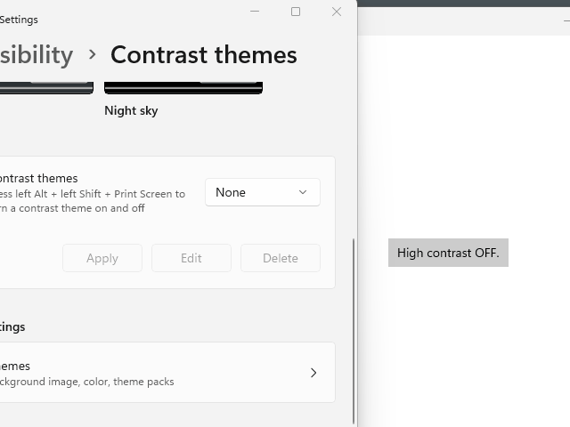

ThemeSettings 
===

# Background
_This section is only for internal use, it should not be part of the public documentation._

In UWP, apps can use the
[AccessibilitySettings](https://learn.microsoft.com/en-us/uwp/api/windows.ui.viewmanagement.accessibilitysettings?view=winrt-22621)
API to query the system's high-contrast setting, and detect when it changes.  But in a Win32/non-UWP context, the
**AccessibilitySettings.HighContrastChanged** event never fires.  This is because the event relies on the **CoreWindow**
object to handle the `WM_THEMECHANGED` message and fire an internal event to the **AccessibilitySettings** object -- but
in a non-UWP, Win32/WinAppSDK context, no **CoreWindow** exists.

The API described in this doc, **ThemeSettings**, is a WinAppSDK WinRT API that provides the functionality of
**AccessibilitySettings**, but for a Win32 environment.  In the future we'd like to add other kinds of theme-related 
information to this API, so we decided to use a name that's not specific to accessibility or high-contrast.

The **ThemeSettings.HighContrast** and **ThemeSettings.HighContrastScheme** properties shown below are basically identical to the
existing UWP [AccessibilitySettings.HighContrast](https://learn.microsoft.com/en-us/uwp/api/windows.ui.viewmanagement.accessibilitysettings.highcontrast?view=winrt-22621) 
and [AccessibilitySettings.HighContrastScheme](https://learn.microsoft.com/en-us/uwp/api/windows.ui.viewmanagement.accessibilitysettings.highcontrastscheme?view=winrt-22621)
properties.  They're all implemented by calling the Win32 [SystemParametersInfo](https://learn.microsoft.com/en-us/windows/win32/api/winuser/nf-winuser-systemparametersinfow)
function with the `SPI_GETHIGHCONTRAST` flag.

Note that **HighContrastScheme** will, like **AccessibilitySettings.HighContrastScheme**, continue to return a valid
string value even when **HighContrast** is false.  The Win10 Settings UI had two controls, a toggle for high-contrast
enablement and a combo box to select the HC theme, the UWP **AccessibilitySettings** API was probably designed to match
that.  Rather than change the model, we stick with what the UWP API already exposed, since we know it works for app
developers and can be implemented very simply on Windows.

This GIF shows how a user can change the HighContrast theme in the Settings app today, and a System Xaml app that displays the current **HighContrastScheme**:



### Why does this API require a WindowId?
This API requires a **WindowId** object because the implementation listens for a `WM_THEMECHANGED` message.  (This is
the same message the **CoreWindow** listens for that drives the UWP **AccessibilitySettings.HighContrastChanged**  event).
An alternative option is for the API to create and manage its own top-level window, but we decided to use an existing
window so we could have better control over the order in which these kinds of WinAppSDK events are fired.

### Future directions
The expectation is to add more theme APIs here that we should have full APIs for:

* We need an API for light/dark mode, which currently you have to read from the registry.
* System colors currently exposed by GetSysColor (Win32).
* Accent colors currently exposed by UISettings.GetColorValue.

# API Pages

## ThemeSettings class
The **ThemeSettings** API allows Win32 WinRT apps to detect that the system's High Contrast setting
has changed.  

In this sample code, an app uses a **ThemeSettings** object to listen for high contrast changes
on the system:

```c++
void MyApp::ListenForHighContrastChange(XamlRoot& xamlRoot) 
{
  const auto myWindowId = xamlRoot.ContentEnvironment().AppWindowId();
  m_themeSettings = ThemeSettings::CreateForWindowId(myWindowId);

  m_themeSettings.Changed([xamlRoot](const ThemeSettings& ts, const auto&) {
    if (ts.HighContrast())
    {
      ::OutputDebugString(L"High contrast is ON, scheme is: ");
      ::OutputDebugString(ts.HighContrastScheme().c_str());
    }
    else
    {
      ::OutputDebugString(L"High contrast is OFF.\n");
    }
  });
}
```

When the app releases all its references to a **ThemeSettings** object, the object will be destroyed and the **Changed** event will
no longer fire.

### Methods
|Name|Description|
|-|-|
|static CreateForWindowId(WindowId)|Creates a ThemeSettings object that will provide theme information for the given WindowId.|

### Events
|Name|Description|
|-|-|
|Changed|Fired when one of the object's properties has changed.|

### Properties
| Name | Description |
|-|-|
| Boolean HighContrast | True if High Contrast mode is enabled on the system. |
| String HighContrastScheme | If HighContrast is true, a string from the system representing the High Contrast scheme, or style. |

## ThemeSettings.CreateForWindowId static method

``` c#
static CreateForWindowId(WindowId windowId)
```

Creates a **ThemeSettings** object that will provide theme information for the given **WindowId**.

The given **WindowId** must represent a window that:
* is a top-level window,
* AND is on the same process and thread as the caller.

For example, you can get a **WindowId** from the **ContentEnvironment.AppWindowId** property.  You can get a **ContentEnvironment**
object from a **XamlRoot** object.

## ThemeSettings.Changed event

```c#
event TypedEventHandler<ThemeSettings, Object> Changed
```

Fired when one of the object's properties has changed.

The **Changed** event will only fire while the **ThemeSettings** object is alive, so apps must ensure
they hold a reference to the object as long as they want to receive the event.

The **Changed** event will only fire as long as the window represented by **WindowId** is alive (has not yet received `WM_NCDESTROY`).

# API Details

_Spec note: this is a new namespace, **Microsoft.UI.System**.
The predecessor for this type is `AccessibilitySettings`,
which is in the `Windows.UI.ViewManagement` namespace,
which is all UWP types we don't plan to carry into Desktop.
This is a UI type that doesn't fit into any of the children of the `UI` namespace.
We anticipate more types here, but don't have any current plans._


``` c# (really midl3)
namespace Microsoft.UI.System
{
  runtimeclass ThemeSettings 
  {
    static ThemeSettings CreateForWindowId(WindowId windowId);

    event TypedEventHandler<ThemeSettings, Object> Changed;

    Boolean HighContrast { get; }
    String HighContrastScheme { get; } 
  }
}
```

# Appendix
_This section is only for internal use, it should not be part of the public documentation._

## Future Directions
In the future, when we support cross-process and/or cross-thread islands, a WindowId won't be sufficient anymore.  We'll need
a static method that allows the app to create a ThemeSettings object for a given island.

## Similar APIs
Note in .net there is a
[SystemEvents](https://learn.microsoft.com/en-us/dotnet/api/microsoft.win32.systemevents?view=dotnet-plat-ext-7.0) type
that provides related APIs.  This is implemented by creating a top-level window to receive `WM_THEMECHANGED` and other
messages.  That implementation is
[here](https://github.com/microsoft/referencesource/blob/5697c29004a34d80acdaf5742d7e699022c64ecd/System/compmod/microsoft/win32/SystemEvents.cs).
